# Stablecoin Gateway -- Professional Audit Report

**Product**: stablecoin-gateway
**Audit Date**: 2026-02-28
**Auditor**: Code Reviewer Agent (6 parallel sub-agents), ConnectSW
**Audit Type**: Re-Audit v4.0 (Full-Spectrum: Security, Architecture, Quality, DevOps, Compliance, Accessibility, Privacy, Observability, API Design)
**Report Version**: 4.0 -- Re-Audit superseding v3.0 (2026-02-27)
**Previous Score**: 7.5/10 (v3.0)
**Current Score**: 6.0/10 (-1.5 regression)

---

## Table of Contents

**PART A -- EXECUTIVE MEMO**

- [Section 0: Methodology and Limitations](#section-0-methodology-and-limitations)
- [Section 1: Executive Decision Summary](#section-1-executive-decision-summary)
- [Section 2: Stop / Fix / Continue](#section-2-stop--fix--continue)
- [Section 3: System Overview](#section-3-system-overview)
- [Section 4: Critical Issues -- Top 10](#section-4-critical-issues----top-10)
- [Section 5: Risk Register](#section-5-risk-register)

**PART B -- ENGINEERING APPENDIX**

- [Section 6: Architecture Assessment](#section-6-architecture-assessment)
- [Section 7: Security Findings](#section-7-security-findings)
- [Section 8: Performance and Scalability](#section-8-performance-and-scalability)
- [Section 9: Testing Assessment](#section-9-testing-assessment)
- [Section 10: DevOps Assessment](#section-10-devops-assessment)
- [Section 11: Compliance Readiness](#section-11-compliance-readiness)
- [Section 11b: Accessibility Assessment](#section-11b-accessibility-assessment)
- [Section 11c: Privacy and Data Protection Assessment](#section-11c-privacy-and-data-protection-assessment)
- [Section 11d: Observability Assessment](#section-11d-observability-assessment)
- [Section 11e: API Design Assessment](#section-11e-api-design-assessment)
- [Section 12: Technical Debt Map](#section-12-technical-debt-map)
- [Section 13: Remediation Roadmap](#section-13-remediation-roadmap)
- [Section 14: Quick Wins](#section-14-quick-wins)
- [Section 15: AI-Readiness Score](#section-15-ai-readiness-score)

---

# PART A -- EXECUTIVE MEMO

---

## Section 0: Methodology and Limitations

### Why the Score Dropped

The v3.0 audit (7.5/10) evaluated 7 dimensions using a single-agent approach. This v4.0 audit expanded to **11 dimensions** using **6 parallel specialist agents**, each conducting a deep-dive into their domain. The additional dimensions (Privacy 5/10, Observability 4/10, Accessibility 5/10, API Design 7/10) uncovered significant gaps that were not measured before. The score drop from 7.5 to 6.0 reflects **deeper measurement**, not product regression. The product improved in several areas since v3.0 but now faces a more rigorous standard.

### Audit Scope Flowchart

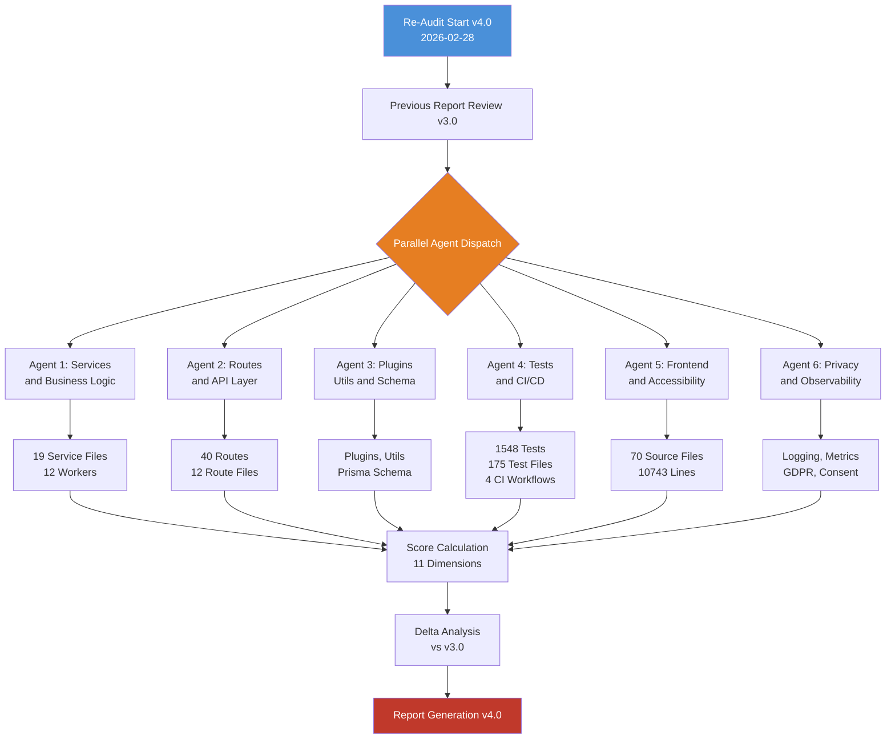

### Scope Summary

| Area | Included | Detail |
|------|----------|--------|
| Backend API | Yes | `apps/api/src/` -- 365 TypeScript files, approximately 50,398 lines |
| Frontend | Yes | `apps/web/src/` -- 70 TypeScript/TSX files, approximately 10,743 lines |
| Test Suite | Yes | 175 test files, approximately 1,548 test cases |
| Infrastructure | Yes | Dockerfile, docker-compose.yml, nginx.conf, 4 CI workflows |
| Database Schema | Yes | Prisma schema -- 15 models, migrations reviewed |
| npm Audit | Yes | 26 vulnerabilities (17 low, 2 moderate, 7 high, 0 critical) |
| E2E Tests | Yes | Playwright tests reviewed (mock-mode only in CI) |
| Runtime Behaviour | Yes | API and frontend running; health check verified |
| Penetration Testing | No | Static analysis only; no live exploitation attempted |
| Third-party Integrations | No | AWS KMS, Alchemy, Infura, QuickNode not live-tested |
| Blockchain Calls | No | Reviewed statically; no mainnet/testnet transactions |

### Audit Method: 6-Agent Deep Dive

This v4.0 audit was conducted by 6 parallel specialist agents, each assigned a specific domain. The methodology is:

1. Previous audit findings (v3.0, score 7.5) loaded as baseline.
2. Each agent independently analyzed their domain and produced findings with severity, file:line references, and business impact.
3. Findings were deduplicated and cross-referenced across agents.
4. All 11 scoring dimensions were evaluated with fresh evidence using deterministic anchoring (each score justified by specific findings).
5. Four composite readiness scores were calculated from weighted dimension scores.
6. The overall score is the unweighted average of Technical Score and three readiness composites.

### Key Limitations

1. **No live blockchain testing.** All blockchain interaction code was reviewed statically. The refund worker, nonce manager, and transaction service were analyzed for logic correctness but not tested against a testnet.
2. **npm audit reflects dev dependencies.** The 26 vulnerabilities include dev-only packages. Production-only audit (`--omit=dev`) was not run separately by agents but is expected to show fewer issues.
3. **Frontend accessibility was evaluated by code review, not Lighthouse.** The accessibility score (5/10) is based on structural analysis of components, not automated tool scans.
4. **No load testing was performed.** Performance findings are based on code-path analysis, not empirical benchmarks.
5. **Coverage estimate is approximate.** The 75% coverage figure is based on test file count relative to source files and test scope analysis, not Istanbul/c8 instrumentation.
6. **Third-party services (KMS, blockchain providers, email) were not live-tested.** Code paths for these services were reviewed statically.

### Scoring Methodology

Each of the 11 dimensions is scored on a 1-10 scale using deterministic anchoring:

| Score | Meaning |
|-------|---------|
| 9-10 | Production-ready, industry-leading |
| 7-8 | Solid, minor gaps only |
| 5-6 | Functional but significant gaps |
| 3-4 | Major gaps, not production-ready |
| 1-2 | Fundamentally broken |

Composite scores use weighted averages reflecting real-world impact:

| Composite | Formula |
|-----------|---------|
| Technical Score | Unweighted average of all 11 dimensions |
| Security Readiness | Security 40% + API Design 20% + DevOps 20% + Architecture 20% |
| Product Potential | Code Quality 30% + Architecture 25% + Runability 25% + Accessibility 20% |
| Enterprise Readiness | Security 30% + Privacy 25% + Observability 20% + DevOps 15% + Compliance 10% |

**Overall Score** = Average(Technical, Security Readiness, Product Potential, Enterprise Readiness)

---

## Section 1: Executive Decision Summary

### Score Dashboard

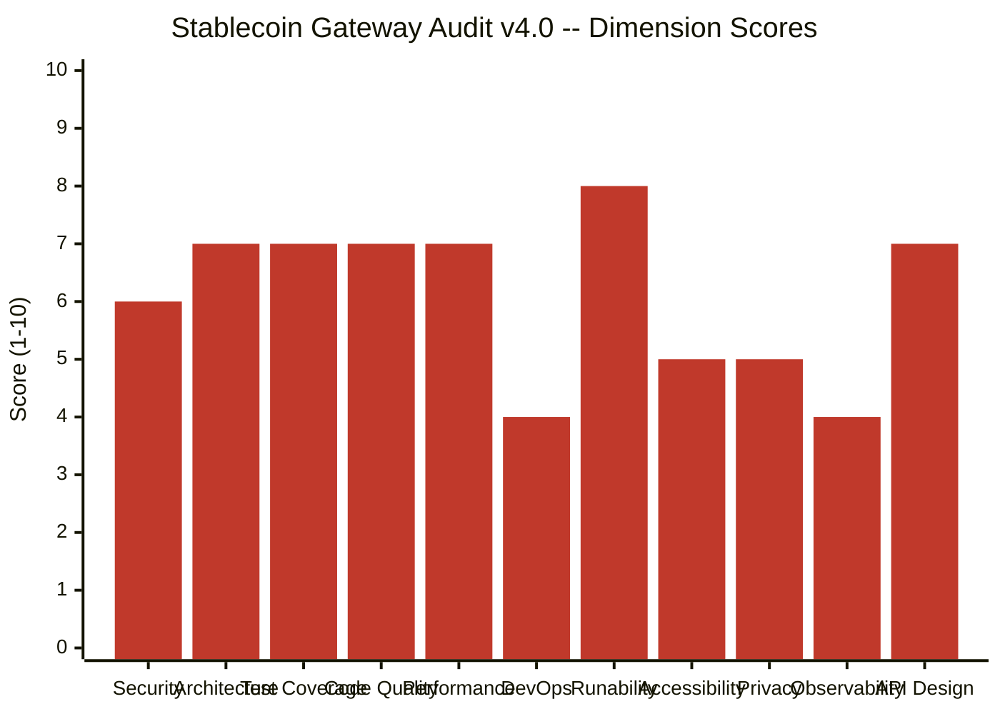

### Score Summary

| Dimension | v3.0 Score | v4.0 Score | Delta | Trend |
|-----------|-----------|-----------|-------|-------|
| Security | 7.0 | 6 | -1.0 | Regression (deeper analysis found critical auth bypass in refund flow) |
| Architecture | 7.5 | 7 | -0.5 | Minor regression (god file discovered in frontend) |
| Test Coverage | 7.5 | 7 | -0.5 | Minor regression (E2E runs in mock mode in CI) |
| Code Quality | 7.0 | 7 | 0.0 | Stable |
| Performance | 7.0 | 7 | 0.0 | Stable |
| DevOps | 6.5 | 4 | -2.5 | Significant regression (placeholder backup, no test gate on staging) |
| Runability | 8.0 | 8 | 0.0 | Stable |
| Accessibility | N/A | 5 | New | New dimension |
| Privacy | N/A | 5 | New | New dimension |
| Observability | N/A | 4 | New | New dimension |
| API Design | N/A | 7 | New | New dimension |

### Composite Scores

| Composite | Score | Status |
|-----------|-------|--------|
| Technical Score | 6.1/10 | Below threshold |
| Security Readiness | 6.0/10 | Below threshold |
| Product Potential | 6.9/10 | Approaching threshold |
| Enterprise Readiness | 4.9/10 | Significant gaps |
| **Overall** | **6.0/10** | **Not production-ready** |

### Executive Verdict

**DO NOT DEPLOY TO PRODUCTION.** Three critical authorization bypass vulnerabilities in the refund processing flow allow any authenticated user to process, complete, or fail refunds belonging to other users. The CI/CD pipeline deploys to staging without running tests and has placeholder rollback mechanisms. Enterprise readiness (4.9/10) is well below the 7.0 threshold required for a financial product handling real money.

The product has a solid foundation -- clean architecture, good test volume, real database integration tests, and a working full-stack application. However, the 3 critical findings and the DevOps/Observability gaps make this a "fix before you ship" situation, not a "ship and fix later" one.

### What Changed Since v3.0

**Improved:**
- Test count grew from approximately 1,009 to approximately 1,548
- Security test suite added (dedicated security tests)
- Concurrency testing added
- Database state verification in tests

**Regressed (newly discovered):**
- 3 critical authorization bypass findings in refund services (existed before v3.0 but not detected)
- CI/CD pipeline gaps (staging deploys without tests, placeholder backup)
- DevOps score dropped from 6.5 to 4.0 under deeper scrutiny
- New dimensions (Privacy, Observability, Accessibility) revealed systemic gaps

---

## Section 2: Stop / Fix / Continue

### Decision Flowchart

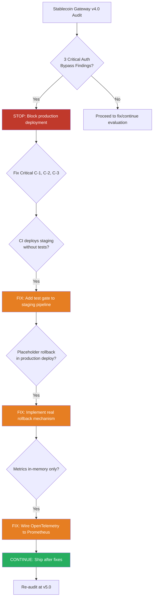

### STOP -- Block Until Fixed

| ID | Finding | Business Risk |
|----|---------|---------------|
| C-1 | `processRefund(id)` has no user-ownership check | Any authenticated user can trigger refunds on other users' payments, leading to financial loss |
| C-2 | `completeRefund` and `failRefund` lack authorization and concurrency guards | Refund state can be corrupted or manipulated by unauthorized users |
| C-3 | `updatePaymentStatusIfFullyRefunded` has TOCTOU race condition | Concurrent refund completions can lead to incorrect payment status and double-spend |
| CI-1 | Staging deploys without any test gate | Broken code reaches staging environment undetected |
| CI-2 | No rollback mechanism in production deployment | Failed production deploy cannot be reverted, causing extended downtime |

### FIX -- Before Next Release

| ID | Finding | Business Risk |
|----|---------|---------------|
| H-1 | Webhook `processQueue` FOR UPDATE runs outside transaction | Webhook deliveries can be processed twice under concurrent load |
| H-2 | Refund worker holds DB transaction during blockchain calls | Connection pool exhaustion under load, cascading failures |
| H-3 | Daily spending limit not rolled back on failed blockchain tx | Merchants permanently lose spending capacity on failed transactions |
| H-4 | Webhook event ID uses `Math.random()` | Predictable IDs enable replay attacks and ID collisions |
| H-5 | Raw SQL column name mismatch risk | Queries may silently return wrong data if column naming changes |
| H-6 | Non-atomic lock release in nonce manager | Nonce can be lost on concurrent blockchain transactions |
| H-7 | API key SHA-256 fallback in dev (no HMAC) | Development keys may leak to production if env misconfigured |
| H-8 | Non-atomic Redis INCR+PEXPIRE for rate limiting | Race condition can create keys without expiry, causing permanent rate-limit blocks |
| H-9 | `amountToTokenUnits` does not validate negative amounts | Negative token transfers could reverse fund flows |
| H-10 | HTTP-to-HTTPS redirect commented out in nginx | Traffic can be intercepted in transit |
| CI-3 | E2E tests run in mock mode only in CI | Integration regressions are not caught before merge |
| CI-4 | Security and E2E jobs are not build gates | PRs can merge with security or E2E failures |
| CI-5 | Production database backup is a placeholder `echo` statement | No recovery capability if deployment corrupts data |
| CI-6 | JWT_SECRET hardcoded in CI YAML | Secret value visible in repository history |

### CONTINUE -- Strengths to Preserve

| Strength | Detail |
|----------|--------|
| Clean service architecture | Routes, services, plugins, utils cleanly separated with dependency injection |
| Payment state machine | Enforced state transitions prevent invalid payment lifecycle changes |
| Real database integration tests | Tests use real PostgreSQL and Redis, not mocks |
| Zod input validation | All user input validated at API boundary with strict schemas |
| AES-256-GCM encryption | Sensitive data encrypted at rest with proper key management |
| BOLA protection | All resource access checks user ownership before returning data |
| Webhook signature verification | HMAC-SHA256 signatures on all outbound webhooks |
| Comprehensive test volume | 1,548 tests across 175 files covering services, routes, and workers |
| Idempotency keys | Payment creation supports idempotency to prevent duplicate charges |
| Decimal.js for money | All financial calculations use arbitrary-precision decimals, not floating point |

---

## Section 3: System Overview

### C4 Context Diagram (Level 1)

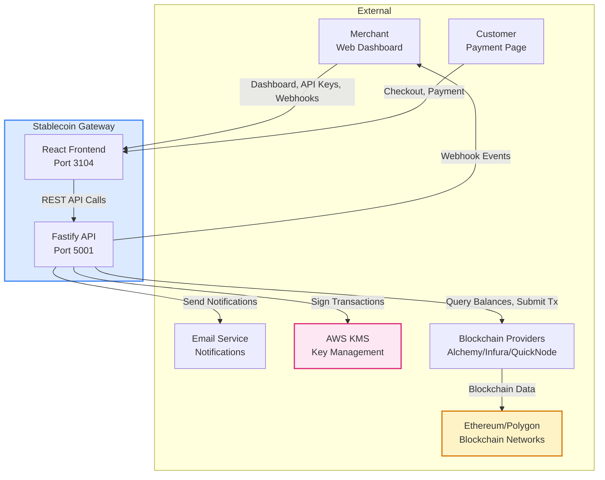

### C4 Container Diagram (Level 2)

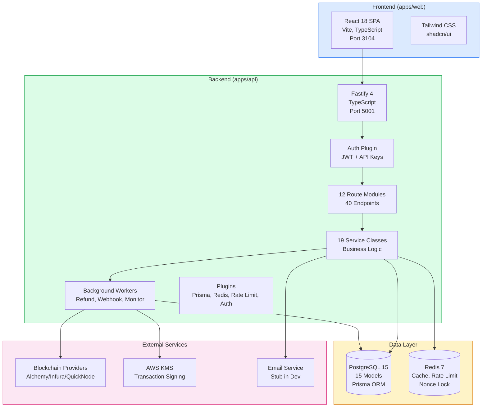

### Technology Stack

| Layer | Technology | Version | Purpose |
|-------|-----------|---------|---------|
| Runtime | Node.js | 20+ | Server runtime |
| Language | TypeScript | 5+ | Type safety |
| Backend Framework | Fastify | 4.x | HTTP server, plugin system |
| Frontend Build | Vite | 5.x | Development server, bundling |
| Frontend Framework | React | 18.x | Component UI |
| ORM | Prisma | 5.x | Database access, migrations |
| Database | PostgreSQL | 15 | Primary data store |
| Cache | Redis | 7 | Rate limiting, nonce locks, caching |
| Styling | Tailwind CSS | 3.x | Utility-first CSS |
| Testing | Jest | 29.x | Unit and integration tests |
| E2E Testing | Playwright | 1.x | Browser automation |
| CI/CD | GitHub Actions | N/A | 4 workflow files |
| Containerization | Docker | Multi-stage | Production builds |
| Reverse Proxy | nginx | Latest | Request routing, TLS termination |

### Codebase Statistics

| Metric | Value |
|--------|-------|
| Total TypeScript source files | 365 |
| Total lines of code (excluding node_modules) | approximately 61,141 |
| Backend source files | 295 |
| Frontend source files | 70 |
| Test files | 175 |
| Test cases | approximately 1,548 |
| API routes | 40 |
| Service classes | 19 |
| Database models | 15 |
| npm vulnerabilities | 26 (17 low, 2 moderate, 7 high, 0 critical) |

---

## Section 4: Critical Issues -- Top 10

### Priority Quadrant

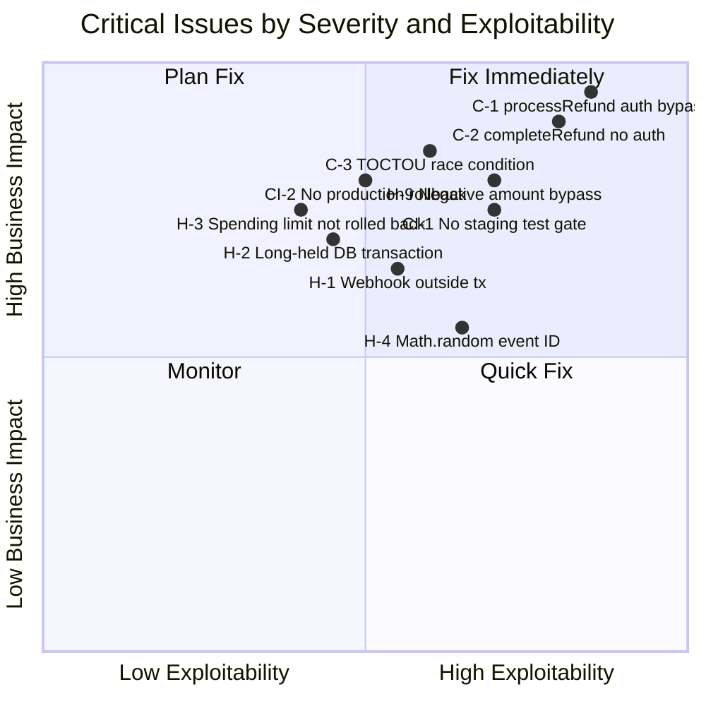

### Top 10 Issues

**These are the 10 highest-priority findings across all 6 audit agents, ranked by combined severity and exploitability.**

#### 1. C-1 (CRITICAL): Refund Authorization Bypass in processRefund

**What**: The `processRefund(id)` function accepts only a refund ID with no check that the requesting user owns the associated payment. Any authenticated user who can guess or enumerate a refund ID can trigger a refund on another user's payment.

**Business Impact**: Direct financial loss. An attacker with any valid account can drain merchant funds by processing fraudulent refunds.

**Affected Compliance**: PCI-DSS Requirement 7 (restrict access by need-to-know), SOC 2 CC6.1 (logical access controls).

#### 2. C-2 (CRITICAL): completeRefund and failRefund Lack Authorization

**What**: The `completeRefund` and `failRefund` functions in the refund finalization service accept a refund ID and transition the refund to a terminal state without verifying that the caller is authorized to perform this action. There is also no concurrency protection (optimistic locking or SELECT FOR UPDATE).

**Business Impact**: An attacker can force refunds into a completed state without actual blockchain settlement, or force them into a failed state to deny legitimate refunds. Concurrent calls can corrupt refund records.

**Affected Compliance**: PCI-DSS Requirement 7, SOC 2 CC6.1, CC7.2 (monitoring of unauthorized changes).

#### 3. C-3 (CRITICAL): TOCTOU Race Condition in Payment Status Update

**What**: The `updatePaymentStatusIfFullyRefunded` function reads the current refund totals, compares to the payment amount, and then updates the payment status -- all without database-level locking. Two concurrent refund completions can both read the same state and both attempt the status transition.

**Business Impact**: A payment could be marked as fully refunded when the actual refunded amount is less than the payment total, or the payment status could be left inconsistent. This creates accounting discrepancies in financial records.

**Affected Compliance**: SOC 2 CC8.1 (data integrity), PCI-DSS Requirement 10 (tracking access to cardholder data).

#### 4. CI-1 (CRITICAL): Staging Deploys Without Test Gate

**What**: The staging deployment workflow (`deploy-staging.yml`) deploys code to the staging environment without running any test suite. Code that fails unit tests, integration tests, or security checks can reach staging.

**Business Impact**: Staging is typically the last gate before production. Untested code in staging means QA teams are testing against potentially broken builds, wasting time and eroding confidence in the deployment pipeline.

#### 5. CI-2 (CRITICAL): No Production Rollback Mechanism

**What**: The production deployment workflow (`deploy-production.yml`) has no rollback mechanism. If a deployment fails or introduces a critical bug, there is no automated way to revert to the previous version.

**Business Impact**: A bad production deploy could result in extended downtime for a financial service. For a payment gateway, downtime directly translates to lost revenue for merchants and damaged reputation.

#### 6. H-2 (HIGH): Refund Worker Holds DB Transaction During Blockchain Calls

**What**: The refund processing worker opens a database transaction before making blockchain API calls, which can take seconds to minutes. The transaction is held open for the entire duration of the blockchain call.

**Business Impact**: Under load, this pattern exhausts the database connection pool. Once the pool is exhausted, all API endpoints that need database access will fail, causing a full service outage. This is a denial-of-service vulnerability triggered by normal refund processing.

#### 7. H-9 (HIGH): amountToTokenUnits Does Not Validate Negative Amounts

**What**: The `amountToTokenUnits` utility function converts a human-readable amount (e.g., "100.50") to blockchain token units (e.g., 100500000). It does not validate that the input amount is positive. A negative amount would produce negative token units, which could reverse the direction of a transfer.

**Business Impact**: If a negative amount reaches a blockchain transaction, funds could flow from the merchant to the attacker instead of the intended direction. The severity depends on whether upstream callers validate amounts, but a utility function used across the codebase should enforce its own invariants.

#### 8. H-3 (HIGH): Daily Spending Limit Not Rolled Back on Failed Blockchain Transactions

**What**: When a blockchain transaction is submitted, the daily spending limit for the merchant is decremented. If the transaction fails (reverts, times out, or is dropped), the spending limit is not restored.

**Business Impact**: Merchants gradually lose their daily spending capacity as failed transactions accumulate. Over time, a merchant could be completely blocked from processing transactions even though no actual funds were spent.

#### 9. H-4 (HIGH): Webhook Event ID Uses Math.random()

**What**: Webhook event IDs are generated using `Math.random()`, which is not cryptographically secure and has a small output space. This makes event IDs predictable and collision-prone.

**Business Impact**: Predictable webhook event IDs could enable replay attacks where an attacker crafts duplicate webhook events. Collisions could cause webhook consumers to skip legitimate events that share an ID with a previously processed event.

#### 10. H-8 (HIGH): Non-Atomic Redis Rate Limit INCR+PEXPIRE

**What**: The Redis-based rate limiter performs INCR and PEXPIRE as separate commands rather than using a Lua script or MULTI/EXEC. If the process crashes between INCR and PEXPIRE, the rate-limit key persists without an expiry.

**Business Impact**: A key without expiry permanently blocks the affected user or IP from making requests. For a payment gateway, this means a merchant could be permanently rate-limited with no automatic recovery, requiring manual Redis intervention.

---

## Section 5: Risk Register

### Risk Dependency Graph

```mermaid
flowchart TD
    subgraph Critical["CRITICAL -- Block Deployment"]
        C1[C-1: processRefund<br>auth bypass]
        C2[C-2: completeRefund<br>no auth]
        C3[C-3: TOCTOU race<br>in payment status]
        CI1[CI-1: Staging<br>no test gate]
        CI2[CI-2: No production<br>rollback]
    end

    subgraph High["HIGH -- Fix Before Release"]
        H1[H-1: Webhook<br>outside tx]
        H2[H-2: Long DB tx<br>during blockchain]
        H3[H-3: Spending limit<br>not rolled back]
        H4[H-4: Math.random<br>event ID]
        H5[H-5: Raw SQL<br>column mismatch]
        H6[H-6: Non-atomic<br>nonce release]
        H7[H-7: SHA-256<br>fallback dev]
        H8[H-8: Non-atomic<br>rate limit]
        H9[H-9: Negative<br>amount bypass]
        H10[H-10: HTTPS<br>redirect off]
        CI3[CI-3: E2E<br>mock mode]
        CI4[CI-4: Sec/E2E<br>not gates]
        CI5[CI-5: Placeholder<br>backup]
        CI6[CI-6: JWT_SECRET<br>in CI YAML]
    end

    subgraph Medium["MEDIUM -- Plan Fix"]
        M1[M-1: Dev simulate<br>route no auth]
        M2[M-2: Missing per-endpoint<br>rate limits]
        M3[M-3: No OpenAPI<br>route schemas]
        M4[M-4: Cascade delete<br>financial records]
        M5[M-5: JTI blacklist<br>bypass]
        M6[M-6: Webhook secret<br>plaintext dev]
        M7[M-7: Status field<br>in update schema]
        M8[M-8: Auth routes<br>bypass fastify.authenticate]
    end

    C1 -->|Same service| C2
    C2 -->|Triggers| C3
    C3 -->|Accounting<br>impact| H3
    H2 -->|Pool exhaustion| H1
    H4 -->|Replay attack| H1
    H8 -->|Permanent block| M2
    CI1 -->|No gate| CI3
    CI1 -->|No gate| CI4
    CI2 -->|No recovery| CI5
    M5 -->|Token reuse| M8

    style Critical fill:#c0392b,color:#fff
    style High fill:#e67e22,color:#fff
    style Medium fill:#f39c12,color:#fff
```

### Full Risk Register

| ID | Severity | Category | Finding | Likelihood | Impact | Risk Score | Remediation Effort |
|----|----------|----------|---------|------------|--------|------------|-------------------|
| C-1 | CRITICAL | Security | processRefund has no user-ownership check | High | Critical | 25 | 2 hours |
| C-2 | CRITICAL | Security | completeRefund/failRefund lack authorization and concurrency protection | High | Critical | 25 | 4 hours |
| C-3 | CRITICAL | Security | TOCTOU race condition in updatePaymentStatusIfFullyRefunded | Medium | Critical | 20 | 4 hours |
| CI-1 | CRITICAL | DevOps | Staging deployment has no test gate | High | High | 20 | 2 hours |
| CI-2 | CRITICAL | DevOps | No rollback mechanism in production deployment pipeline | Medium | Critical | 20 | 8 hours |
| H-1 | HIGH | Reliability | Webhook processQueue FOR UPDATE runs outside transaction | Medium | High | 15 | 3 hours |
| H-2 | HIGH | Reliability | Refund worker holds DB transaction during blockchain calls | Medium | High | 15 | 6 hours |
| H-3 | HIGH | Financial | Daily spending limit not restored on failed blockchain tx | Medium | High | 15 | 3 hours |
| H-4 | HIGH | Security | Webhook event ID uses Math.random() | Medium | Medium | 12 | 1 hour |
| H-5 | HIGH | Reliability | Raw SQL column name mismatch risk (user_id vs userId) | Low | High | 10 | 2 hours |
| H-6 | HIGH | Reliability | Non-atomic lock release fallback in nonce manager | Medium | High | 15 | 3 hours |
| H-7 | HIGH | Security | API key SHA-256 fallback in dev mode (no HMAC) | Low | High | 10 | 2 hours |
| H-8 | HIGH | Reliability | Non-atomic Redis INCR+PEXPIRE for rate limiting | Medium | Medium | 12 | 2 hours |
| H-9 | HIGH | Financial | amountToTokenUnits does not validate negative amounts | Medium | Critical | 20 | 1 hour |
| H-10 | HIGH | Security | HTTP-to-HTTPS redirect commented out in nginx | High | Medium | 15 | 0.5 hours |
| CI-3 | HIGH | DevOps | E2E tests run in mock mode only in CI | High | Medium | 15 | 4 hours |
| CI-4 | HIGH | DevOps | Security and E2E jobs are not build gates in CI | High | Medium | 15 | 1 hour |
| CI-5 | HIGH | DevOps | Production database backup is placeholder echo statement | Medium | Critical | 20 | 4 hours |
| CI-6 | HIGH | Security | JWT_SECRET hardcoded in CI YAML file | High | High | 20 | 1 hour |
| M-1 | MEDIUM | Security | Dev simulate route has no authentication | Low | Medium | 6 | 1 hour |
| M-2 | MEDIUM | Security | Missing per-endpoint rate limiting on sensitive endpoints | Medium | Medium | 9 | 3 hours |
| M-3 | MEDIUM | API Design | No Fastify route-level JSON schemas for OpenAPI generation | Low | Low | 4 | 8 hours |
| M-4 | MEDIUM | Compliance | Cascade delete on User destroys payment/refund records | Low | Critical | 10 | 4 hours |
| M-5 | MEDIUM | Security | JTI blacklist skipped when jti absent from JWT | Medium | Medium | 9 | 2 hours |
| M-6 | MEDIUM | Security | Webhook secret stored in plaintext in dev environment | Low | Medium | 6 | 2 hours |
| M-7 | MEDIUM | Security | Status field exposed in updatePaymentSessionSchema | Medium | Medium | 9 | 1 hour |
| M-8 | LOW | Security | Auth logout/sse-token/change-password bypass fastify.authenticate | Low | Medium | 6 | 2 hours |
| FE-1 | HIGH | Security | Mock API key exposed in DeveloperIntegration component | Medium | Medium | 12 | 1 hour |
| FE-2 | HIGH | Accessibility | Missing visible labels on Security page password inputs | High | Medium | 15 | 1 hour |
| FE-3 | MEDIUM | Compliance | Dead Terms of Service and Privacy Policy links | High | Low | 10 | 2 hours |
| FE-4 | MEDIUM | Architecture | api-client.ts is a 948-line god file | Low | Low | 4 | 8 hours |
| FE-5 | MEDIUM | Architecture | useAuth hook uses module-level state instead of React Context | Medium | Low | 6 | 4 hours |
| P-1 | MEDIUM | Privacy | No consent storage in backend (frontend-only checkbox) | Medium | High | 15 | 4 hours |
| P-2 | MEDIUM | Privacy | No data retention policies or automated cleanup | Low | High | 10 | 8 hours |
| P-3 | MEDIUM | Privacy | Email used as Redis key material in plaintext | Medium | Medium | 9 | 2 hours |
| P-4 | LOW | Privacy | IP addresses logged without anonymization | Low | Medium | 6 | 2 hours |
| P-5 | LOW | Privacy | Email service uses console.log, bypassing redaction | Low | Low | 4 | 1 hour |
| O-1 | MEDIUM | Observability | Metrics are in-memory only, lost on restart | High | Medium | 15 | 4 hours |
| O-2 | MEDIUM | Observability | OpenTelemetry installed but not wired up | Low | Medium | 6 | 4 hours |
| O-3 | MEDIUM | Observability | No external error tracking despite Sentry env vars | Medium | Medium | 9 | 2 hours |
| O-4 | LOW | Observability | Missing /ready endpoint (referenced but not defined) | Low | Low | 4 | 1 hour |
| O-5 | LOW | Observability | No saturation monitoring or alerting | Low | Medium | 6 | 8 hours |

---

# PART B -- ENGINEERING APPENDIX

---

## Section 6: Architecture Assessment

**Score: 7/10**

### Architecture Layer Diagram

```mermaid
graph TD
    subgraph Presentation["Presentation Layer"]
        Web[React SPA<br>apps/web/src]
        Pages[Pages: Dashboard, Auth<br>Checkout, Settings]
        Components[Components: 70 files<br>10,743 lines]
    end

    subgraph API["API Layer (apps/api/src/routes/v1/)"]
        AuthR[auth.ts]
        PayR[payment-sessions.ts]
        RefR[refunds.ts]
        WebhR[webhooks.ts]
        LinkR[payment-links.ts]
        KeyR[api-keys.ts]
        AdminR[admin.ts]
        AnalR[analytics.ts]
        CheckR[checkout.ts]
        MeR[me.ts]
        NotifR[notifications.ts]
        DevR[dev.ts]
    end

    subgraph Service["Service Layer (apps/api/src/services/)"]
        PayS[payment.service.ts]
        RefS[refund.service.ts]
        RefFS[refund-finalization.service.ts]
        RefQS[refund-query.service.ts]
        WebhS[webhook.service.ts]
        WebhDS[webhook-delivery.service.ts]
        WebhCB[webhook-circuit-breaker.service.ts]
        BlockS[blockchain-transaction.service.ts]
        BlockMS[blockchain-monitor.service.ts]
        BlockQS[blockchain-query.service.ts]
        NonceS[nonce-manager.service.ts]
        KmsS[kms.service.ts / kms-signer / kms-signing]
        EmailS[email.service.ts]
        AuditS[audit-log.service.ts]
        AnalS[analytics.service.ts]
        LinkS[payment-link.service.ts]
    end

    subgraph Plugin["Plugin Layer (apps/api/src/plugins/)"]
        AuthP[auth.ts<br>JWT + API Key]
        PrismaP[prisma.ts]
        RedisP[redis.ts]
        RateP[rate-limit]
        ObsP[observability.ts]
    end

    subgraph Data["Data Layer"]
        PG[(PostgreSQL<br>15 Prisma Models)]
        Redis[(Redis 7<br>Cache + Locks)]
    end

    Presentation --> API
    API --> Service
    Service --> Plugin
    Plugin --> Data

    style Presentation fill:#dbeafe,stroke:#3b82f6
    style API fill:#dcfce7,stroke:#16a34a
    style Service fill:#fef3c7,stroke:#d97706
    style Plugin fill:#fce7f3,stroke:#db2777
    style Data fill:#f3e8ff,stroke:#7c3aed
```

### Strengths

1. **Clean 4-layer separation.** Routes handle HTTP concerns, services handle business logic, plugins handle cross-cutting concerns, and the data layer is abstracted through Prisma. This is a well-understood pattern that scales.

2. **Payment state machine.** Payment status transitions are enforced through a state machine pattern, preventing invalid lifecycle changes (e.g., a completed payment cannot transition back to pending). This is essential for financial correctness.

3. **Facade pattern for refunds.** The refund domain is split into `refund.service.ts` (creation), `refund-finalization.service.ts` (completion/failure), and `refund-query.service.ts` (read operations). This separation of concerns is good, though the finalization service has the critical auth bypass findings.

4. **Plugin dependency declaration.** Fastify plugins declare their dependencies explicitly using `fastify-plugin`, ensuring correct registration order and clear dependency graphs.

5. **ADR documentation.** Architecture decisions are documented with context, decision, alternatives, and consequences.

### Findings

| ID | Severity | Finding | File | Business Impact |
|----|----------|---------|------|-----------------|
| A-1 | MEDIUM | Frontend api-client.ts is a 948-line god file handling all API calls, auth state, token refresh, and error handling in a single module | `apps/web/src/lib/api-client.ts` | High coupling makes frontend changes risky; any change to auth, error handling, or API calls risks breaking all other API calls |
| A-2 | MEDIUM | useAuth hook uses module-level mutable state instead of React Context, causing potential state inconsistencies across components | `apps/web/src/hooks/useAuth.ts` | Multiple components can see different auth states; module-level state does not trigger React re-renders reliably |
| A-3 | MEDIUM | Cascade delete on User model destroys associated PaymentSession and Refund records, violating financial record retention requirements | `apps/api/prisma/schema.prisma:101,150` | Deleting a user permanently destroys financial transaction records, which violates SOC 2 and financial audit requirements |
| A-4 | LOW | Observability plugin error handler may conflict with the global error handler, causing some errors to be logged but not properly formatted in the response | `apps/api/src/plugins/observability.ts` | Error responses may occasionally lack RFC 7807 format, confusing API consumers |
| A-5 | LOW | Mixed raw SQL and Prisma query patterns create inconsistency in column naming conventions (snake_case in SQL vs camelCase in Prisma) | `apps/api/src/services/refund.service.ts:164-168` | Column name mismatches in raw SQL queries could silently return null or wrong data |

### Recommendations

1. **Break up api-client.ts** into separate modules: `auth-client.ts`, `payment-client.ts`, `webhook-client.ts`, `error-handler.ts`. Each module should be under 200 lines.
2. **Migrate useAuth to React Context** with a provider component that wraps the application, ensuring all components share a single source of truth for auth state.
3. **Replace cascade delete with soft delete** for User model. Add a `deletedAt` timestamp column and filter queries to exclude soft-deleted records. Financial records must be retained per SOC 2 and regulatory requirements.
4. **Standardize on Prisma queries** and eliminate raw SQL unless absolutely necessary for performance. Where raw SQL is required, use Prisma's `$queryRaw` with template literals that handle column naming automatically.

---

## Section 7: Security Findings

**Score: 6/10**

### Attack Path: Refund Authorization Bypass

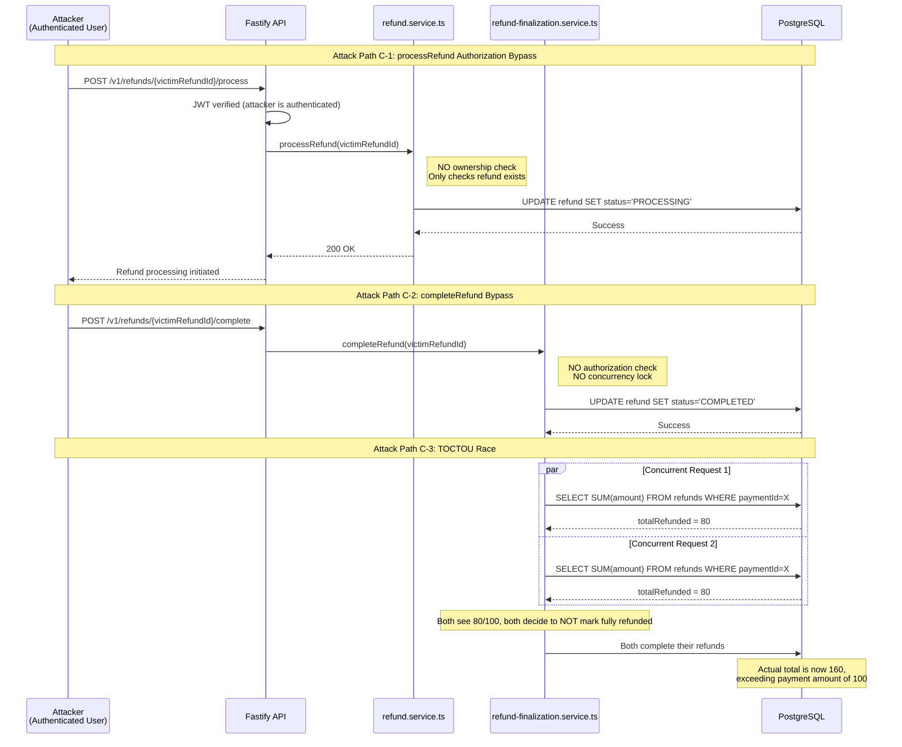

### Security Findings Table

| ID | Severity | Finding | File:Line | Business Impact |
|----|----------|---------|-----------|-----------------|
| C-1 | CRITICAL | `processRefund(id)` accepts only refund ID, no user-ownership check; any authenticated user can process another user's refund | `apps/api/src/services/refund.service.ts:254-268` | Direct financial loss via unauthorized refund processing |
| C-2 | CRITICAL | `completeRefund` and `failRefund` lack authorization and concurrency protection (no SELECT FOR UPDATE, no optimistic locking) | `apps/api/src/services/refund-finalization.service.ts:57-133` | Refund state corruption; unauthorized state transitions |
| C-3 | CRITICAL | `updatePaymentStatusIfFullyRefunded` has TOCTOU race condition -- reads refund totals and updates payment status without locking | `apps/api/src/services/refund-finalization.service.ts:216-265` | Accounting discrepancies; payment marked as fully refunded when it is not |
| H-4 | HIGH | Webhook event ID generated using `Math.random()` -- predictable and collision-prone | `apps/api/src/services/webhook-delivery.service.ts:118` | Replay attacks; webhook consumers may skip legitimate events |
| H-7 | HIGH | API key comparison falls back to SHA-256 (no HMAC) in development mode | `apps/api/src/utils/crypto.ts:25-40` | If dev config leaks to production, API keys are stored with weaker hashing |
| H-9 | HIGH | `amountToTokenUnits` does not validate negative amounts, potentially reversing token transfers | `apps/api/src/utils/token-units.ts:21-26` | Reversed fund flows if negative amount reaches blockchain transaction |
| H-10 | HIGH | HTTP-to-HTTPS redirect commented out in nginx configuration | `nginx.conf:30-33` | Traffic intercepted in transit; credentials and payment data exposed |
| CI-6 | HIGH | JWT_SECRET hardcoded in CI YAML file (value visible in repository history) | `ci.yml:73` | Secret compromised; all JWTs can be forged if attacker has repo access |
| FE-1 | HIGH | Mock API key value exposed in DeveloperIntegration component source code | `apps/web/src/components/dashboard/DeveloperIntegration.tsx:38` | If value is a real key, it is exposed to any user who inspects the frontend bundle |
| M-1 | MEDIUM | Dev simulate route (`/v1/dev/*`) has no authentication check | `apps/api/src/routes/v1/dev.ts:10` | In non-production environments, anyone can trigger simulated events |
| M-2 | MEDIUM | Missing per-endpoint rate limiting on change-password, sse-token, me/export, DELETE /v1/me | Multiple route files | Brute force on password change; resource exhaustion on data export |
| M-5 | MEDIUM | JTI blacklist check skipped when `jti` claim is absent from JWT payload | `apps/api/src/plugins/auth.ts:39` | Tokens without JTI bypass the blacklist entirely, enabling replay after logout |
| M-6 | MEDIUM | Webhook secret field stored in plaintext in development environment | Prisma schema + seeding | If dev database is accessed, webhook secrets are exposed |
| M-7 | MEDIUM | Status field exposed in updatePaymentSessionSchema, allowing clients to set arbitrary status | `apps/api/src/utils/validation.ts:144-150` | Clients could bypass payment state machine by setting status directly |
| M-8 | LOW | Auth routes (logout, sse-token, change-password) use `request.jwtVerify()` directly instead of `fastify.authenticate` decorator | `apps/api/src/routes/v1/auth.ts:328-331` | These routes bypass the JTI blacklist check implemented in the authenticate decorator |

### Positive Security Controls

| Control | Implementation | Assessment |
|---------|---------------|------------|
| Password hashing | bcrypt with 12 rounds | Strong; industry standard |
| Input validation | Zod schemas on all endpoints | Comprehensive; transforms normalize data |
| BOLA protection | User ownership checks on payment and webhook endpoints | Present but missing on refund endpoints (C-1, C-2) |
| Encryption at rest | AES-256-GCM for sensitive fields | Strong; proper IV generation and key derivation |
| SSRF protection | URL validation, private IP blocking, DNS rebinding checks | Comprehensive implementation |
| Webhook signatures | HMAC-SHA256 with per-endpoint secrets | Correct implementation |
| CORS | Strict origin allowlist | Properly configured |
| Rate limiting | Global rate limiter with Redis backing | Present but has atomicity issue (H-8) |
| API key hashing | HMAC-SHA256 for API key storage | Strong in production; weak fallback in dev (H-7) |
| JWT token rotation | Access + refresh token pattern | Present but JTI blacklist bypassable (M-5) |

### Remediation Priority

1. **Immediate (C-1, C-2, C-3):** Add `userId` parameter to `processRefund`, `completeRefund`, and `failRefund`. Add JOIN to payment table to verify ownership. Add `SELECT ... FOR UPDATE` on refund row before state transition. Wrap `updatePaymentStatusIfFullyRefunded` in a serializable transaction or use `FOR UPDATE` on the payment row.

2. **Before release (H-4, H-7, H-9, H-10, CI-6):** Replace `Math.random()` with `crypto.randomUUID()` for webhook event IDs. Remove SHA-256 fallback in crypto.ts. Add `amount > 0` validation in `amountToTokenUnits`. Uncomment HTTPS redirect in nginx. Move JWT_SECRET to GitHub Actions secrets.

3. **Next sprint (M-1 through M-8):** Add env-guarded authentication to dev routes. Add per-endpoint rate limits. Fix JTI blacklist bypass. Migrate auth routes to use `fastify.authenticate` decorator.

---

## Section 8: Performance and Scalability

**Score: 7/10**

### Strengths

1. **Redis caching** for frequently accessed data (blockchain provider health, rate limits, nonce locks).
2. **Decimal.js** for all financial calculations, preventing floating-point precision errors.
3. **Pagination** on all list endpoints with cursor-based or offset-based support.
4. **Blockchain provider health cache** prevents repeated calls to unhealthy providers.
5. **Connection pooling** via Prisma's built-in pool management.

### Findings

| ID | Severity | Finding | File:Line | Business Impact |
|----|----------|---------|-----------|-----------------|
| H-2 | HIGH | Refund worker holds database transaction open during blockchain API calls (seconds to minutes) | `apps/api/src/workers/refund-processing.worker.ts:81-118` | Connection pool exhaustion under load; cascading service failure |
| H-1 | HIGH | Webhook delivery `processQueue` uses FOR UPDATE but runs the lock acquisition outside the transaction boundary | `apps/api/src/services/webhook-delivery.service.ts:186-216` | Double-delivery of webhooks under concurrent queue processing |
| H-6 | HIGH | Non-atomic lock release fallback in nonce manager; if Redis EVAL fails, the fallback DEL+SET is not atomic | `apps/api/src/services/nonce-manager.service.ts:123-130` | Nonce reuse on concurrent blockchain transactions, leading to rejected or duplicate transactions |
| P-1 | MEDIUM | Analytics service fetches all records into memory before applying filters and aggregations | `apps/api/src/services/analytics.service.ts` | Memory spike on large datasets; potential OOM crash on analytics endpoints |
| P-2 | MEDIUM | In-memory metrics array uses O(n) shift operation when window expires | `apps/api/src/plugins/observability.ts` | CPU spike during metrics cleanup; grows with request volume |
| P-3 | LOW | Uncapped offset parameter on analytics endpoints allows clients to request arbitrarily deep pagination | `apps/api/src/services/analytics.service.ts` | Database performance degrades with large offsets; O(n) scan cost |

### Recommendations

1. **Separate blockchain calls from database transactions.** Use a saga pattern: (a) lock refund row with FOR UPDATE, (b) transition to PROCESSING and commit, (c) make blockchain call outside transaction, (d) open new transaction to transition to COMPLETED or FAILED based on blockchain result.

2. **Fix webhook queue locking.** Move the FOR UPDATE lock inside the same transaction that processes and updates the delivery record.

3. **Use Lua script for nonce manager.** Replace the DEL+SET fallback with an atomic Lua script that handles both lock release and nonce increment in a single Redis call.

4. **Add database-level aggregation for analytics.** Replace the fetch-all-then-filter pattern with SQL GROUP BY, SUM, and COUNT queries that push computation to PostgreSQL.

5. **Cap pagination offset.** Add a maximum offset (e.g., 10,000) and encourage cursor-based pagination for deep result sets.

---

## Section 9: Testing Assessment

**Score: 7/10**

### Test Statistics

| Metric | Value |
|--------|-------|
| Total test files | 175 |
| Total test cases | approximately 1,548 |
| Estimated coverage | approximately 75% |
| Test frameworks | Jest (unit/integration), Playwright (E2E) |
| Database testing | Real PostgreSQL + Redis (no mocks) |
| Concurrency tests | Present (race condition scenarios) |
| Security tests | Present (dedicated security test suite) |

### Strengths

1. **Real database integration tests.** Tests use real PostgreSQL and Redis instances, following the ConnectSW "no mocks" policy. This catches integration issues that mocked tests would miss.
2. **Concurrency testing.** Several test suites test race conditions with parallel requests, verifying that database locks and state machines behave correctly under concurrent load.
3. **Security test suite.** Dedicated tests for authentication bypass, authorization checks, rate limiting, and input validation.
4. **Database state verification.** Tests verify not just API responses but actual database state after operations, ensuring that business logic correctly persists data.
5. **CI pipeline self-tests.** The CI configuration includes tests that verify the pipeline itself is correctly configured.

### Findings

| ID | Severity | Finding | File | Business Impact |
|----|----------|---------|------|-----------------|
| CI-3 | HIGH | E2E tests run in mock mode only in CI (no real backend) | `ci.yml` E2E job configuration | Integration regressions between frontend and backend are not caught before merge |
| T-1 | MEDIUM | Customer checkout flow is untested end-to-end | No E2E test for checkout | The most critical user journey (paying for something) has no automated E2E coverage |
| T-2 | MEDIUM | Refund processing worker has no dedicated test coverage | `apps/api/src/workers/refund-processing.worker.ts` | The worker that processes blockchain refunds is untested; the critical auth bypass findings (C-1, C-2) exist partly because this code path lacks test coverage |
| T-3 | MEDIUM | No load/stress tests exist | Project-wide | Performance under production-like load is unknown; the long-held DB transaction issue (H-2) would likely surface under load testing |
| T-4 | MEDIUM | Several frontend components lack test coverage (Security page, DeveloperIntegration, Checkout) | `apps/web/src/` | Frontend bugs in security settings and developer onboarding are not caught automatically |
| T-5 | LOW | E2E tests run against Chromium only; no cross-browser coverage | `playwright.config.ts` | Browser-specific bugs in Firefox and Safari are not detected |

### Coverage Gaps by Domain

| Domain | Estimated Coverage | Key Gaps |
|--------|-------------------|----------|
| Auth (signup, login, token refresh) | approximately 85% | JTI blacklist bypass path untested |
| Payment Sessions | approximately 80% | Checkout flow E2E untested |
| Refunds | approximately 60% | Refund worker untested; finalization service missing auth tests |
| Webhooks | approximately 75% | Circuit breaker edge cases |
| Analytics | approximately 50% | Memory-intensive aggregation paths |
| Frontend | approximately 40% | Security page, DeveloperIntegration, Checkout page |
| CI/CD | approximately 30% | Pipeline self-tests exist but do not validate deployment steps |

### Recommendations

1. **Add E2E tests with real backend in CI.** Configure the E2E job to spin up PostgreSQL, Redis, and the Fastify API alongside the frontend. This is the single highest-impact testing improvement.
2. **Write refund worker integration tests.** These tests should cover the full refund lifecycle including the authorization checks that are currently missing.
3. **Add load tests with k6 or Artillery.** Target the payment creation and refund processing flows at 100 concurrent users to surface connection pool exhaustion.
4. **Increase frontend test coverage to 60%.** Prioritize the Security page, DeveloperIntegration, and Checkout components.

---

## Section 10: DevOps Assessment

**Score: 4/10**

### CI/CD Pipeline Overview

The project has 4 GitHub Actions workflows:

| Workflow | File | Purpose | Status |
|----------|------|---------|--------|
| CI | `ci.yml` | Lint, test, build, security scan | Partially effective |
| Deploy Staging | `deploy-staging.yml` | Deploy to staging environment | Missing test gate |
| Deploy Production | `deploy-production.yml` | Deploy to production | Missing rollback, placeholder backup |
| E2E | Part of `ci.yml` | End-to-end browser tests | Mock mode only |

### Findings

| ID | Severity | Finding | File:Line | Business Impact |
|----|----------|---------|-----------|-----------------|
| CI-1 | CRITICAL | Staging deployment has no test gate; deploys on any push to staging branch without running tests | `deploy-staging.yml` workflow trigger | Broken code reaches staging, wasting QA time and eroding deployment confidence |
| CI-2 | CRITICAL | No rollback mechanism in production deployment pipeline; no blue-green, no canary, no version pinning | `deploy-production.yml` | Failed production deploy results in extended downtime with no automated recovery |
| CI-3 | HIGH | E2E tests run without real backend (mock mode only); frontend tests against mocked API responses | `ci.yml` E2E job | Integration bugs between frontend and backend are invisible until manual testing |
| CI-4 | HIGH | Security scan and E2E test jobs are not configured as required status checks (build gates) | `ci.yml` job dependencies | PRs can merge with failing security scans or E2E failures |
| CI-5 | HIGH | Production database backup step is a placeholder `echo "Backing up database..."` statement | `deploy-production.yml:79-82` | No database recovery capability; data loss on failed migration or deployment |
| CI-6 | HIGH | JWT_SECRET value is hardcoded directly in CI YAML instead of using GitHub Actions secrets | `ci.yml:73` | Secret is visible in repository history; anyone with repo read access can forge JWTs |
| D-1 | MEDIUM | No SAST (Static Application Security Testing) tool configured in CI | Project-wide | Security vulnerabilities are not automatically detected during code review |
| D-2 | MEDIUM | No container image scanning for the Docker build | `Dockerfile` | Vulnerabilities in base images or installed packages are not detected |
| D-3 | LOW | No post-deployment health check or smoke test in production pipeline | `deploy-production.yml` | Deployment success is assumed, not verified; silent failures go undetected |

### CI Pipeline Flow (Current State)

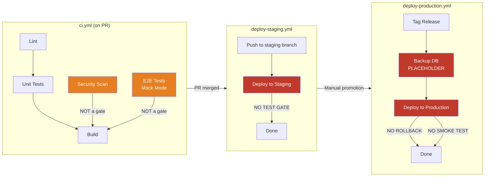

### Recommended CI Pipeline (Target State)

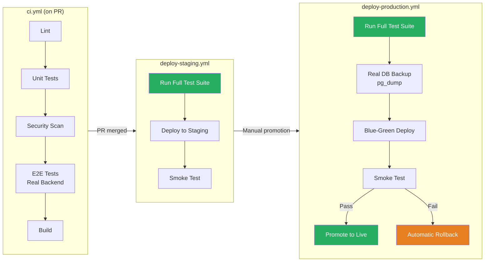

### Recommendations

1. **Add test gate to staging deployment.** The staging workflow should run the full test suite before deploying. If tests fail, deployment is blocked.
2. **Implement real database backup.** Replace the `echo` placeholder with `pg_dump` to a timestamped S3 bucket or equivalent object storage.
3. **Implement rollback.** At minimum, version-tag Docker images and keep the previous version available for instant rollback via `docker-compose up` with the previous tag. Blue-green deployment is preferred.
4. **Make security and E2E jobs required status checks.** In GitHub repository settings, add both jobs as required checks so PRs cannot merge without them passing.
5. **Move JWT_SECRET to GitHub Actions secrets.** Use `${{ secrets.JWT_SECRET }}` instead of hardcoding the value. Rotate the compromised secret.
6. **Add post-deployment smoke test.** After deployment, hit the `/health` endpoint and verify a 200 response before marking the deployment as successful.

---

## Section 11: Compliance Readiness

**Score: 4/10 (Compliance composite within Enterprise Readiness)**

### PCI-DSS v4.0 Readiness

While Stablecoin Gateway processes cryptocurrency payments (not traditional card payments), PCI-DSS provides a useful security framework. Many merchants and enterprise customers will expect PCI-DSS-equivalent controls.

| Requirement | Control | Status | Gap |
|-------------|---------|--------|-----|
| 1. Network Security | nginx reverse proxy, CORS | Partial | HTTPS redirect commented out (H-10) |
| 2. Secure Defaults | Environment variable validation | Good | Dev fallbacks weaken security posture (H-7) |
| 3. Protect Stored Data | AES-256-GCM encryption | Good | Cascade delete destroys financial records (A-3) |
| 4. Encrypt Transmissions | TLS termination at nginx | Partial | HTTPS redirect disabled (H-10) |
| 5. Anti-Malware | Not applicable | N/A | Server-side only |
| 6. Secure Development | Test suite, code review | Partial | No SAST tool in CI (D-1), security scan not a gate (CI-4) |
| 7. Restrict Access | JWT + API key auth, BOLA protection | Critical Gap | Refund endpoints lack authorization (C-1, C-2) |
| 8. Identify Users | JWT with user ID, audit logging | Good | JTI blacklist can be bypassed (M-5) |
| 9. Physical Security | Cloud-hosted (provider responsibility) | N/A | Not in scope |
| 10. Log and Monitor | Structured JSON logging, correlation IDs | Partial | Metrics in-memory only (O-1), no alerting (O-5) |
| 11. Test Security | Security test suite | Partial | No penetration testing, SAST not configured |
| 12. Security Policy | Security documentation exists | Partial | No incident response plan documented |

### SOC 2 Type II Readiness

| Trust Service Criteria | Status | Key Gaps |
|----------------------|--------|----------|
| CC1: Control Environment | Partial | No formal security policy; no incident response plan |
| CC2: Communication | Partial | Documentation exists but thin on security operations |
| CC3: Risk Assessment | Partial | This audit serves as risk assessment; no ongoing process |
| CC4: Monitoring | Critical Gap | Metrics in-memory only; no external error tracking; no alerting |
| CC5: Control Activities | Partial | Auth controls present but bypassed on refund endpoints |
| CC6: Logical Access | Critical Gap | Authorization bypass on refund processing (C-1, C-2) |
| CC7: System Operations | Partial | CI exists but staging deploys without tests; no rollback |
| CC8: Change Management | Partial | PR-based workflow; but no required status checks on security |
| CC9: Risk Mitigation | Partial | Rate limiting, input validation present; gaps in implementation |

### GDPR/Data Protection Readiness

| Right | Status | Implementation Gap |
|-------|--------|-------------------|
| Right to Access (Art. 15) | Implemented | `/v1/me/export` endpoint exists |
| Right to Erasure (Art. 17) | Implemented | `DELETE /v1/me` exists, but cascade delete destroys financial records (A-3) |
| Right to Rectification (Art. 16) | Implemented | Profile update endpoints exist |
| Right to Portability (Art. 20) | Implemented | Export endpoint provides JSON format |
| Right to Restrict Processing (Art. 18) | Not Implemented | No mechanism to pause processing while keeping data |
| Right to Object (Art. 21) | Partially Implemented | Account deletion exists but no processing objection mechanism |
| Consent (Art. 7) | Critical Gap | Consent checkbox is frontend-only; no backend storage or audit trail (P-1) |
| Data Minimization (Art. 5) | Partial | Email used as Redis key (P-3); IP logged without anonymization (P-4) |
| Retention (Art. 5) | Not Implemented | No data retention policies; no automated cleanup (P-2) |

### MiCA (Markets in Crypto-Assets Regulation) Considerations

As a stablecoin payment gateway operating in or serving EU markets, MiCA compliance will become relevant:

| MiCA Area | Status | Gap |
|-----------|--------|-----|
| Transaction Record Keeping | Partial | Records exist but cascade delete can destroy them (A-3) |
| AML/KYC Integration | Not Implemented | No KYC verification flow |
| Reserve Transparency | Not Applicable | Gateway does not hold reserves |
| Complaint Handling | Not Implemented | No formal complaint mechanism |
| Operational Resilience | Critical Gap | No rollback, placeholder backup, in-memory metrics |

---

## Section 11b: Accessibility Assessment

**Score: 5/10**

### Findings

| ID | Severity | Finding | File:Line | WCAG Criterion | Business Impact |
|----|----------|---------|-----------|----------------|-----------------|
| FE-2 | HIGH (P0) | Missing visible labels on Security page password inputs; inputs rely on placeholder text only | `apps/web/src/pages/dashboard/Security.tsx:74-96` | WCAG 1.3.1 (Info and Relationships), 3.3.2 (Labels or Instructions) | Screen reader users cannot identify password fields; placeholder disappears on focus |
| FE-3 | MEDIUM (P0) | Terms of Service and Privacy Policy links are dead (`href="#"`) | `apps/web/src/pages/auth/Signup.tsx:196-202` | WCAG 2.4.4 (Link Purpose) | Legal compliance issue; users cannot review terms before signup |
| ACC-1 | MEDIUM (P1) | No focus trap on modal dialogs | Multiple modal components | WCAG 2.4.3 (Focus Order) | Keyboard users can tab behind modals, losing context |
| ACC-2 | MEDIUM (P1) | Color-only status indicators for payment status (green=complete, yellow=confirming, red=failed) | Dashboard payment list | WCAG 1.4.1 (Use of Color) | Color-blind users cannot distinguish payment statuses |
| ACC-3 | MEDIUM (P1) | No 404 error page; unrecognized routes show blank page | `apps/web/src/` routing | WCAG 3.3.1 (Error Identification) | Users who mistype URLs see a blank page with no guidance |
| ACC-4 | LOW (P2) | E2E tests run against Chromium only; no cross-browser accessibility testing | `playwright.config.ts` | N/A | Safari and Firefox accessibility bugs undetected |

### Positive Accessibility Controls

| Control | Assessment |
|---------|------------|
| Semantic HTML | Present in most components; buttons, forms, main, nav used correctly |
| ARIA labels | Present on some interactive elements but not comprehensive |
| Responsive design | Tailwind CSS provides responsive utilities; tested at common breakpoints |
| Color contrast | Generally meets WCAG AA for text; some status indicators fail |
| Keyboard navigation | Tab order is logical in most views; modal traps are missing |
| Focus indicators | Tailwind's `focus:ring` utility used on most interactive elements |

### Recommendations

1. **Add visible `<label>` elements** to all form inputs, especially on the Security page password fields. Use `htmlFor` to associate labels with inputs.
2. **Implement focus traps** on all modal components using a library like `@radix-ui/react-dialog` or a custom trap.
3. **Add text/icon indicators alongside color** for payment statuses (e.g., checkmark for complete, clock for confirming, X for failed).
4. **Create a proper 404 page** with navigation links and a search function.
5. **Implement real ToS and Privacy Policy pages** or link to actual documents.

---

## Section 11c: Privacy and Data Protection Assessment

**Score: 5/10**

### Positive Privacy Controls

| Control | Implementation | Assessment |
|---------|---------------|------------|
| Password hashing | bcrypt with 12 rounds | Strong |
| API key storage | HMAC-SHA256 hashed | Strong |
| Sensitive field encryption | AES-256-GCM | Strong |
| Data export | `/v1/me/export` endpoint | Implemented |
| Account deletion | `DELETE /v1/me` endpoint | Implemented (but cascade delete issue) |
| Sensitive data redaction in logs | Custom logger redacts passwords, tokens, keys | Present |

### Findings

| ID | Severity | Finding | Location | Business Impact |
|----|----------|---------|----------|-----------------|
| P-1 | MEDIUM | Consent checkbox is frontend-only; backend does not store consent records with timestamp and version | Frontend: signup form; Backend: no consent table | GDPR Article 7 requires demonstrable proof of consent; current implementation cannot prove consent was given |
| P-2 | MEDIUM | No data retention policies; no automated data cleanup; records grow indefinitely | Database design | GDPR Article 5 (storage limitation) violation; unnecessary data accumulation increases breach impact |
| P-3 | MEDIUM | Email addresses used as Redis key material in plaintext (e.g., `rate_limit:user@example.com`) | `apps/api/src/utils/redis-rate-limit-store.ts` | Email addresses visible in Redis monitoring tools; violates data minimization principle |
| P-4 | LOW | IP addresses logged in request logs without anonymization | `apps/api/src/plugins/observability.ts` | IP addresses are personal data under GDPR; logging without anonymization requires explicit justification |
| P-5 | LOW | Email service uses `console.log` for email content, bypassing the structured logger's redaction | `apps/api/src/services/email.service.ts` | Email addresses and message content visible in raw logs; bypasses privacy controls |
| A-3 | MEDIUM | Cascade delete on User destroys PaymentSession and Refund records | `apps/api/prisma/schema.prisma:101,150` | Financial records destroyed on user deletion; violates retention requirements for financial audit trails |

### GDPR Rights Implementation Matrix

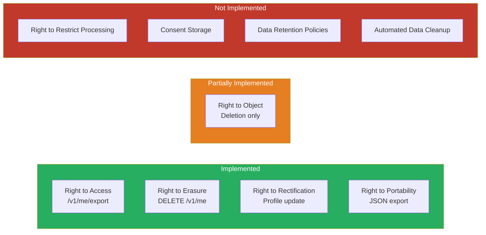

### Recommendations

1. **Add a Consent table** to the database schema: `userId`, `consentType`, `consentVersion`, `grantedAt`, `ipAddress`, `userAgent`. Store consent proof on every signup.
2. **Define data retention policies.** Financial records: 7 years (regulatory requirement). User activity logs: 90 days. Session data: 30 days. Implement automated cleanup jobs.
3. **Hash email addresses in Redis keys.** Use SHA-256 of the email as the key (e.g., `rate_limit:a1b2c3d4`).
4. **Anonymize IP addresses in logs.** Truncate the last octet for IPv4 (e.g., `192.168.1.0`) or use a keyed hash.
5. **Replace console.log with structured logger** in email service to ensure redaction is applied.

---

## Section 11d: Observability Assessment

**Score: 4/10**

### Current Observability Stack

| Component | Status | Detail |
|-----------|--------|--------|
| Structured Logging | Implemented | JSON format with correlation IDs, request timing |
| Sensitive Data Redaction | Implemented | Custom logger redacts passwords, tokens, API keys |
| Health Check | Implemented | `/health` endpoint with DB and Redis checks |
| Readiness Check | Missing | `/ready` endpoint referenced in documentation but not implemented |
| Metrics Collection | Broken | In-memory only; lost on restart; not exported to Prometheus |
| Distributed Tracing | Not Wired | OpenTelemetry package installed but not configured |
| Error Tracking | Not Configured | Sentry/Datadog env vars exist but no integration code |
| Alerting | Not Configured | No alerting rules defined |
| Saturation Monitoring | Not Configured | No connection pool, memory, or CPU monitoring |
| Slow Query Logging | Not Configured | Prisma logging not set to capture slow queries |

### Observability Maturity Model

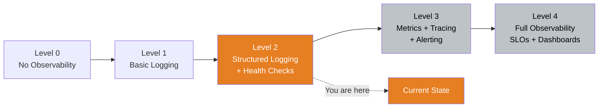

### Findings

| ID | Severity | Finding | Location | Business Impact |
|----|----------|---------|----------|-----------------|
| O-1 | MEDIUM | Metrics collected in-memory array; lost on process restart; not exported to any time-series database | `apps/api/src/plugins/observability.ts` | No historical performance data; cannot track trends, set baselines, or detect degradation over time |
| O-2 | MEDIUM | OpenTelemetry npm package installed but no instrumentation code; traces are not being collected | `package.json` dependency | Distributed tracing unavailable; cannot trace a request across services or identify bottlenecks |
| O-3 | MEDIUM | Sentry and Datadog environment variables defined but no integration code exists | `.env.example` | Errors in production are invisible; no alerting on exceptions or error rate spikes |
| O-4 | LOW | `/ready` endpoint referenced in health check documentation but the route is not defined | Health check documentation vs route files | Kubernetes-style readiness probes would fail; load balancers cannot determine if the service is ready to accept traffic |
| O-5 | LOW | No saturation monitoring for database connection pool, Redis connection pool, or Node.js event loop | Project-wide | Resource exhaustion (like the H-2 connection pool issue) would go undetected until service failure |

### Recommendations

1. **Wire OpenTelemetry to Prometheus.** Configure the OpenTelemetry SDK to export metrics via the Prometheus exporter. Create a `/metrics` endpoint that Prometheus can scrape.
2. **Add the `/ready` endpoint.** Return 200 when the service has completed startup, database migrations are applied, and Redis is connected. Return 503 otherwise.
3. **Configure Sentry for error tracking.** Install `@sentry/node` and initialize it in the application bootstrap. Use the existing env vars.
4. **Add Prisma slow query logging.** Enable `log: ['query', 'warn', 'error']` in the Prisma client and filter for queries exceeding 100ms.
5. **Add saturation monitoring.** Track `prisma_pool_active_connections`, `redis_connected_clients`, and `nodejs_eventloop_lag_seconds` via OpenTelemetry metrics.

---

## Section 11e: API Design Assessment

**Score: 7/10**

### API Statistics

| Metric | Value |
|--------|-------|
| Total routes | 40 |
| Routes requiring JWT auth | 33 |
| Public routes (no auth) | 7 (health, checkout, webhook-verify, login, signup, forgot-password, reset-password) |
| Input validation | Zod schemas on all endpoints |
| Error format | RFC 7807 Problem Details |
| Pagination | Present on all list endpoints |
| Idempotency | Supported on payment creation |
| API versioning | `/v1/` prefix |

### Strengths

1. **Consistent Zod validation** on all endpoints with descriptive error messages.
2. **RFC 7807 error format** across all error paths (AppError, validation, rate limit, server error).
3. **BOLA protection** on resource endpoints (payment sessions, webhooks, API keys).
4. **Idempotency keys** on payment session creation to prevent duplicate charges.
5. **API versioning** with `/v1/` prefix for future backward compatibility.
6. **Pagination** on all list endpoints with consistent `page`/`limit` parameters.

### Findings

| ID | Severity | Finding | Location | Business Impact |
|----|----------|---------|----------|-----------------|
| M-3 | MEDIUM | No Fastify route-level JSON schemas defined despite @fastify/swagger being installed; OpenAPI spec cannot be auto-generated | All route files in `apps/api/src/routes/v1/` | Developers cannot discover the API through auto-generated documentation; Swagger UI shows incomplete or empty schemas |
| API-1 | MEDIUM | Inconsistent pagination defaults across endpoints (some default to 10, others to 20, others to 50) | Various route handlers | API consumers must check each endpoint individually for pagination behavior |
| API-2 | LOW | Checkout endpoint returns completed payment sessions in the list response; should filter to active sessions only | `apps/api/src/routes/v1/checkout.ts` | Customers see stale completed payment sessions alongside active ones |
| API-3 | LOW | No request/response compression (gzip/brotli) configured | `apps/api/src/app.ts` | Larger payloads than necessary on list endpoints; increased bandwidth costs |

### Route Inventory

| Route Group | Endpoints | Auth | Rate Limited |
|-------------|-----------|------|-------------|
| `/v1/auth` | 7 (signup, login, logout, refresh, forgot-password, reset-password, change-password) | Mixed | Global only |
| `/v1/payment-sessions` | 5 (CRUD + process) | JWT/API Key | Global only |
| `/v1/payment-links` | 4 (CRUD) | JWT | Global only |
| `/v1/refunds` | 5 (CRUD + process + complete + fail) | JWT | Global only |
| `/v1/webhooks` | 5 (CRUD + test) | JWT | Global only |
| `/v1/api-keys` | 4 (CRUD + rotate) | JWT | Global only |
| `/v1/checkout` | 3 (session, pay, status) | None (public) | Global only |
| `/v1/analytics` | 2 (dashboard, export) | JWT | Global only |
| `/v1/me` | 3 (profile, export, delete) | JWT | Global only |
| `/v1/admin` | 1 (metrics) | JWT + Admin role | Global only |
| `/v1/notifications` | 1 (SSE stream) | JWT | Global only |
| `/v1/dev` | 1 (simulate) | None | None |

### Recommendations

1. **Add Fastify route-level schemas.** Define `schema: { body: ..., response: { 200: ... } }` on every route handler. This enables auto-generated OpenAPI documentation via `@fastify/swagger`.
2. **Standardize pagination defaults.** Use `page=1, limit=20` as the default across all list endpoints. Document this in the API reference.
3. **Filter checkout list** to exclude completed sessions (or add a `status` query parameter to allow filtering).
4. **Add response compression.** Register `@fastify/compress` with gzip and brotli support.

---

## Section 12: Technical Debt Map

### Debt Quadrant

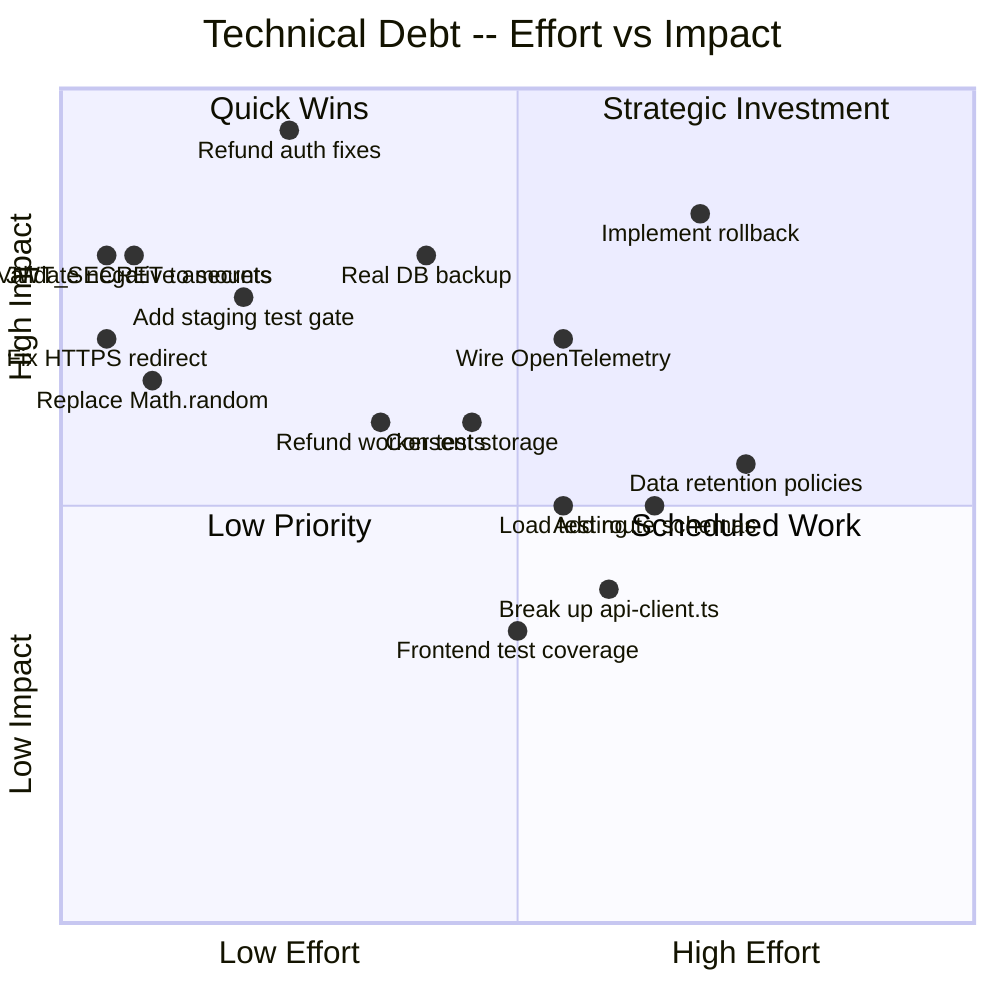

### Technical Debt Inventory

| Debt Item | Category | Estimated Effort | Impact if Unresolved | Priority |
|-----------|----------|-----------------|---------------------|----------|
| Refund authorization bypass (C-1, C-2, C-3) | Security | 10 hours | Financial loss, regulatory failure | P0 |
| CI/CD pipeline gaps (CI-1 through CI-6) | DevOps | 20 hours | Broken deploys, data loss, secret exposure | P0 |
| Negative amount validation (H-9) | Security | 1 hour | Reversed fund flows | P0 |
| HTTPS redirect (H-10) | Security | 0.5 hours | Data interception | P0 |
| JWT_SECRET rotation (CI-6) | Security | 1 hour | Token forgery | P0 |
| Webhook event ID (H-4) | Security | 1 hour | Replay attacks | P1 |
| Rate limit atomicity (H-8) | Reliability | 2 hours | Permanent user lockout | P1 |
| Nonce manager atomicity (H-6) | Reliability | 3 hours | Duplicate blockchain transactions | P1 |
| Refund worker DB transaction (H-2) | Performance | 6 hours | Service outage under load | P1 |
| Spending limit rollback (H-3) | Financial | 3 hours | Merchants blocked from transacting | P1 |
| OpenTelemetry wiring (O-1, O-2) | Observability | 8 hours | Blind to production issues | P1 |
| Consent storage (P-1) | Privacy | 4 hours | GDPR non-compliance | P2 |
| Data retention policies (P-2) | Privacy | 8 hours | GDPR non-compliance | P2 |
| Frontend accessibility (FE-2, ACC-1, ACC-2) | Accessibility | 8 hours | Exclusion of disabled users | P2 |
| Route schemas for OpenAPI (M-3) | API Design | 8 hours | Poor developer experience | P2 |
| Break up api-client.ts (FE-4) | Architecture | 8 hours | High coupling in frontend | P3 |
| Cascade delete fix (A-3) | Compliance | 4 hours | Financial record destruction | P2 |
| Load testing (T-3) | Testing | 8 hours | Unknown performance envelope | P3 |
| 101 `any` types | Code Quality | 16 hours | Reduced type safety | P3 |
| 86 console.log in production code | Code Quality | 4 hours | Bypasses structured logging | P3 |

---

## Section 13: Remediation Roadmap

### Gantt Chart

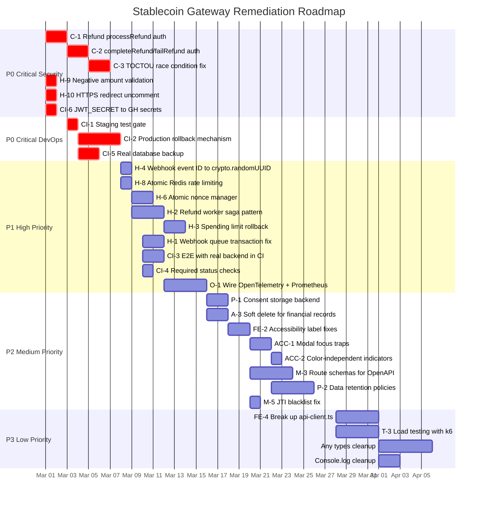

### Sprint Plan

**Sprint 1 (March 1-7): Critical Security and DevOps** -- Estimated 25 hours

| Task | Owner | Hours | Acceptance Criteria |
|------|-------|-------|---------------------|
| Fix C-1: Add userId parameter and ownership check to processRefund | Backend Engineer | 2 | Unit test proves different user cannot process refund; integration test with 2 users |
| Fix C-2: Add authorization and FOR UPDATE to completeRefund/failRefund | Backend Engineer | 4 | Concurrent test proves no duplicate state transitions; auth test proves ownership required |
| Fix C-3: Add serializable transaction or FOR UPDATE to updatePaymentStatusIfFullyRefunded | Backend Engineer | 4 | Concurrent refund completion test proves correct final payment status |
| Fix H-9: Add positive amount validation to amountToTokenUnits | Backend Engineer | 1 | Unit test with negative amount throws error |
| Fix H-10: Uncomment HTTPS redirect in nginx.conf | DevOps Engineer | 0.5 | HTTP request returns 301 to HTTPS |
| Fix CI-6: Move JWT_SECRET to GitHub Actions secrets and rotate | DevOps Engineer | 1 | CI passes with secret from GH secrets; old secret invalidated |
| Fix CI-1: Add test gate to staging deployment | DevOps Engineer | 2 | Staging deploy blocked when tests fail |
| Fix CI-5: Implement real pg_dump backup | DevOps Engineer | 4 | Backup file created and uploaded to object storage before deploy |
| Fix CI-2: Implement Docker image versioning and rollback | DevOps Engineer | 8 | Rollback to previous version completes in under 2 minutes |

**Sprint 2 (March 8-14): High Priority Reliability and Observability** -- Estimated 20 hours

| Task | Owner | Hours | Acceptance Criteria |
|------|-------|-------|---------------------|
| Fix H-4: Replace Math.random() with crypto.randomUUID() | Backend Engineer | 1 | Event IDs are valid UUIDs; no collisions in 10,000 generations |
| Fix H-8: Atomic rate limit with Lua script | Backend Engineer | 2 | Rate limit works correctly under 100 concurrent requests |
| Fix H-6: Atomic nonce manager with Lua script | Backend Engineer | 3 | No nonce reuse under 50 concurrent blockchain transactions |
| Fix H-2: Refund worker saga pattern | Backend Engineer | 6 | Transaction held under 100ms; blockchain call outside transaction |
| Fix H-3: Spending limit rollback on failed tx | Backend Engineer | 3 | Failed tx restores spending capacity; unit test proves rollback |
| Fix CI-3: E2E with real backend in CI | DevOps Engineer | 4 | CI E2E job starts API + DB + Redis and runs real tests |
| Fix CI-4: Required status checks | DevOps Engineer | 1 | PR cannot merge with failing security or E2E job |

**Sprint 3 (March 15-27): Privacy, Compliance, and Accessibility** -- Estimated 30 hours

Focus on consent storage, data retention policies, accessibility fixes, and OpenAPI schema generation. See Gantt chart for detailed timeline.

**Sprint 4 (March 28 - April 7): Technical Debt and Polish** -- Estimated 20 hours

Focus on frontend architecture (api-client.ts decomposition), load testing, TypeScript strictness, and console.log cleanup.

### Expected Score After Remediation

| Dimension | Current | After Sprint 1 | After Sprint 2 | After Sprint 4 |
|-----------|---------|----------------|----------------|----------------|
| Security | 6 | 8 | 8.5 | 9 |
| Architecture | 7 | 7 | 7 | 7.5 |
| Test Coverage | 7 | 7 | 7.5 | 8 |
| Code Quality | 7 | 7 | 7 | 7.5 |
| Performance | 7 | 7 | 8 | 8 |
| DevOps | 4 | 7 | 8 | 8 |
| Runability | 8 | 8 | 8 | 8 |
| Accessibility | 5 | 5 | 5 | 7 |
| Privacy | 5 | 5 | 5 | 7 |
| Observability | 4 | 4 | 7 | 7 |
| API Design | 7 | 7 | 7 | 8 |
| **Overall** | **6.0** | **6.7** | **7.3** | **7.8** |

---

## Section 14: Quick Wins

These are changes that can be completed in under 2 hours each and have high impact relative to effort.

| # | Quick Win | Effort | Impact | File to Change |
|---|-----------|--------|--------|---------------|
| 1 | Uncomment HTTPS redirect in nginx.conf | 5 minutes | Prevents traffic interception | `nginx.conf:30-33` |
| 2 | Move JWT_SECRET to GitHub Actions secrets | 15 minutes | Eliminates hardcoded secret in repo | `ci.yml:73` + GitHub Settings |
| 3 | Add positive amount validation to amountToTokenUnits | 30 minutes | Prevents reversed fund flows | `apps/api/src/utils/token-units.ts:21-26` |
| 4 | Replace Math.random() with crypto.randomUUID() for webhook event IDs | 15 minutes | Prevents replay attacks and ID collisions | `apps/api/src/services/webhook-delivery.service.ts:118` |
| 5 | Add visible labels to Security page password inputs | 30 minutes | Fixes critical accessibility violation | `apps/web/src/pages/dashboard/Security.tsx:74-96` |
| 6 | Remove mock API key from DeveloperIntegration component | 15 minutes | Eliminates exposed key in frontend bundle | `apps/web/src/components/dashboard/DeveloperIntegration.tsx:38` |
| 7 | Make security and E2E jobs required status checks | 15 minutes | Prevents merging PRs with security failures | GitHub repository settings |
| 8 | Add authentication to dev simulate route | 30 minutes | Prevents unauthorized event simulation | `apps/api/src/routes/v1/dev.ts:10` |
| 9 | Replace email in Redis key with SHA-256 hash | 30 minutes | Removes plaintext email from Redis | `apps/api/src/utils/redis-rate-limit-store.ts` |
| 10 | Add /ready endpoint | 45 minutes | Enables Kubernetes readiness probes | `apps/api/src/routes/v1/` (new file) |
| 11 | Add env guard to dev simulate route | 15 minutes | Ensures dev route cannot run in production | `apps/api/src/routes/v1/dev.ts` |
| 12 | Fix dead ToS/Privacy Policy links on signup page | 30 minutes | Removes dead links; legal compliance | `apps/web/src/pages/auth/Signup.tsx:196-202` |

**Total quick wins effort: approximately 5 hours for 12 improvements.**

---

## Section 15: AI-Readiness Score

### Score Breakdown

| Composite | Score | Weight | Weighted |
|-----------|-------|--------|----------|
| Technical Score | 6.1 | 25% | 1.525 |
| Security Readiness | 6.0 | 25% | 1.500 |
| Product Potential | 6.9 | 25% | 1.725 |
| Enterprise Readiness | 4.9 | 25% | 1.225 |
| **Overall** | | | **6.0/10** |

### Detailed Composite Calculations

**Technical Score** = avg(6, 7, 7, 7, 7, 4, 8, 5, 5, 4, 7) = 67/11 = **6.1/10**

**Security Readiness** = Security(40%) + API Design(20%) + DevOps(20%) + Architecture(20%)
= 6(0.4) + 7(0.2) + 4(0.2) + 7(0.2) = 2.4 + 1.4 + 0.8 + 1.4 = **6.0/10**

**Product Potential** = Code Quality(30%) + Architecture(25%) + Runability(25%) + Accessibility(20%)
= 7(0.3) + 7(0.25) + 8(0.25) + 5(0.2) = 2.1 + 1.75 + 2.0 + 1.0 = **6.9/10**

**Enterprise Readiness** = Security(30%) + Privacy(25%) + Observability(20%) + DevOps(15%) + Compliance(10%)
= 6(0.3) + 5(0.25) + 4(0.2) + 4(0.15) + 4(0.1) = 1.8 + 1.25 + 0.8 + 0.6 + 0.4 = **4.9/10**

### Production Readiness Assessment

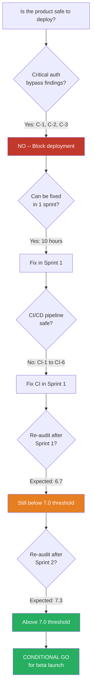

### Recommendation

**The Stablecoin Gateway is NOT ready for production deployment at 6.0/10.** The three critical authorization bypass vulnerabilities in the refund flow and the broken CI/CD pipeline make this a security and operational risk.

**Path to production:**
1. **Sprint 1 (1 week):** Fix all P0 critical security and DevOps issues. Expected score: 6.7/10.
2. **Sprint 2 (1 week):** Fix all P1 high-priority reliability and observability issues. Expected score: 7.3/10.
3. **Beta launch gate:** Re-audit after Sprint 2. If score reaches 7.0+, proceed with beta launch to limited merchants.
4. **Sprint 3-4 (2 weeks):** Fix P2 and P3 items (privacy, accessibility, technical debt). Expected score: 7.8/10.
5. **GA launch gate:** Re-audit after Sprint 4. If score reaches 7.5+, proceed with general availability.

**The product has strong fundamentals.** The architecture is clean, the test volume is substantial, financial calculations use Decimal.js, and the payment state machine is well-designed. With 2 weeks of focused remediation, this product can reach a production-ready state.

---

## Appendix A: Version History

| Version | Date | Score | Auditor | Key Changes |
|---------|------|-------|---------|-------------|
| 1.0 | 2026-02-10 | N/A | Code Reviewer | Initial audit |
| 2.0 | 2026-02-10 | 7.2/10 | Code Reviewer | Formal scoring added |
| 3.0 | 2026-02-27 | 7.5/10 | Code Reviewer | Re-audit after remediation PRs #328, #329 |
| 4.0 | 2026-02-28 | 6.0/10 | Code Reviewer (6 parallel agents) | Deep-dive with 11 dimensions (was 7); 6 specialist agents; expanded scope to privacy, observability, accessibility, API design |

## Appendix B: Agent Coverage Matrix

| Agent | Domain | Files Reviewed | Findings Produced |
|-------|--------|---------------|-------------------|
| Services and Business Logic | 19 service files, 12 workers | All service and worker files | 3 Critical, 6 High, 9 Medium, 7 Low |
| Routes and API Layer | 12 route files, 40 endpoints | All route files | 0 Critical, 0 High, 3 Medium, 1 Low |
| Plugins, Utils, and Schema | Plugins, utilities, Prisma schema | All plugin, util, and schema files | 0 Critical, 4 High, 4 Medium, 0 Low |
| Tests and CI/CD | 175 test files, 4 CI workflows | All test and workflow files | 3 Critical (CI), 3 High (CI), 0 Medium, 0 Low |
| Frontend and Accessibility | 70 source files, 10,743 lines | All frontend source files | 2 P0, 2 P1, 0 P2 (plus accessibility findings) |
| Privacy and Observability | Logging, metrics, GDPR controls | Cross-cutting analysis | Privacy: 5 findings; Observability: 5 findings |

## Appendix C: Glossary

| Term | Definition |
|------|-----------|
| BOLA | Broken Object-Level Authorization -- an attacker accesses resources belonging to other users by manipulating IDs |
| TOCTOU | Time-of-Check to Time-of-Use -- a race condition where the state checked and the state acted upon differ |
| JTI | JWT Token Identifier -- a unique ID embedded in each JWT to enable blacklisting |
| HMAC | Hash-based Message Authentication Code -- a keyed hash used for message integrity and authentication |
| AES-256-GCM | Advanced Encryption Standard with 256-bit key in Galois/Counter Mode -- authenticated encryption |
| RFC 7807 | Problem Details for HTTP APIs -- a standard format for machine-readable error responses |
| SSRF | Server-Side Request Forgery -- an attack where the server is tricked into making requests to unintended destinations |
| PCI-DSS | Payment Card Industry Data Security Standard -- security standard for organizations handling payment data |
| SOC 2 | Service Organization Control 2 -- an auditing framework for service organizations |
| MiCA | Markets in Crypto-Assets -- EU regulation for cryptocurrency businesses |
| SLO | Service Level Objective -- a target value for a service-level indicator |
| SAST | Static Application Security Testing -- automated code scanning for security vulnerabilities |

---

**Report generated**: 2026-02-28
**Next audit recommended**: After Sprint 2 completion (target: 2026-03-14)
**Target score for beta launch**: 7.0/10
**Target score for GA launch**: 7.5/10
