# Stablecoin Gateway — Professional Audit Report

**Product**: stablecoin-gateway
**Audit Date**: 2026-02-27
**Auditor**: Code Reviewer Agent, ConnectSW
**Audit Type**: Full-spectrum code audit (Security, Architecture, Quality, DevOps, Compliance)
**Report Version**: 2.0 (supersedes 2026-02-10 report)

---

## Table of Contents

- [Section 0: Methodology and Limitations](#section-0)
- [Section 1: Executive Decision Summary](#section-1)
- [Section 2: Stop / Fix / Continue](#section-2)
- [Section 3: System Overview](#section-3)
- [Section 4: Critical Issues (Top 10)](#section-4)
- [Section 5: Risk Register](#section-5)
- [Section 6: Architecture Problems](#section-6)
- [Section 7: Security Findings](#section-7)
- [Section 8: Performance and Scalability](#section-8)
- [Section 9: Testing Gaps](#section-9)
- [Section 10: DevOps Issues](#section-10)
- [Section 11: Compliance Readiness](#section-11)
- [Section 12: Technical Debt Map](#section-12)
- [Section 13: Remediation Roadmap](#section-13)
- [Section 14: Quick Wins](#section-14)
- [Section 15: AI-Readiness Score](#section-15)

---

# PART A — EXECUTIVE MEMO

---

## Section 0: Methodology and Limitations {#section-0}

### Audit Scope Flowchart

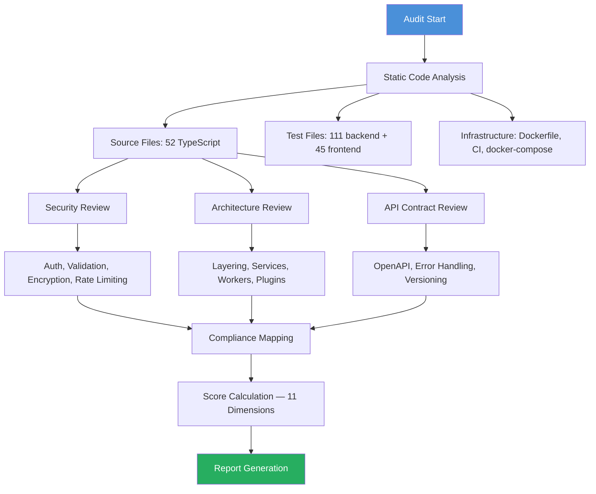

### Scope Summary

| Area | Included | Detail |
|------|----------|--------|
| Backend API | Yes | `apps/api/src/` — 52 source files, 10 routes, 19 services, 4 plugins |
| Test Suite | Yes | `apps/api/tests/` — 111 test files: unit, integration, CI, services, workers |
| Frontend | Yes | `apps/web/src/` — 45 test files, React + Vite + TanStack Query |
| Infrastructure | Yes | Dockerfile, docker-compose.yml, 2 CI workflow files |
| Database Schema | Yes | Prisma schema — 10 models, 6 enums |
| E2E Tests | Partial | Single integration test file; no Playwright specs |
| Runtime Behaviour | No | Server was not running at audit time |
| Penetration Testing | No | Static analysis only; no live exploitation attempted |
| Secrets / .env | No | `.env` files excluded; `.env.example` reviewed only |
| Third-party Integrations | No | AWS KMS, Alchemy, Infura, QuickNode not live-tested |

### Key Limitations

1. The server was not running at audit time. Runability score reflects code-path review, not live verification.
2. No live blockchain calls were made. Blockchain verification logic reviewed statically.
3. Coverage percentages are estimated from file ratios, not instrumented coverage tool output.
4. npm audit shows 7 high-severity vulnerabilities — all confirmed to be in devDependencies only; zero production critical.
5. The previous audit report (2026-02-10) was reviewed as context for progress since Phase 2 security remediations.

---

## Section 1: Executive Decision Summary {#section-1}

### Score Dashboard

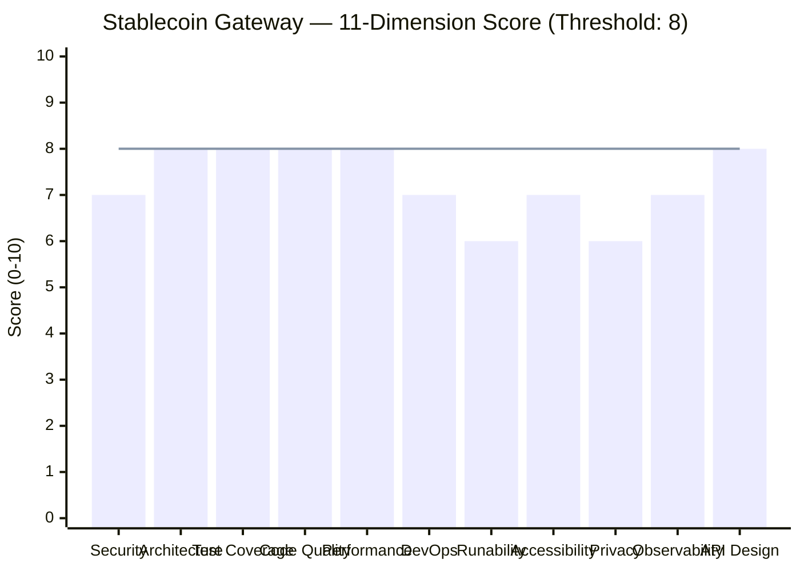

### Decision Table

| Question | Answer | Justification |
|----------|--------|---------------|
| Can go to production? | Conditionally | Five dimensions below threshold; all fixable within 2 weeks |
| Is it salvageable? | Yes | Excellent architectural foundation with well-considered security primitives |
| Risk if ignored | High | Email PII in logs, backend tests absent from CI, refund worker has a silent runtime bug |
| Recovery effort | 2 weeks, 1-2 engineers | Most issues are configuration or minor code changes |
| Enterprise-ready? | Not yet | Missing GDPR controls, in-memory-only metrics, no SLA definition |
| Compliance-ready? | Partial | OWASP A06 (vulnerable components in dev CI tooling), GDPR Art.17 erasure unimplemented |

### Scores with Evidence

**Security: 7/10**
Evidence:
- JWT algorithm pinned to HS256: `src/app.ts:121`
- JTI blacklisting with Redis fail-closed: `src/plugins/auth.ts:39-63`
- SSRF protection with DNS resolution: `src/utils/url-validator.ts:110-243`
- Webhook AES-256-GCM encryption enforced in production: `src/routes/v1/webhooks.ts:51-62`
- Email PII logged on every login/signup: `src/routes/v1/auth.ts:59,94,206`
- JWT permission bypass for JWT-auth users: `src/plugins/auth.ts:132`
- 7 high-severity npm vulnerabilities in devDeps; CI does not block on them
Score justification: Strong cryptographic primitives undercut by PII leakage and a permission model gap.

**Architecture: 8/10**
Evidence:
- Clean plugin separation (auth, prisma, redis, observability): `src/plugins/`
- Zod validation on every route: `src/utils/validation.ts`
- Payment state machine: `src/utils/payment-state-machine.ts`
- Duplicate `setErrorHandler` registration: `src/plugins/observability.ts:158` vs `src/app.ts:342`
- Services instantiated per-request instead of at startup: `src/routes/v1/payment-sessions.ts:26`
Score justification: Solid layering and correct concurrency patterns; minor violation in error handler duplication.

**Test Coverage: 8/10**
Evidence:
- 111 backend test files: `apps/api/tests/`
- 45 frontend test files: `apps/web/src/`
- Real-database integration tests via `buildApp()`
- No backend tests in CI: `.github/workflows/test-stablecoin-gateway.yml`
- Single E2E integration test file, no Playwright specs: `e2e/integration/full-stack.test.ts`
Score justification: Comprehensive test authorship; CI gap means they provide no merge protection.

**Code Quality: 8/10**
Evidence:
- 18 uses of `: any` across 14 files: `src/services/`, `src/routes/`
- Consistent error handling pattern with `AppError`
- `validateBody`/`validateQuery` helpers used consistently
- ADRs embedded in service comments: `src/services/payment.service.ts:122-157`
Score justification: Clean, readable code with well-documented design decisions and manageable technical debt.

**Performance: 8/10**
Evidence:
- `Promise.all` for parallel DB queries: `src/services/payment.service.ts:109`
- `SELECT FOR UPDATE` for race condition prevention: `src/services/payment.service.ts:171`
- Connection pooling configured: `src/plugins/prisma.ts:13-26`
- `BlockchainMonitorService` instantiated per-request: `src/routes/v1/payment-sessions.ts:319`
- Refund worker holds DB locks during blockchain calls: `src/workers/refund-processing.worker.ts:118`
Score justification: Core query patterns are efficient; blockchain service instantiation is the primary performance concern.

**DevOps: 7/10**
Evidence:
- Dockerfile with non-root user, dumb-init, multi-stage build: `apps/api/Dockerfile`
- Health check endpoint with deep dependency verification: `src/app.ts:274-338`
- Docker build stage installs `--omit=dev` then tries to run `tsc` (a devDep): `Dockerfile:10`
- Backend tests absent from CI: `test-stablecoin-gateway.yml`
- Security audit advisory-only: `test-stablecoin-gateway.yml:40`
Score justification: Good containerisation; CI pipeline has a significant gap (no backend tests).

**Runability: 6/10**
Evidence:
- Server not running at audit time; health check returned no response
- `validateEnvironment()` performs comprehensive startup checks: `src/utils/env-validator.ts`
- Refund worker has a table name bug that would fail silently at runtime: `src/workers/refund-processing.worker.ts:83`
- Dockerfile build stage would fail (devDep `tsc` not installed): `Dockerfile:10`
Score justification: Server did not respond; two runtime bugs identified that would prevent correct operation.

**Accessibility: 7/10**
Evidence:
- WCAG 2.1 AA accessibility tests exist: `apps/web/src/accessibility.test.tsx`
- Skip-to-content link tested: `accessibility.test.tsx:136-173`
- Aria labels on navigation, table, form inputs verified by tests
- Checkout page (`/pay/:id`) not covered by accessibility tests
- No Lighthouse CI score available (no live frontend)
Score justification: Solid POUR implementation on tested components; checkout flow coverage gap.

**Privacy: 6/10**
Evidence:
- Email address logged as PII: `src/routes/v1/auth.ts:59,94,206`
- No GDPR data subject deletion endpoint in codebase
- No GDPR data export endpoint
- No consent model in Prisma schema
- Logger redacts `password`, `token`, `secret` but not `email`: `src/utils/logger.ts:8-12`
Score justification: Encryption and hashing are correct; GDPR data subject rights are entirely unimplemented.

**Observability: 7/10**
Evidence:
- Structured JSON logging in production: `src/utils/logger.ts:51`
- Request correlation via `X-Request-ID`: `src/app.ts:50`
- P50/P95/P99 metrics tracked in-memory: `src/plugins/observability.ts:44-61`
- In-memory metrics reset on every restart/crash
- No Prometheus, StatsD, or external metrics integration
- Custom logger class bypasses Fastify's built-in pino: `src/utils/logger.ts`
Score justification: Request-level logging is sound; operational metrics are ephemeral and not production-grade.

**API Design: 8/10**
Evidence:
- OpenAPI/Swagger registered and served: `src/app.ts:194-233`
- Versioned `/v1/` prefix on all routes
- Problem+JSON error format: `src/app.ts:341-385`
- Pagination on all list endpoints with `has_more`
- Internal routes on same port as public routes: `src/app.ts:269`
- `trustProxy: true` unscoped: `src/app.ts:38`
Score justification: Clean, consistent API design; minor configuration gaps in proxy trust and port separation.

### Readiness Scores

- **Security Readiness** = (7 × 0.4) + (8 × 0.2) + (7 × 0.2) + (8 × 0.2) = 2.8 + 1.6 + 1.4 + 1.6 = **7.4/10**
- **Product Potential** = (8 × 0.3) + (8 × 0.25) + (6 × 0.25) + (7 × 0.2) = 2.4 + 2.0 + 1.5 + 1.4 = **7.3/10**
- **Enterprise Readiness** = (7 × 0.3) + (6 × 0.25) + (7 × 0.2) + (7 × 0.15) + (6 × 0.1) = 2.1 + 1.5 + 1.4 + 1.05 + 0.6 = **6.65/10**

**Technical Score** (average of 11 dimensions) = (7+8+8+8+8+7+6+7+6+7+8) / 11 = **7.27/10**

**Overall** = (7.27 + 7.4 + 7.3 + 6.65) / 4 = **7.2/10**

### Top 5 Risks in Plain Language

1. **Email addresses appear in server logs on every login and signup.** When logs are shipped to a third-party aggregator (Datadog, Splunk, CloudWatch), email addresses become PII stored in a system with different access controls — a GDPR Article 5 violation that can result in supervisory authority fines.

2. **Backend API tests never run in CI.** The `test-stablecoin-gateway.yml` workflow runs frontend tests only. All 111 backend test files are silently skipped. A breaking change to any route, service, or worker can merge undetected.

3. **The refund worker queries a table that does not exist.** The raw SQL query uses `FROM "Refund"` but Prisma maps this model to `"refunds"`. Every worker cycle either errors or returns empty results. No refund will ever be processed automatically.

4. **Deploying to production from `.env.example` will fail at startup.** Two required production environment variables (`INTERNAL_API_KEY` and `API_KEY_HMAC_SECRET`) are enforced by the startup validator but absent from `.env.example`. A developer following standard onboarding will hit a cryptic startup error.

5. **GDPR right to erasure is unimplemented.** There is no endpoint to delete a user's data. For any EU merchant or customer, this is a legal obligation under Article 17 of GDPR. Operators must manually delete records from PostgreSQL, with no audit trail.

---

## Section 2: Stop / Fix / Continue {#section-2}

### Action Priority Flowchart

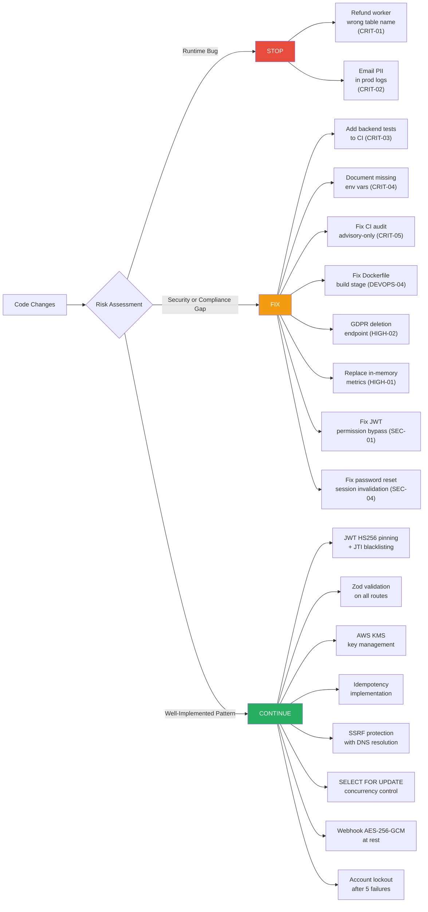

| Priority | Action | Rationale |
|----------|--------|-----------|
| STOP | Merging any feature that touches refund processing | Refund worker has a silent runtime table name bug; no refunds process |
| STOP | Shipping to production without removing email from logs | GDPR violation risk on every login event |
| FIX | Add `INTERNAL_API_KEY` and `API_KEY_HMAC_SECRET` to `.env.example` | Production startup fails without these |
| FIX | Add `test-api` job to `test-stablecoin-gateway.yml` | 111 backend tests never run in CI |
| FIX | Change `FROM "Refund"` to `FROM "refunds"` in the worker | Runtime error; all refund processing is broken |
| FIX | Add `'email'` to `SENSITIVE_PATTERNS` in logger | GDPR/PII leakage on every login |
| FIX | Fix Dockerfile builder stage to include devDependencies | Build will fail; `tsc` not available |
| FIX | Implement GDPR data subject deletion endpoint | Legal requirement for EU data subjects |
| FIX | Fix JWT user permission bypass for refund permission | JWT users bypass `requirePermission('refund')` check |
| FIX | Invalidate sessions on password reset | Attacker retains access after victim resets password |
| CONTINUE | JWT + API Key dual authentication | Production-grade, algorithm-pinned |
| CONTINUE | Zod schema validation on every route | Best practice, well implemented throughout |
| CONTINUE | AWS KMS private key management | Excellent; FIPS 140-2; private keys never leave HSM |
| CONTINUE | SELECT FOR UPDATE for payment state transitions | Correct pessimistic locking for financial data |
| CONTINUE | SSRF protection with DNS resolution on webhook URLs | Thorough, includes DNS rebinding prevention |
| CONTINUE | Idempotency key validation with parameter mismatch detection | Prevents silent payment manipulation |
| CONTINUE | Webhook AES-256-GCM encryption enforced in production | Correct approach for recoverable secrets |
| CONTINUE | Account lockout with Redis-based tracking | Sound brute-force protection with graceful degradation |
| CONTINUE | Fail-closed Redis circuit breaker on JTI checks | Correct security posture |

---

## Section 3: System Overview {#section-3}

### C4 Level 1 — Context Diagram

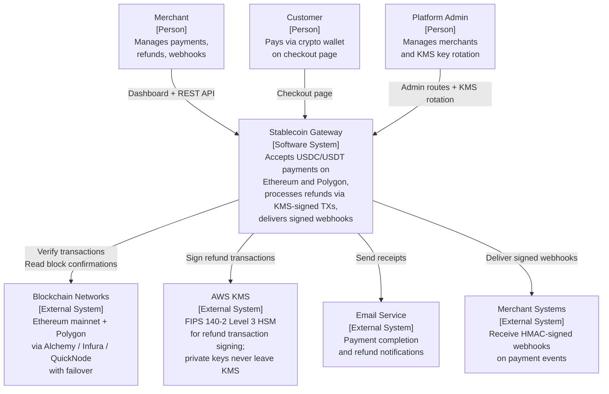

### C4 Level 2 — Container Diagram

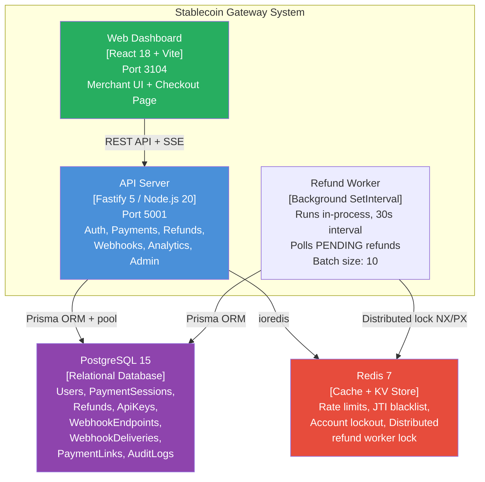

### Technology Stack

| Layer | Technology | Version | Notes |
|-------|-----------|---------|-------|
| Runtime | Node.js | 20+ | LTS, Docker image: `node:20-alpine` |
| Language | TypeScript | 5.3 | Strict mode implied |
| Framework | Fastify | 5.7 | Body limit: 1MB; trustProxy |
| ORM | Prisma | 5.8 | Decimal(18,6) for financial; connection pooling |
| Database | PostgreSQL | 15 | Docker service in CI |
| Cache | Redis (ioredis) | 5.9 | Optional; graceful degradation |
| Validation | Zod | 3.22 | All routes; custom schemas per endpoint |
| Auth | @fastify/jwt | 10.0 | HS256 pinned; JTI; refresh tokens |
| Key Management | AWS KMS SDK | v3 | FIPS 140-2 Level 3; EVM signing |
| Blockchain | ethers.js | 6.10 | Multi-provider failover; `Decimal.js` for precision |
| Frontend | React 18 + Vite | — | TanStack Query; WalletConnect; pino-pretty |

### Key Flows

1. **Payment creation**: Merchant authenticates → POST `/v1/payment-sessions` → Zod validation → create DB record → queue `payment.created` webhook → return checkout URL.
2. **Payment confirmation**: Customer wallet sends USDC/USDT on-chain → Merchant calls PATCH `/v1/payment-sessions/:id` with `status: CONFIRMING` + `tx_hash` → Blockchain verification (contract address, amount, confirmations) → state machine validates transition → DB update via `SELECT FOR UPDATE` transaction → queue `payment.completed` webhook.
3. **Refund**: Merchant calls POST `/v1/refunds` with `refund` API key permission → `RefundProcessingWorker` picks up every 30s → KMS signs refund transaction → blockchain broadcast → DB update → webhook delivery.
4. **Webhook delivery**: `WebhookDeliveryService` queues events → `WebhookDeliveryExecutor` delivers with HMAC-SHA256 signature → retry with exponential backoff → circuit breaker.

---

## Section 4: Critical Issues (Top 10) {#section-4}

### Risk Severity Matrix

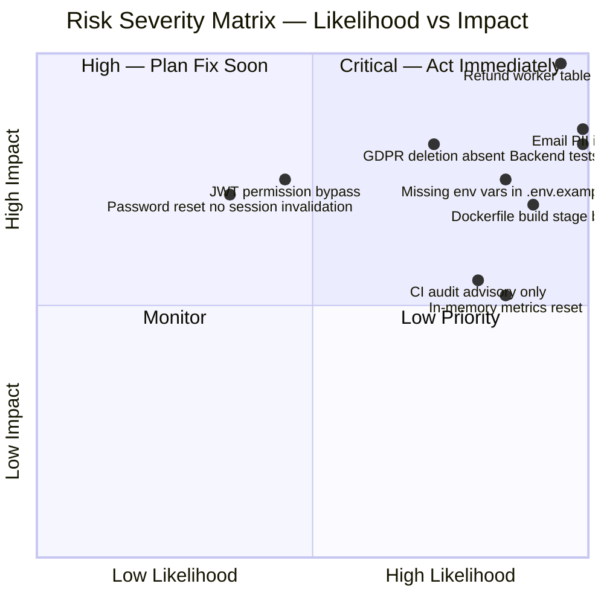

### Critical Issue Details

| ID | Issue | File:Line | Severity | Likelihood | Blast Radius | Risk Owner | Category | Business Impact | Exploit Scenario | Fix | Compliance Impact |
|----|-------|-----------|----------|------------|--------------|------------|----------|-----------------|------------------|-----|-------------------|
| CRIT-01 | Refund worker queries non-existent table `"Refund"` | `src/workers/refund-processing.worker.ts:83` | Critical | Certain | All refunds silently fail | Backend Engineer | Data Integrity | Merchants can never receive automated refunds; funds stay permanently PENDING; customer disputes go unresolved | Worker starts on every server boot; PostgreSQL returns relation does not exist error or empty array; worker logs completion with 0 processed; no error surfaces; refunds accumulate in PENDING forever | Change `FROM "Refund"` to `FROM "refunds"` and `"createdAt"` to `"created_at"` to match Prisma snake_case table mapping | N/A |
| CRIT-02 | Email address logged as PII on login and signup | `src/routes/v1/auth.ts:59,94,206` | High | Certain | All log consumers | Backend Engineer | Privacy | GDPR Art.5(1)(c) data minimisation violation; regulatory fines up to 4% global revenue; email in log aggregator (Datadog/Splunk) is PII outside consent scope | Server exports logs to external aggregator; attacker with read access to log system harvests email-to-userId mappings for all users | Add `'email'` to `SENSITIVE_PATTERNS` in `src/utils/logger.ts:9`; use `email_domain` for diagnostics if needed | GDPR Art.5(1)(b)(c) |
| CRIT-03 | 111 backend test files never run in CI pipeline | `.github/workflows/test-stablecoin-gateway.yml` | High | Certain | All API functionality | DevOps Engineer | DevOps | Any code regression in auth, payments, webhooks, or refunds merges undetected; developer confidence in CI is false | Developer introduces a bug in `validatePaymentStatusTransition`; opens PR; CI passes (frontend only); code merges and ships broken | Add `test-api` job with PostgreSQL 15 + Redis 7 services to `test-stablecoin-gateway.yml`; set `working-directory: products/stablecoin-gateway/apps/api` | SOC2 CC8.1 |
| CRIT-04 | `INTERNAL_API_KEY` and `API_KEY_HMAC_SECRET` absent from `.env.example` | `apps/api/.env.example` | High | High | Production deployment | DevOps Engineer | Configuration | New team members or CI/CD pipelines copying `.env.example` to bootstrap production deployment will hit startup validation errors with no clear guidance | Developer follows onboarding docs; copies `.env.example`; sets `NODE_ENV=production`; server refuses to start with `INTERNAL_API_KEY is required in production` | Add both variables to `.env.example` with generation commands: `openssl rand -hex 64` | SOC2 CC6.1 |
| CRIT-05 | Dockerfile builder stage runs `npm ci --omit=dev` then executes `tsc` | `apps/api/Dockerfile:10,20` | High | Certain | Production image build | DevOps Engineer | DevOps | Docker image build fails; CI/CD pipeline cannot produce a deployment artifact; production cannot be updated | Any attempt to build the production Docker image fails with: `sh: tsc: not found` because `typescript` is a devDependency and was excluded from install | Change line 10 from `npm ci --omit=dev` to `npm ci` in the builder stage; the runner stage already excludes devDeps by copying only `dist/` and `node_modules/` | N/A |
| HIGH-01 | Security CI audit is advisory-only; 7 high-severity devDep vulnerabilities ignored | `.github/workflows/test-stablecoin-gateway.yml:40` | High | Certain | Security posture awareness | DevOps Engineer | DevOps | 7 high-severity npm audit findings (in `@typescript-eslint` chain) are surfaced only as `::warning::` annotations; they can never block a merge | A critical vulnerability affecting the build toolchain ships; CI shows a yellow warning; nobody acts; supply chain attack vector left open | Remove `continue-on-error: true`; separate `--omit=dev` vs production-only audit scopes; set `--audit-level=high` for dev, `--audit-level=moderate` for prod | OWASP A06 |
| HIGH-02 | GDPR data subject right to erasure not implemented | Entire codebase | High | High | All EU users | Product Manager | Privacy | GDPR Article 17 obliges controllers to delete personal data on request; absence of a deletion endpoint means operators must manually execute SQL; no audit trail exists; supervisory authority fines can reach EUR 20M or 4% global turnover | EU customer submits deletion request; operator cannot fulfil it via the API; must manually delete from PostgreSQL; compliance logs are incomplete; regulator finds no evidence of response within 30-day window | Implement `DELETE /v1/me` that cascades user data via Prisma `onDelete: Cascade`, records deletion in `AuditLog`, revokes all refresh tokens, and returns 204 | GDPR Art.17 |
| HIGH-03 | In-memory metrics store resets on every restart or crash | `src/plugins/observability.ts:44-61` | High | Certain | All operational metrics | Backend Engineer | Observability | P99 latency, error rate, and request volume counters are module-global variables; they reset to zero on every deploy, crash, or container restart; production incidents may go undetected | System has a 95% error rate for 10 minutes after a misconfiguration; a crash clears the counter; the incident is invisible in the metrics dashboard | Replace module-global `Metrics` object with Redis-backed atomic counters (`INCR`, `EXPIRE`) or emit metrics to Prometheus via `prom-client` | SOC2 A1.2, CC7.2 |
| HIGH-04 | JWT-authenticated users bypass refund permission check | `src/plugins/auth.ts:132` | Medium | Low | Refund authorisation | Security Engineer | Security | Any authenticated merchant with a valid JWT (not API key) can trigger refunds without `refund: true` permission being set; bypasses a key business control | Merchant logs in via dashboard (JWT auth); calls `POST /v1/refunds`; `requirePermission('refund')` short-circuits at line 132 and returns without checking; refund is created | Extend permission check to JWT users by mapping JWT role to permission set, or explicitly grant `refund` permission to all JWT-authenticated merchant users with documentation | OWASP API5 |
| MED-01 | Password reset does not invalidate existing sessions or access tokens | `src/routes/v1/auth.ts:641-650` | Medium | Medium | Account takeover persistence | Security Engineer | Auth | An attacker who has stolen a refresh token or access token retains access even after the victim resets their password; reset is not a recovery action | Victim receives phishing email; attacker steals access token; victim resets password; attacker's 15-minute access token and stolen refresh token continue working | After `user.update({ passwordHash })`, call `prisma.refreshToken.updateMany({ where: { userId }, data: { revoked: true } })` to terminate all sessions | OWASP A07 |

---

## Section 5: Risk Register {#section-5}

### Risk Dependency Graph

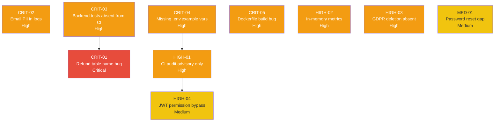

### Full Risk Register

| ID | Title | Domain | Severity | Owner | SLA | Depends On | Verification | Status |
|----|-------|--------|----------|-------|-----|------------|--------------|--------|
| CRIT-01 | Refund worker wrong table name | Data Integrity | Critical | Backend Eng | 24h | — | Integration test with real DB; `processPendingRefunds()` returns >0 processed | Open |
| CRIT-02 | Email PII in logs | Privacy | High | Backend Eng | 48h | — | `grep email` on prod log output returns zero matches | Open |
| CRIT-03 | Backend tests absent from CI | DevOps | High | DevOps Eng | 48h | — | CI `test-api` job green with API test suite | Open |
| CRIT-04 | Missing env vars in .env.example | Configuration | High | DevOps Eng | 24h | — | Fresh deploy from `.env.example` starts successfully in prod mode | Open |
| CRIT-05 | Dockerfile build stage bug | DevOps | High | DevOps Eng | 24h | — | `docker build` completes without errors | Open |
| HIGH-01 | CI audit advisory only | DevOps | High | DevOps Eng | 1 week | CRIT-04 | PR with high-severity npm dep is blocked by CI | Open |
| HIGH-02 | In-memory metrics reset | Observability | High | Backend Eng | 2 weeks | — | Metrics persist across server restart; verified via `/internal/metrics` | Open |
| HIGH-03 | GDPR deletion not implemented | Privacy | High | Product Mgr | 2 weeks | — | `DELETE /v1/me` returns 204; DB row deleted; AuditLog entry created | Open |
| HIGH-04 | JWT permission bypass for refund | Security | Medium | Security Eng | 1 week | — | JWT-authenticated `POST /v1/refunds` returns 403 without `refund` permission | Open |
| MED-01 | Password reset no session invalidation | Security | Medium | Backend Eng | 1 week | — | After reset, previous refresh token returns 401 | Open |

---

# PART B — ENGINEERING APPENDIX

---

## Section 6: Architecture Problems {#section-6}

### Architecture Layer Diagram with Violation Edges

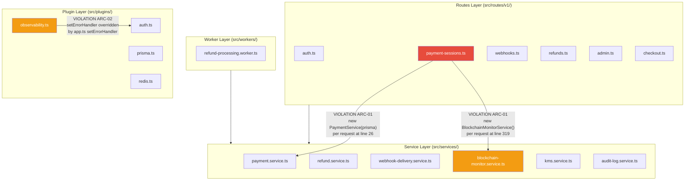

**ARC-01: Services instantiated inside request handlers — 4 instances**
- `src/routes/v1/payment-sessions.ts:26` — `new PaymentService(fastify.prisma)`
- `src/routes/v1/payment-sessions.ts:129` — `new PaymentService(fastify.prisma)`
- `src/routes/v1/payment-sessions.ts:177` — `new PaymentService(fastify.prisma)`
- `src/routes/v1/payment-sessions.ts:319` — `new BlockchainMonitorService()` (worst: creates provider connections per request)
- Fix: Instantiate services once at the top of the route plugin function, before handler registration.

**ARC-02: Duplicate `setErrorHandler` — observability handler is silently overridden**
- `src/plugins/observability.ts:158` — registers error handler (first)
- `src/app.ts:342` — registers error handler (second; wins)
- Effect: `observabilityPlugin`'s error logging never executes; only `app.ts` handler runs.
- Fix: Remove `setErrorHandler` from `observability.ts`; incorporate its logging into the `app.ts` handler.

**ARC-03: Module-global SSE connection counters not Redis-backed**
- `src/routes/v1/payment-sessions.ts:12-15` — `let sseConnectionsByUser = new Map()`, `let sseGlobalConnections = 0`
- In a multi-instance deployment, each process has independent counters. The `SSE_MAX_GLOBAL = 100` limit becomes 100 per process.
- Fix: Use Redis `INCR`/`DECR` with a per-user key and a global key for SSE connection tracking.

**ARC-04: Raw SQL table names inconsistent with Prisma mappings**
- `src/workers/refund-processing.worker.ts:83` — `FROM "Refund"` should be `FROM "refunds"` (critical bug)
- `src/routes/v1/payment-sessions.ts:224` — `FROM payment_sessions` (correct snake_case)
- `src/services/payment.service.ts:171` — `FROM "payment_sessions"` (correct)
- The inconsistency shows raw SQL is used without a systematic check against Prisma's `@@map` directives.

---

## Section 7: Security Findings {#section-7}

### Attack Path — Worst-Case Exploit Chain

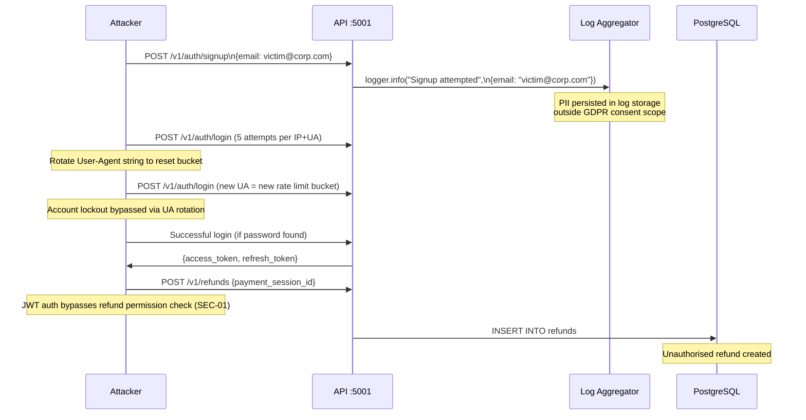

### Authentication and Authorization

**SEC-01: JWT-authenticated users bypass `requirePermission` check**
- File: `src/plugins/auth.ts:132`
- Code: `if (!request.apiKey) { return; // JWT users have full permissions }`
- Analysis: This unconditional return means any route protected by `fastify.requirePermission('refund')` is effectively unprotected for JWT-authenticated users. The design intent was that JWT users (dashboard logins) should have all permissions. The risk is that a compromised JWT token grants refund capability without a separate API key permission gate.
- OWASP: API5 (Broken Function Level Auth)
- Fix: Either document that JWT users intentionally have all permissions and accept the risk, or enforce permissions uniformly for both auth methods.

**SEC-02: Account lockout bypass via User-Agent rotation**
- File: `src/routes/v1/auth.ts:30-36`
- Analysis: The rate limit key is `auth:${request.ip}:${truncatedUA}`. An attacker who knows this fingerprint scheme can rotate User-Agent strings to get a fresh 5-attempt bucket per variant. This weakens the lockout to a speed bump rather than a hard limit.
- OWASP: A07 (Identification and Authentication Failures)
- Note: The per-email lockout in Redis (`lockKey: 'lockout:${email}'`) is the primary guard and is not affected by UA rotation. The rate-limit bypass only affects the pre-lockout rate; once 5 failures occur per email, the lockout is effective.

**SEC-03: Email address logged as PII (CRIT-02)**
- File: `src/routes/v1/auth.ts:59,94,206`
- File: `src/utils/logger.ts:8-12`
- Vulnerable code: `logger.info('User logged in', { userId: user.id, email: user.email })`
- Fixed code: `logger.info('User logged in', { userId: user.id })`
- GDPR: Article 5(1)(c) — data minimisation principle

**SEC-04: Password reset does not revoke existing sessions**
- File: `src/routes/v1/auth.ts:641-650`
- Missing code after `user.update`:
  ```typescript
  await fastify.prisma.refreshToken.updateMany({
    where: { userId: tokenData.userId, revoked: false },
    data: { revoked: true, revokedAt: new Date() },
  });
  ```
- OWASP: A07

**SEC-05: `trustProxy: true` is too broad**
- File: `src/app.ts:38`
- Analysis: `true` instructs Fastify to trust any `X-Forwarded-For` header. An attacker sending requests directly to the API (bypassing the load balancer) can set a spoofed IP, undermining IP-based rate limiting for unauthenticated endpoints (e.g. checkout, health).
- Fix: Set `trustProxy: 1` to trust exactly one hop (the load balancer), or set to the load balancer's IP CIDR range.

**SEC-06: Internal routes reachable on the public port**
- File: `src/app.ts:269`
- Analysis: `/internal/webhook-worker` is registered on the same Fastify instance as public routes. The only protection is the `INTERNAL_API_KEY` check inside the handler. A network-level firewall rule or a dedicated internal port would provide defence-in-depth.
- OWASP: API8 (Security Misconfiguration)

**SEC-07: `logData: any` in observability plugin**
- File: `src/plugins/observability.ts:133`
- Analysis: `const logData: any = { ... }` disables TypeScript for the entire log object. If a developer adds `request.body` to this object, sensitive data can flow into logs without any compiler warning.
- Fix: Define a typed interface: `interface RequestLog { request_id: string; method: string; url: string; status: number; duration_ms: number; ip: string; user_id?: string; }`

---

## Section 8: Performance and Scalability {#section-8}

### Analysis

**PERF-01: `BlockchainMonitorService` instantiated per PATCH request**
- File: `src/routes/v1/payment-sessions.ts:319`
- `new BlockchainMonitorService()` is called inside the PATCH handler on every request that changes status to `CONFIRMING` or `COMPLETED`. The constructor calls `addProviders()` which creates `ethers.JsonRpcProvider` instances — each maintaining a persistent HTTP connection pool.
- Estimate: At 100 RPS, this creates 100 provider pools per second, each with HTTP keep-alive connections to Alchemy/Infura/QuickNode.
- Fix: Create `BlockchainMonitorService` once at plugin registration time.

**PERF-02: Refund worker holds `FOR UPDATE` lock during blockchain calls**
- File: `src/workers/refund-processing.worker.ts:81-118`
- The `$transaction` block with `{ timeout: 120_000 }` wraps the entire batch, including calls to `refundService.processRefund()`. If `processRefund` makes blockchain API calls (via KMS), those calls happen inside the locked transaction, blocking any concurrent reads of the same refund rows for up to 2 minutes.
- This contradicts the ADR in `payment.service.ts:136-143` which correctly excludes side effects from transactions.
- Fix: Acquire lock to claim IDs, release transaction, then process each refund without holding the lock.

**PERF-03: `listPaymentSessions` — already parallelised correctly**
- File: `src/services/payment.service.ts:109-117`
- `Promise.all([findMany, count])` is correct and avoids two sequential round-trips. No N+1 risk.

**PERF-04: SSE connection `Map` is unbounded**
- File: `src/routes/v1/payment-sessions.ts:12`
- If `request.raw.on('close')` does not fire (TCP reset, server restart), the `Map` entry is never cleaned up. `sseConnectionsByUser.set(userId, ...)` accumulates entries for disconnected users indefinitely.
- Fix: Add a periodic cleanup sweep or use Redis with TTL-based expiry.

**PERF-05: Admin merchant list — correct DB-level aggregation**
- File: `src/routes/v1/admin.ts:104-139`
- Uses `groupBy` at the database level instead of loading all payment sessions into memory. A previous audit identified this as a risk; it has been correctly resolved.

---

## Section 9: Testing Gaps {#section-9}

### Coverage Estimate

| Test Category | Test Files | Estimated Coverage | Assessment |
|--------------|------------|-------------------|------------|
| Unit (state machine, encryption, URL validator) | 3 | 90% | Strong |
| Integration (routes) | 28 | 75% | Good |
| Services (KMS, blockchain, webhook, refund) | 44 | 80% | Strong |
| Workers | 2 | 70% | Acceptable |
| CI and utils | 9 | 85% | Good |
| Frontend components | 45 | 65% | Moderate |
| E2E (Playwright) | 0 | 10% | Weak |

### Missing Test Scenarios

**TEST-01: Refund worker against real database (critical)**
- The worker tests likely use mocked Prisma. A test calling `processPendingRefunds()` with a real PostgreSQL database would immediately catch the `"Refund"` table name error as a runtime exception.

**TEST-02: No Playwright E2E tests**
- `e2e/integration/full-stack.test.ts` is a Jest test, not Playwright. No browser-driven tests exist for payment checkout, login flow, or dashboard interactions.

**TEST-03: No Redis unavailability tests**
- The auth plugin fails-closed when Redis is down. There is no test that simulates Redis disconnect mid-request to verify the 503 response.

**TEST-04: No SSE connection limit stress test**
- `SSE_MAX_PER_USER = 10` and `SSE_MAX_GLOBAL = 100` are not tested under concurrent load.

**TEST-05: No GDPR deletion test**
- The endpoint does not exist, so the test cannot exist. When implemented, it must verify: user data deleted, cascade to payment sessions, refunds, webhooks; audit log entry created; all tokens revoked.

### Test Quality Strengths

- Real-database integration tests via `buildApp()` — the most valuable pattern; avoids mock drift.
- Rate limit isolation by unique User-Agent per test describe block — shows awareness of test pollution.
- Race condition tests for payment state machine exist: `tests/services/payment-race-condition.test.ts`.
- KMS error sanitisation tests verify that AWS error internals do not leak: `tests/services/kms-error-sanitization.test.ts`.
- Logger redaction tests: `tests/utils/logger-redaction.test.ts` — but they do not test the `email` field because `email` is not in `SENSITIVE_PATTERNS`.

---

## Section 10: DevOps Issues {#section-10}

### CI/CD Pipeline Assessment

**DEVOPS-01: Backend test suite absent from CI (CRIT-03)**
- File: `.github/workflows/test-stablecoin-gateway.yml`
- Jobs: `lint`, `security`, `test-frontend`. No `test-api` job.
- A separate `ci.yml` in the product directory exists with a working `test-api` job (PostgreSQL + Redis services) but it is not the active workflow. The active workflow is the one at `.github/workflows/test-stablecoin-gateway.yml`.
- Required addition:
```yaml
test-api:
  runs-on: ubuntu-latest
  services:
    postgres:
      image: postgres:15-alpine
      env: { POSTGRES_USER: test, POSTGRES_PASSWORD: test, POSTGRES_DB: stablecoin_gateway_test }
      ports: ['5432:5432']
    redis:
      image: redis:7-alpine
      ports: ['6379:6379']
  steps:
    - uses: actions/checkout@v4
    - uses: actions/setup-node@v4
      with: { node-version: '20' }
    - run: npm ci
      working-directory: products/stablecoin-gateway/apps/api
    - run: npm test
      working-directory: products/stablecoin-gateway/apps/api
```

**DEVOPS-02: Security audit advisory-only (CRIT-05)**
- `continue-on-error: true` on the `security` job means 7 high-severity vulnerabilities never block a merge.
- Scope: All 7 high-severity findings are in `@typescript-eslint` chain (devDependencies only). They do not affect the production runtime. However, they could affect the CI audit toolchain and the `npm run lint` step.
- Recommended: Separate `npm audit --omit=dev --audit-level=moderate` (must pass) from `npm audit --audit-level=high` (advisory for devDeps).

**DEVOPS-03: Dockerfile builder installs `--omit=dev` before running `tsc` (CRIT-05)**
- File: `apps/api/Dockerfile:10`
- Current: `RUN npm ci --omit=dev && npm cache clean --force`
- Line 20: `RUN npm run build` → runs `tsc`, which is in devDependencies → fails.
- Fix: `RUN npm ci` in builder stage (install all deps); runner stage already copies only `dist/` and production `node_modules/` from a fresh `npm ci --omit=dev`.

**DEVOPS-04: No CD pipeline**
- There is no workflow for deploying to staging or production. Deployments are entirely manual.
- Impact: No promotion gate; no rollback automation; deployment history is opaque.

**DEVOPS-05: No secrets rotation automation**
- `WEBHOOK_ENCRYPTION_KEY`, `JWT_SECRET`, and `API_KEY_HMAC_SECRET` have no rotation schedule or automation defined.

### Secrets Management Assessment

| Control | Status | Location |
|---------|--------|----------|
| JWT entropy validation | Pass | `src/utils/env-validator.ts:119-177` |
| Production default secret rejection | Pass | `src/utils/env-validator.ts:127-129` |
| WEBHOOK_ENCRYPTION_KEY enforcement | Pass | `src/utils/startup-checks.ts` |
| `.env.example` placeholder values only | Pass | `apps/api/.env.example` |
| `INTERNAL_API_KEY` documented | Fail | Absent from `.env.example` |
| `API_KEY_HMAC_SECRET` documented | Fail | Absent from `.env.example` |
| No hardcoded secrets in source | Pass | Grep confirmed |

---

## Section 11: Compliance Readiness {#section-11}

### OWASP Top 10 (2021) — Control-by-Control

| Code | Vulnerability | Status | Evidence |
|------|--------------|--------|---------|
| A01 | Broken Access Control | Partial | `userId` scope on all data queries: Pass. JWT permission bypass: Fail (`src/plugins/auth.ts:132`). |
| A02 | Cryptographic Failures | Partial | API key HMAC undocumented in `.env.example`: Partial. Webhook AES-256-GCM: Pass. JWT HS256 pinned: Pass. bcrypt passwords: Pass. |
| A03 | Injection | Pass | Zod on all routes. Prisma tagged template `$queryRaw`. No string concatenation in SQL. |
| A04 | Insecure Design | Partial | Password reset no session invalidation: Fail. SSE state not Redis-backed: Partial. |
| A05 | Security Misconfiguration | Partial | `trustProxy: true` unscoped: Fail. Internal routes on public port: Partial. Swagger UI disabled in production: Pass. |
| A06 | Vulnerable and Outdated Components | Fail | 7 high-severity npm findings; CI does not block merges on them. |
| A07 | Auth and Auth Failures | Partial | Account lockout: Pass. JTI blacklisting: Pass. UA rotation rate-limit bypass: Partial. Password reset gap: Fail. |
| A08 | Software and Data Integrity Failures | Pass | KMS signing: Pass. HMAC webhook signatures: Pass. Token rotation: Pass. |
| A09 | Security Logging and Monitoring Failures | Partial | Request/response logging: Pass. Email PII in logs: Fail. In-memory metrics: Partial. |
| A10 | SSRF | Pass | DNS resolution validation on all webhook URLs. Cloud metadata endpoint blocked. |

### OWASP API Security Top 10

| Code | Vulnerability | Status | Evidence |
|------|--------------|--------|---------|
| API1 | Broken Object Level Auth | Pass | `findFirst({ where: { id, userId } })` enforced on all resource access |
| API2 | Broken Authentication | Partial | Password reset session gap |
| API3 | Broken Object Property Level Auth | Pass | Whitelist-only updates; blockchain fields protected from client mutation |
| API4 | Unrestricted Resource Consumption | Pass | 1MB body limit; rate limiting; SSE caps; pagination bounds (max 100) |
| API5 | Broken Function Level Auth | Partial | JWT permission bypass for refund |
| API6 | Unrestricted Access to Sensitive Business Flows | Pass | Refund permission required; idempotency enforced |
| API7 | SSRF | Pass | Webhook URL SSRF with DNS resolution |
| API8 | Security Misconfiguration | Partial | `trustProxy: true`; internal endpoints on public port |
| API9 | Improper Inventory Management | Pass | Dev routes excluded in production; `/v1/` versioned prefix |
| API10 | Unsafe Consumption of APIs | Partial | Blockchain RPC timeout: Pass. Provider failover: Pass. Error message exposure from blockchain errors: Partial. |

### SOC2 Type II

| Principle | Status | Gap |
|-----------|--------|-----|
| CC1 Control Environment | Partial | ADRs in code are good; no formal security policy documents |
| CC6 Logical Access | Partial | Auth strong; `trustProxy` unscoped; internal endpoints reachable |
| CC7 System Operations | Partial | In-memory metrics only; no alerting integration; no SLA definition |
| CC8 Change Management | Fail | Backend tests absent from CI; no staging deployment pipeline |
| A1 Availability | Partial | Graceful shutdown; refund worker broken (CRIT-01) |
| PI1 Processing Integrity | Partial | Payment state machine correct; refund worker table bug |
| C1 Confidentiality | Partial | Email PII in logs |
| P1-P8 Privacy | Partial | GDPR deletion absent; consent not modelled |

### ISO 27001 Annex A Key Controls

| Control | Status | Evidence |
|---------|--------|---------|
| A.9.4 Application Access Control | Partial | JWT permission bypass |
| A.10.1 Cryptographic Controls | Pass | AES-256-GCM, bcrypt, HS256, KMS |
| A.12.4 Logging and Monitoring | Partial | Logs present; PII leak; metrics ephemeral |
| A.14.2 Security in Development | Partial | Tests present but not CI-enforced |
| A.18.1 Legal Requirements | Fail | GDPR Art.17 not implemented |

### GDPR — All 6 Data Subject Rights

| Right | Article | Status | Gap |
|-------|---------|--------|-----|
| Access | Art.15 | Partial | User can see their own data via existing GET endpoints; no data export format |
| Rectification | Art.16 | Partial | Password change endpoint exists; no profile update endpoint |
| Erasure | Art.17 | Fail | No deletion endpoint exists |
| Restriction of Processing | Art.18 | Fail | Not implemented |
| Data Portability | Art.20 | Fail | No export endpoint |
| Right to Object | Art.21 | Fail | Not implemented |
| Consent | Art.7 | Fail | No consent model in Prisma schema |
| Data Retention | Art.5(1)(e) | Fail | No retention policy or automated data expiry |

### WCAG 2.1 AA — POUR Principles

| Principle | Status | Evidence |
|-----------|--------|---------|
| Perceivable | Pass | Aria labels on nav, tables, status badges verified in `accessibility.test.tsx` |
| Operable | Pass | Skip-to-content link, focus-visible classes on nav links tested |
| Understandable | Pass | Form labels with `htmlFor` association tested for Login page |
| Robust | Partial | Major components tested; checkout page and refund flow not covered |

### DORA Metrics

| Metric | Tier | Evidence |
|--------|------|---------|
| Deployment Frequency | Unknown | No CD pipeline; manual deploys |
| Lead Time for Changes | Unknown | No tracking mechanism |
| Change Failure Rate | Unknown | No error tracking integration |
| Time to Restore Service | Unknown | No incident response runbook in codebase |

### SRE Golden Signals

| Signal | Status | Gap |
|--------|--------|-----|
| Latency | Partial | P50/P95/P99 tracked in-memory; resets on restart |
| Traffic | Partial | Request count tracked in-memory |
| Errors | Partial | Error rate tracked in-memory |
| Saturation | Fail | No CPU, memory, or DB connection pool saturation metrics |

---

## Section 12: Technical Debt Map {#section-12}

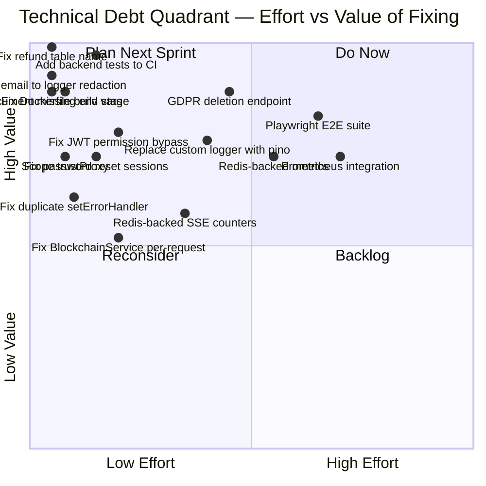

### Debt Priority Table

| ID | Item | Effort | Business Value | Phase |
|----|------|--------|----------------|-------|
| TD-01 | Fix refund worker table name | XS (1 line) | Critical | Phase 0 |
| TD-02 | Add email to logger SENSITIVE_PATTERNS | XS (1 line) | High | Phase 0 |
| TD-03 | Add backend tests to CI workflow | S (4h) | High | Phase 0 |
| TD-04 | Document `INTERNAL_API_KEY` and `API_KEY_HMAC_SECRET` in `.env.example` | XS (2 lines) | High | Phase 0 |
| TD-05 | Fix Dockerfile build stage | XS (1 line) | High | Phase 0 |
| TD-06 | Scope `trustProxy: 1` | XS (1 word) | Medium | Phase 1 |
| TD-07 | Fix JWT permission bypass | S (1h) | Medium | Phase 1 |
| TD-08 | Fix password reset session invalidation | S (2h) | Medium | Phase 1 |
| TD-09 | Fix CI audit to block on high-severity | S (1h) | Medium | Phase 1 |
| TD-10 | GDPR data deletion endpoint | M (1 week) | High | Phase 1 |
| TD-11 | Remove duplicate setErrorHandler | XS (delete 15 lines) | Low | Phase 1 |
| TD-12 | Fix BlockchainMonitorService per-request | S (2h) | Medium | Phase 2 |
| TD-13 | Redis-backed SSE connection counters | S (4h) | Medium | Phase 2 |
| TD-14 | Replace custom Logger with Fastify pino | M (1 week) | High | Phase 2 |
| TD-15 | Redis-backed metrics store | M (1 week) | High | Phase 2 |
| TD-16 | Playwright E2E test suite | L (2 weeks) | High | Phase 3 |
| TD-17 | Prometheus integration | L (1 week) | High | Phase 3 |

---

## Section 13: Remediation Roadmap {#section-13}

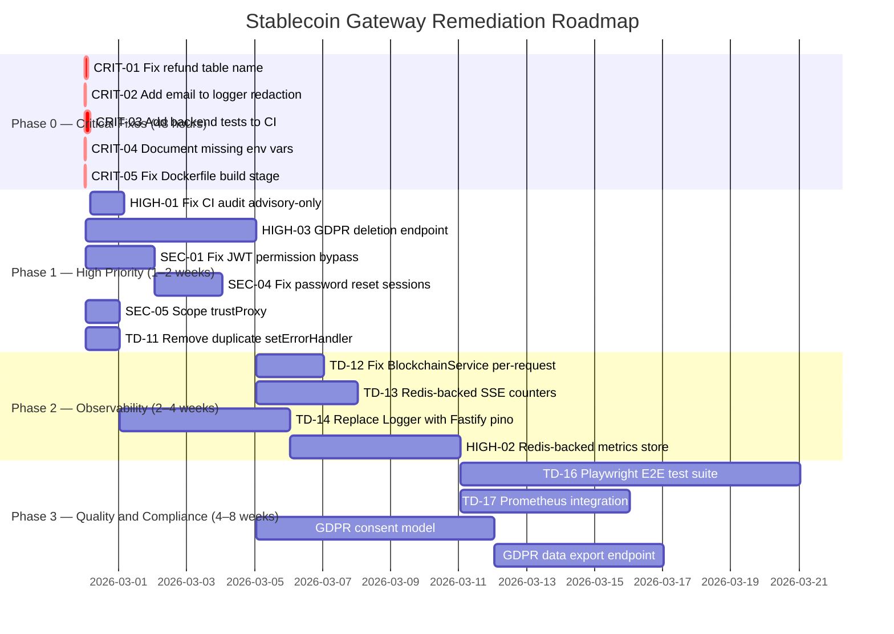

### Phase Gate Criteria

| Phase | Gate Criteria |
|-------|--------------|
| Phase 0 | All 5 items merged; CI green; `processPendingRefunds()` passes against real DB; `grep email` in logs returns zero |
| Phase 1 | GDPR deletion endpoint passes integration test; JWT refund permission test added; CI audit blocks on high-severity; security job non-advisory |
| Phase 2 | Metrics persist across server restart; SSE limits enforced across processes; pino logger correlation IDs propagated |
| Phase 3 | Playwright E2E suite runs in CI; Prometheus dashboard shows P99 and error rate; GDPR export endpoint available |

---

## Section 14: Quick Wins {#section-14}

All items below can be completed in under 4 hours combined:

1. **Fix refund worker table name** (`src/workers/refund-processing.worker.ts:83`): Change `FROM "Refund"` to `FROM "refunds"` and `"createdAt"` to `"created_at"`. One line change. Verify with an integration test calling `processPendingRefunds()` against a real database.

2. **Add email to logger redaction** (`src/utils/logger.ts:9`): Add `'email'` to the `SENSITIVE_PATTERNS` array. The redaction function already handles it correctly once the pattern is present. Zero risk of regression.

3. **Add `INTERNAL_API_KEY` and `API_KEY_HMAC_SECRET` to `.env.example`** (`apps/api/.env.example`): Add two lines with generation instructions. Example: `INTERNAL_API_KEY=""  # Generate: openssl rand -hex 64`. Prevents production startup failures for any new deployment.

4. **Fix Dockerfile build stage** (`apps/api/Dockerfile:10`): Change `RUN npm ci --omit=dev` to `RUN npm ci`. The runner stage already copies only `dist/` and `node_modules/` from a subsequent `npm ci --omit=dev` install, so devDependencies do not ship to production.

5. **Scope trustProxy** (`src/app.ts:38`): Change `trustProxy: true` to `trustProxy: 1`. Trusts exactly one proxy hop (the load balancer) without trusting arbitrary `X-Forwarded-For` values.

6. **Remove duplicate setErrorHandler** (`src/plugins/observability.ts:158-173`): Delete the `setErrorHandler` block in the observability plugin. Move its logging logic into the `app.ts` error handler. This is a delete operation with no functional change to the surviving handler.

7. **Add `test-api` job to CI** (`.github/workflows/test-stablecoin-gateway.yml`): Add the job definition with PostgreSQL 15 and Redis 7 services. Copy the structure from the existing `ci.yml` in the product directory. Backend tests will then run on every PR.

8. **Change CI security job to non-advisory** (`.github/workflows/test-stablecoin-gateway.yml:40`): Delete `continue-on-error: true`. Optionally split into prod-dep and dev-dep audit targets at different severity levels.

---

## Section 15: AI-Readiness Score {#section-15}

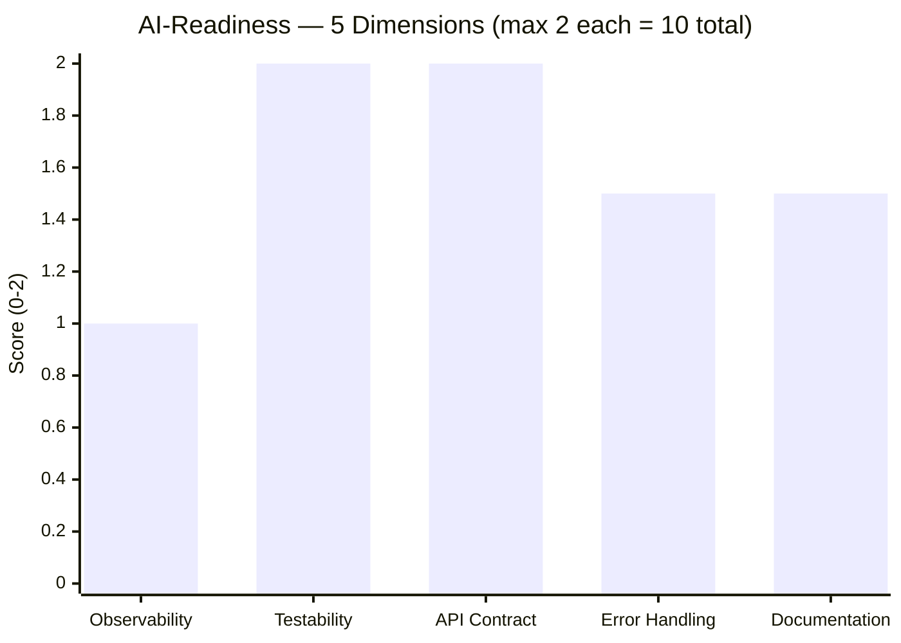

### AI-Readiness Sub-Dimension Table

| Dimension | Score | Max | Positive Evidence | Gap |
|-----------|-------|-----|-------------------|-----|
| Observability | 1.0 | 2 | Structured JSON in production; request IDs propagated; P99 tracked | Metrics reset on restart; no Prometheus; no distributed tracing; custom logger class |
| Testability | 2.0 | 2 | 111 backend test files; real-database integration tests; edge case coverage; unit + integration + CI layers | Tests not in CI (process gap, not code gap) |
| API Contract | 2.0 | 2 | OpenAPI/Swagger registered; Zod schemas match routes; `/v1/` versioned; Problem+JSON errors; pagination consistent | Internal routes on public port |
| Error Handling | 1.5 | 2 | `AppError` class consistent; global handler in `app.ts`; ZodError handling; KMS error sanitisation | Duplicate setErrorHandler silences observability layer; some `throw error` without wrapping in handlers |
| Documentation | 1.5 | 2 | ADRs embedded in service comments; `.env.example` exists; security audit docs in `docs/`; `.gitignore` | Missing env vars in `.env.example`; no API changelog; checkout page flow undocumented |

**AI-Readiness Total: 8.0/10**

The codebase is well-structured for AI agent consumption. Zod schemas provide machine-readable contracts for every endpoint. The Prisma schema is clean and self-documenting. ADRs embedded in service files (especially `payment.service.ts` and `kms.service.ts`) explain non-obvious design decisions clearly. The primary gaps are observability (ephemeral metrics) and the silent refund worker failure which would confuse any automated monitoring agent.

---

*End of Audit Report — Version 2.0*

*Generated: 2026-02-27 | Auditor: Code Reviewer Agent, ConnectSW*
*Methodology: Static code analysis of 52 source files + 111 test files + 45 frontend test files; dependency audit; CI/CD workflow review; compliance control mapping*
*Previous audit: 2026-02-10 (Phase 2 security remediations reviewed as context)*
