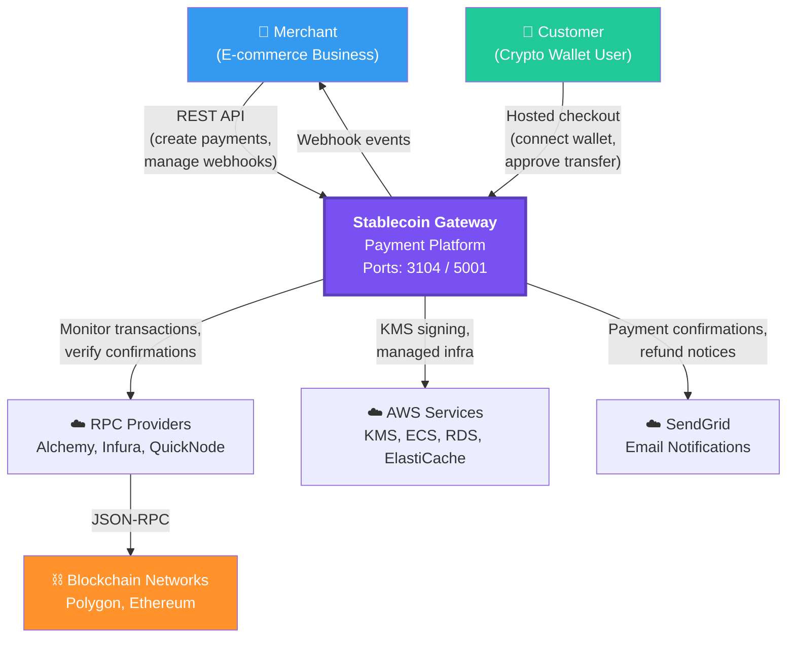
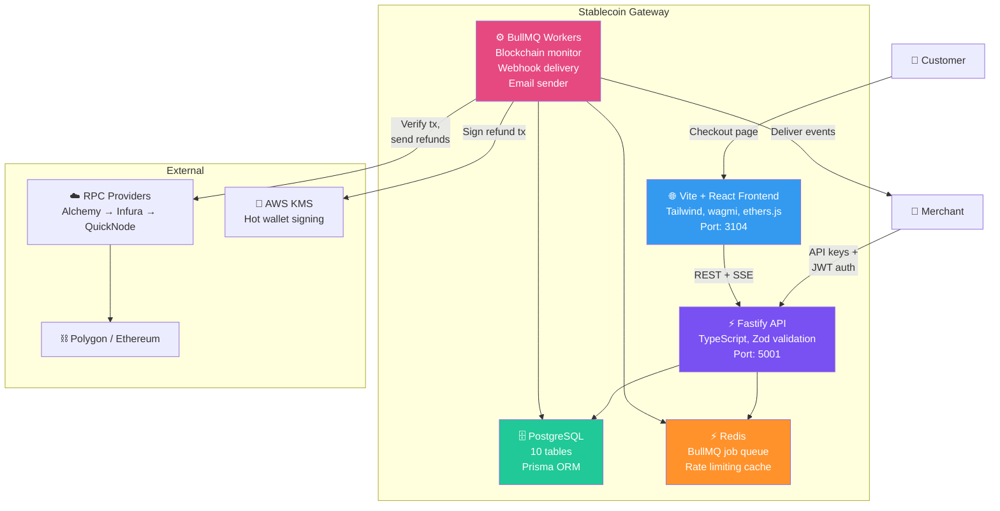
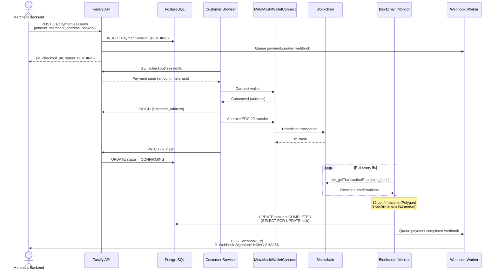
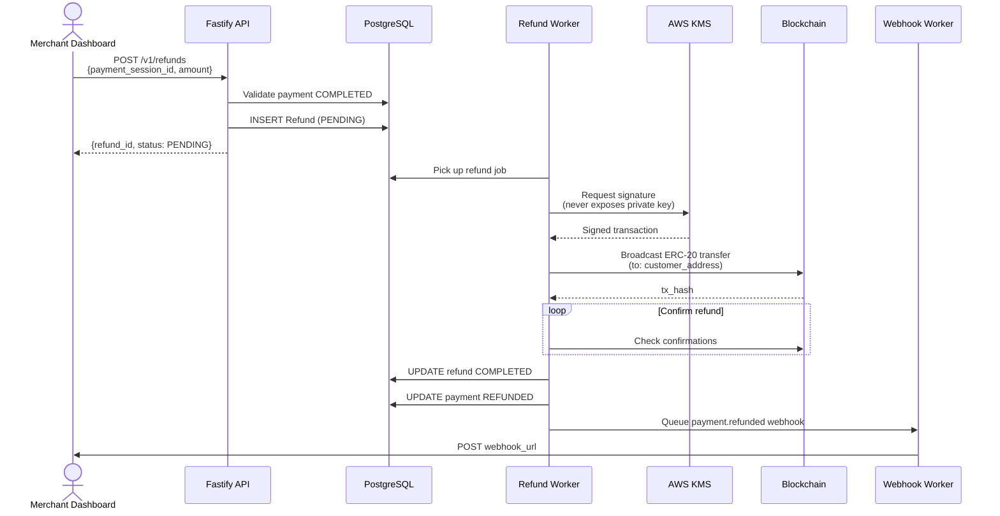
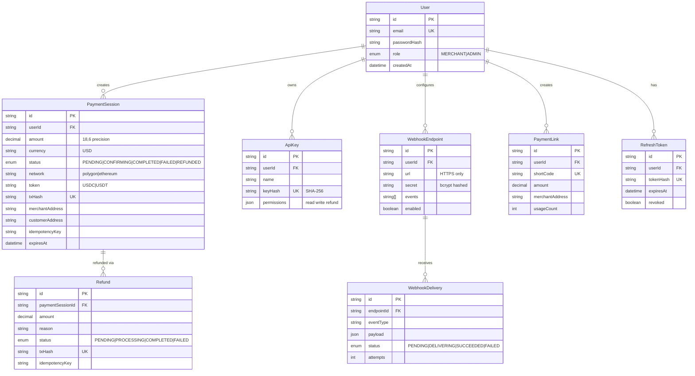
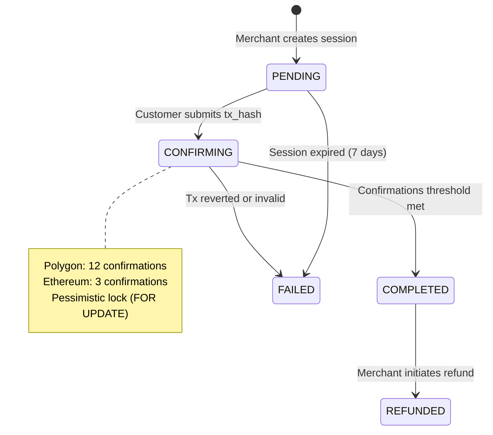
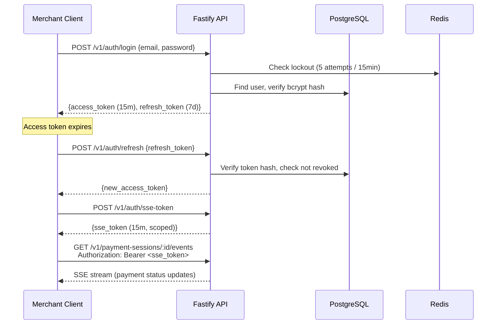

# Stablecoin Gateway - System Architecture

**Version**: 1.1
**Status**: Production Design
**Last Updated**: 2026-02-20
**Architect**: Claude Architect

---

## 1. Executive Summary

Stablecoin Gateway is transitioning from a validated prototype to a production-ready payment platform. This document defines the complete system architecture for accepting stablecoin payments (USDC/USDT) with Stripe-level developer experience at 0.5% transaction fees.

**Key Architecture Principles**:
- **Reliability First**: 99.9% uptime, graceful failure handling
- **Security by Design**: Defense in depth, principle of least privilege
- **Developer Experience**: Stripe-quality API and documentation
- **Cost Efficiency**: Optimize for low operational costs (0.5% fee margin)
- **Scalability**: Support 100 payments/minute at launch, 1000+ at scale

---

## Architecture Diagrams (Mermaid)

### C4 Level 1 — System Context



### C4 Level 2 — Container Diagram



### Sequence Diagram — Payment Flow



### Sequence Diagram — Refund Flow



### Entity-Relationship Diagram



### State Diagram — Payment Lifecycle



### Authentication Flow



---

## 2. Architecture Overview (Detailed)

### 2.1 High-Level Architecture

```
┌─────────────────────────────────────────────────────────────────────┐
│                         CUSTOMER DEVICES                             │
│  ┌──────────────┐  ┌──────────────┐  ┌──────────────┐             │
│  │   Browser    │  │  MetaMask    │  │ WalletConnect│             │
│  │   (Web3)     │  │  Extension   │  │   Mobile     │             │
│  └──────┬───────┘  └──────┬───────┘  └──────┬───────┘             │
└─────────┼──────────────────┼──────────────────┼───────────────────┘
          │                  │                  │
          │ HTTPS            │ JSON-RPC         │ WebSocket
          ▼                  ▼                  ▼
┌─────────────────────────────────────────────────────────────────────┐
│                         FRONTEND LAYER                               │
│  ┌──────────────────────────────────────────────────────────────┐  │
│  │  Next.js App (Merchant Dashboard + Hosted Checkout)          │  │
│  │  - SSR for SEO (landing pages)                               │  │
│  │  - CSR for dashboard (React 18)                              │  │
│  │  - ethers.js for wallet connections                          │  │
│  │  - WalletConnect SDK for mobile                              │  │
│  └────────────────────────┬─────────────────────────────────────┘  │
└────────────────────────────┼────────────────────────────────────────┘
                             │ REST API (HTTPS)
                             ▼
┌─────────────────────────────────────────────────────────────────────┐
│                          API LAYER                                   │
│  ┌──────────────────────────────────────────────────────────────┐  │
│  │  Fastify API Server (TypeScript)                             │  │
│  │  ├── Routes: /v1/payment-sessions, /v1/webhooks, /v1/auth   │  │
│  │  ├── Middleware: Auth (JWT), Rate Limiting, CORS            │  │
│  │  ├── Validation: Zod schemas                                │  │
│  │  └── Plugins: Prisma, Auth, Webhooks                        │  │
│  └────────────────────────┬─────────────────────────────────────┘  │
└────────────────────────────┼────────────────────────────────────────┘
                             │
         ┌───────────────────┼───────────────────┐
         │                   │                   │
         ▼                   ▼                   ▼
┌────────────────┐  ┌────────────────┐  ┌────────────────┐
│   DATABASE     │  │   BLOCKCHAIN   │  │   WORKERS      │
│                │  │   MONITOR      │  │                │
│  PostgreSQL    │  │                │  │  - Webhook     │
│  ├─ users      │  │  Event Poller  │  │    Delivery    │
│  ├─ payments   │  │  (BullMQ)      │  │  - Email       │
│  ├─ api_keys   │  │  ├─ Listen tx  │  │    Sender      │
│  └─ webhooks   │  │  ├─ Confirm    │  │  - Analytics   │
│                │  │  └─ Update DB  │  │                │
└────────┬───────┘  └────────┬───────┘  └────────────────┘
         │                   │
         │                   │ JSON-RPC
         │                   ▼
         │          ┌────────────────┐
         │          │  BLOCKCHAIN    │
         │          │  NODES         │
         │          │  ├─ Alchemy    │
         │          │  ├─ Infura     │
         │          │  └─ QuickNode  │
         │          └────────┬───────┘
         │                   │
         │                   ▼
         │          ┌────────────────┐
         │          │  BLOCKCHAIN    │
         │          │  NETWORKS      │
         │          │  ├─ Polygon    │
         │          │  └─ Ethereum   │
         │          └────────────────┘
         │
         │ Backup/Logs
         ▼
┌────────────────┐
│   EXTERNAL     │
│   SERVICES     │
│  ├─ SendGrid   │
│  ├─ Datadog    │
│  └─ AWS S3     │
└────────────────┘
```

### 2.2 Technology Stack

| Layer | Technology | Version | Justification |
|-------|-----------|---------|---------------|
| **Frontend** | Next.js | 14.x | SSR for marketing pages, CSR for dashboard, excellent DX |
| **UI Framework** | React | 18.x | Component-based, large ecosystem, team familiarity |
| **Styling** | Tailwind CSS | 3.x | Utility-first, fast iteration, small bundle |
| **Web3 Library** | ethers.js | 6.x | Industry standard, excellent docs, TypeScript support |
| **Wallet Connect** | WalletConnect | v2 | Mobile wallet support, secure protocol |
| **Backend** | Fastify | 4.x | Fast, TypeScript-first, plugin ecosystem |
| **Language** | TypeScript | 5.x | Type safety critical for payment logic |
| **Database** | PostgreSQL | 15.x | ACID compliance, JSON support, proven at scale |
| **ORM** | Prisma | 5.x | Type-safe queries, excellent migrations, developer-friendly |
| **Validation** | Zod | 3.x | Runtime type validation, integrates with TypeScript |
| **Job Queue** | BullMQ | 5.x | Redis-backed, reliable, monitoring UI |
| **Cache** | Redis | 7.x | Fast in-memory cache, pub/sub for real-time |
| **Auth** | JWT + Bcrypt | - | Simple, stateless, industry standard |
| **Testing** | Vitest + Playwright | 1.x | Fast tests, great DX |
| **CI/CD** | GitHub Actions | - | Free for open source, good ecosystem |
| **Monitoring** | Datadog | - | APM, logs, metrics, alerting |
| **Email** | SendGrid | - | Reliable delivery, templates, analytics |

---

## 3. System Components

### 3.1 Frontend Application (Next.js)

**Purpose**: Merchant dashboard and customer-facing hosted checkout

**Architecture**:
```
apps/web/
├── app/                        # Next.js 14 App Router
│   ├── (marketing)/           # Public pages (SSR)
│   │   ├── page.tsx           # Landing page
│   │   ├── pricing/           # Pricing page
│   │   └── docs/              # Documentation
│   ├── (auth)/                # Auth pages
│   │   ├── login/
│   │   ├── signup/
│   │   └── reset-password/
│   ├── dashboard/             # Merchant dashboard (CSR)
│   │   ├── page.tsx           # Overview
│   │   ├── payments/          # Payment list
│   │   ├── settings/          # Account settings
│   │   └── api-keys/          # API key management
│   └── checkout/              # Hosted checkout (CSR)
│       └── [sessionId]/       # Dynamic payment page
├── components/
│   ├── dashboard/             # Dashboard components
│   ├── checkout/              # Checkout flow
│   └── ui/                    # shadcn/ui components
├── lib/
│   ├── api-client.ts          # Typed API client
│   ├── wallet.ts              # Wallet connection logic
│   └── validation.ts          # Form validation schemas
└── hooks/
    ├── useWallet.ts           # Wallet state management
    ├── usePayment.ts          # Payment operations
    └── useWebSocket.ts        # Real-time updates
```

**Key Features**:
- Server-side rendering for marketing pages (SEO)
- Client-side rendering for dashboard (performance)
- Real-time updates via WebSocket (payment status)
- Responsive design (mobile-first)
- Progressive enhancement (works without JavaScript for forms)

**State Management**:
- React Context for wallet connection state
- React Query for server state (payments, user data)
- LocalStorage for session persistence

**Bundle Optimization**:
- Code splitting by route
- Dynamic imports for ethers.js (reduce initial load)
- Image optimization with Next.js Image component
- Target: < 200KB initial bundle, < 3s LCP

---

### 3.2 Backend API (Fastify)

**Purpose**: Business logic, payment orchestration, blockchain interaction

**Architecture**:
```
apps/api/
├── src/
│   ├── routes/
│   │   ├── v1/
│   │   │   ├── auth.ts              # POST /v1/auth/signup, /login
│   │   │   ├── payment-sessions.ts  # CRUD for payment sessions
│   │   │   ├── payments.ts          # Payment history, search
│   │   │   ├── webhooks.ts          # Webhook management
│   │   │   └── api-keys.ts          # API key CRUD
│   ├── plugins/
│   │   ├── prisma.ts                # Database plugin
│   │   ├── auth.ts                  # JWT verification
│   │   ├── rate-limit.ts            # Rate limiting
│   │   └── cors.ts                  # CORS configuration
│   ├── services/
│   │   ├── blockchain.ts            # Blockchain interaction
│   │   ├── blockchain-monitor.ts    # On-chain payment verification (FIX-07)
│   │   ├── webhook.ts               # Webhook delivery with HMAC signatures (FIX-06)
│   │   ├── email.ts                 # Email notifications
│   │   └── payment.ts               # Payment business logic
│   ├── workers/
│   │   ├── blockchain-monitor.ts    # Poll for confirmations
│   │   ├── webhook-delivery.ts      # Retry failed webhooks
│   │   └── email-sender.ts          # Send emails async
│   ├── types/
│   │   ├── api.ts                   # API request/response types
│   │   └── domain.ts                # Domain models
│   └── utils/
│       ├── crypto.ts                # Hashing, signing
│       ├── validation.ts            # Zod schemas
│       └── logger.ts                # Structured logging
├── prisma/
│   ├── schema.prisma                # Database schema
│   └── migrations/                  # Migration history
└── tests/
    ├── unit/                        # Pure function tests
    ├── integration/                 # API route tests
    └── e2e/                         # Full flow tests
```

**API Design Principles**:
- RESTful endpoints with clear naming
- Versioned API (v1, v2) for backward compatibility
- Consistent error responses (RFC 7807 Problem Details)
- Request validation with Zod schemas
- Rate limiting per API key (100 req/min)
- Idempotency keys for payment creation
- API key permission enforcement (read, write, refund) - FIX-05
- PATCH field whitelisting for security - FIX-03
- SSE authentication via query tokens - FIX-02

**Error Handling**:
```typescript
// Standard error response format
{
  "error": {
    "type": "validation_error",
    "message": "Invalid payment amount",
    "details": [
      { "field": "amount", "issue": "Must be >= 1" }
    ],
    "request_id": "req_abc123"
  }
}
```

**Performance Targets**:
- API response time: < 200ms (p95)
- Payment session creation: < 100ms
- Webhook delivery: < 5s after confirmation
- Database query time: < 50ms (p95)

---

### 3.3 Database (PostgreSQL + Prisma)

**Purpose**: Persistent storage for users, payments, API keys, webhooks

**Design Principles**:
- ACID transactions for payment state changes
- Foreign key constraints for data integrity
- Indexes on frequently queried fields
- JSON columns for flexible metadata
- Soft deletes for audit trail
- UTC timestamps everywhere

**Key Tables**:
- `users` - Merchant accounts
- `api_keys` - API authentication
- `payment_sessions` - Payment requests
- `transactions` - Blockchain transaction records
- `webhooks` - Webhook configurations
- `webhook_deliveries` - Delivery attempts
- `refunds` - Refund records

See `database-schema.md` for full ERD and schema.

**Scalability Strategy**:
- Connection pooling (PgBouncer)
- Read replicas for analytics queries
- Partitioning by date for transaction history
- Archive old data to S3 after 2 years

---

### 3.4 Blockchain Integration

**Purpose**: Monitor blockchain for payment confirmations and verify transactions

**Architecture**:

```
Blockchain Monitor (BullMQ Worker)
  ├─ Job: MonitorTransaction
  │   ├─ Input: txHash, network, minConfirmations
  │   ├─ Poll: eth_getTransactionReceipt every 5s
  │   ├─ Check: confirmations >= threshold
  │   └─ Output: Update payment status to "completed"
  │
  ├─ Job: VerifyTransaction (NEW - FIX-07)
  │   ├─ Input: txHash, expectedAmount, merchantAddress
  │   ├─ Query: Blockchain for transaction details
  │   ├─ Verify:
  │   │   - Transaction exists
  │   │   - Amount matches expected (in USDC/USDT)
  │   │   - Recipient is merchant address
  │   │   - Token contract is correct (USDC/USDT address)
  │   │   - Minimum confirmations met (12 for Polygon)
  │   └─ Output: Mark payment as verified or reject
  │
  ├─ Job: RefundTransaction
  │   ├─ Input: refundId, toAddress, amount
  │   ├─ Action: Send USDC/USDT from hot wallet
  │   └─ Output: Store refund txHash
  │
  └─ Job: SyncPaymentStatus
      ├─ Input: paymentSessionId
      ├─ Poll: Payment status from blockchain
      └─ Output: Update database + trigger webhook
```

**Blockchain Verification Service** (NEW - FIX-07):

The BlockchainMonitorService implements comprehensive on-chain verification to prevent payment fraud:

```typescript
class BlockchainMonitorService {
  async verifyPayment(
    txHash: string,
    expectedAmount: number,
    merchantAddress: string,
    tokenAddress: string
  ): Promise<VerificationResult> {
    // 1. Fetch transaction from blockchain
    const tx = await this.provider.getTransaction(txHash);
    if (!tx) throw new Error('Transaction not found');

    // 2. Verify transaction is mined
    const receipt = await tx.wait();
    if (!receipt) throw new Error('Transaction not mined');

    // 3. Check minimum confirmations
    const currentBlock = await this.provider.getBlockNumber();
    const confirmations = currentBlock - receipt.blockNumber;
    if (confirmations < 12) {
      throw new Error('Insufficient confirmations');
    }

    // 4. Decode transfer event from logs
    const transferEvent = this.decodeTransferEvent(receipt.logs);

    // 5. Verify amount matches
    if (transferEvent.amount !== expectedAmount) {
      throw new Error('Amount mismatch');
    }

    // 6. Verify recipient is merchant
    if (transferEvent.to !== merchantAddress) {
      throw new Error('Recipient mismatch');
    }

    // 7. Verify token contract
    if (transferEvent.tokenAddress !== tokenAddress) {
      throw new Error('Wrong token contract');
    }

    return { verified: true, blockNumber: receipt.blockNumber };
  }
}
```

**Node Providers** (with failover):
1. **Primary**: Alchemy (fast, reliable, generous free tier)
2. **Secondary**: Infura (fallback if Alchemy down)
3. **Tertiary**: QuickNode (high-performance backup)

**Confirmation Strategy**:
- **Polygon**: 64 block confirmations (~128 seconds)
- **Ethereum**: 3 block confirmations (~36 seconds)

**Re-org Handling**:
- Store block number with each confirmation
- If block hash changes, reset confirmation count
- Alert if re-org detected

**Gas Management**:
- For refunds: Use EIP-1559 (base fee + priority fee)
- Monitor gas prices via EthGasStation API
- Alert if gas price > $50 (block refunds temporarily)

See `ADR-002-blockchain-integration.md` for full decision rationale.

---

### 3.5 Webhook System

**Purpose**: Notify merchants of payment events

**Architecture Overview (PHASE2-01)**:
```
┌─────────────┐     POST /v1/webhooks       ┌──────────────┐
│  Merchant   │ ─────────────────────────────▶│  API Server  │
│  Dashboard  │◀───── webhook_id + secret ────│              │
│             │                                │  - Generate  │
└─────────────┘                                │    secret    │
                                               │  - Hash      │
                                               │    (bcrypt)  │
                                               │  - Store     │
                                               └──────────────┘

┌─────────────┐                               ┌──────────────┐
│  Payment    │─────── Event Occurs ─────────▶│   Webhook    │
│  Monitor    │        (completed/failed)      │   Worker     │
└─────────────┘                               └──────┬───────┘
                                                     │
                    1. Load webhook endpoint         │
                    2. Load hashed secret            │
                    3. Sign payload (HMAC-SHA256)    │
                    4. POST to merchant URL          │
                                                     │
                                                     ▼
                                              ┌──────────────┐
                                              │  Merchant    │
                                              │  Server      │
                                              │              │
                                              │  - Verify    │
                                              │    signature │
                                              │  - Process   │
                                              └──────────────┘
```

**Webhook CRUD Operations (PHASE2-01)**:
- `POST /v1/webhooks` - Create webhook (secret shown once)
- `GET /v1/webhooks` - List all webhooks
- `GET /v1/webhooks/:id` - Get webhook details
- `PATCH /v1/webhooks/:id` - Update webhook (URL, events, enabled)
- `DELETE /v1/webhooks/:id` - Delete webhook

**Event Types**:
- `payment.created` - Payment session created
- `payment.confirming` - Transaction detected on blockchain
- `payment.completed` - Payment confirmed
- `payment.failed` - Transaction failed or expired
- `payment.expired` - Payment session expired (24-hour timeout)
- `payment.refunded` - Refund processed

**Secret Management (PHASE2-01)**:
```typescript
// Secret generation (256 bits of entropy)
const secret = `whsec_${crypto.randomBytes(32).toString('hex')}`;

// Secret hashing (bcrypt, one-way)
const hashedSecret = await bcrypt.hash(secret, 10);

// Storage
await prisma.webhook.create({
  data: {
    url: 'https://merchant.com/webhooks',
    secretHash: hashedSecret, // Only hash stored
    events: ['payment.completed'],
  }
});

// Return secret ONLY ONCE
return { id: webhook.id, secret: secret };
```

**Security Properties**:
- ✅ Secrets generated with 256 bits of entropy
- ✅ Secrets stored hashed (bcrypt), never retrievable
- ✅ Database compromise doesn't expose secrets
- ✅ Secrets shown only once during creation
- ✅ HTTPS-only URLs enforced

**Delivery Mechanism**:
```
1. Payment event occurs → Emit event
2. Webhook worker picks up event from queue
3. Load webhook endpoint and hashed secret
4. Sign payload with HMAC-SHA256 (using plaintext secret for signing)
5. POST to merchant's webhook URL with signature header
6. Retry on failure:
   - Attempt 1: Immediate
   - Attempt 2: +10 seconds
   - Attempt 3: +60 seconds
   - Attempt 4: +600 seconds (10 min)
7. Mark as "failed" after 4 attempts
8. Merchant can replay via dashboard
```

**Payload Format**:
```json
{
  "id": "evt_abc123",
  "type": "payment.completed",
  "created_at": "2026-01-27T10:00:00Z",
  "data": {
    "payment_session_id": "ps_xyz789",
    "amount": 100.00,
    "currency": "USD",
    "status": "completed",
    "tx_hash": "0x123...",
    "confirmed_at": "2026-01-27T10:02:15Z"
  }
}
```

**Security** (FIX-06 - Timing-Safe Implementation):
- **HMAC-SHA256 signature** in `X-Webhook-Signature` header
- **Timing-safe comparison** using `crypto.timingSafeEqual()` to prevent timing attacks
- **Timestamp validation** in `X-Webhook-Timestamp` header (rejects webhooks > 5 minutes old)
- Signature computed over `timestamp + "." + rawBody` (prevents tampering and replay attacks)
- Merchant verifies signature using their webhook secret

**Why Timing-Safe Comparison is Critical**:
- Regular string comparison (`===`) leaks timing information
- Attackers can use timing analysis to forge signatures (CWE-208)
- `crypto.timingSafeEqual()` compares all bytes in constant time
- Prevents attackers from determining correct signature characters through response time analysis

**Implementation**:
```typescript
// Webhook signature verification with timing-safe comparison
function verifyWebhookSignature(
  rawBody: string,
  signature: string,
  timestamp: string,
  secret: string
): boolean {
  // 1. Check timestamp (prevent replay)
  const currentTime = Math.floor(Date.now() / 1000);
  const webhookTime = parseInt(timestamp, 10);
  if (Math.abs(currentTime - webhookTime) > 300) {
    return false; // Reject if > 5 minutes old
  }

  // 2. Compute expected signature
  const payload = `${timestamp}.${rawBody}`;
  const expectedSignature = crypto
    .createHmac('sha256', secret)
    .update(payload)
    .digest('hex');

  // 3. Constant-time comparison (prevents timing attacks)
  if (signature.length !== expectedSignature.length) {
    return false;
  }

  return crypto.timingSafeEqual(
    Buffer.from(signature),
    Buffer.from(expectedSignature)
  );
}
```

See `docs/guides/webhook-integration.md` for merchant integration details.

---

### 3.6 Background Workers (BullMQ)

**Purpose**: Async processing for long-running tasks

**Job Queues**:

1. **`blockchain-monitor`**: Poll blockchain for transaction status
   - Priority: High
   - Concurrency: 50
   - Rate: 1000 jobs/minute

2. **`webhook-delivery`**: Deliver webhooks to merchants
   - Priority: Medium
   - Concurrency: 20
   - Retry: 4 attempts with exponential backoff

3. **`email-sender`**: Send transactional emails
   - Priority: Low
   - Concurrency: 10
   - Provider: SendGrid

4. **`analytics-aggregation`**: Compute daily metrics
   - Priority: Low
   - Concurrency: 1
   - Schedule: Daily at 02:00 UTC

**Monitoring**:
- BullBoard UI for queue visibility
- Metrics: job completion rate, failure rate, latency
- Alerts: queue depth > 1000, job failure rate > 5%

---

## 4. Data Flow

### 4.1 Payment Creation Flow

```
Merchant (Browser)
  │
  │ POST /v1/payment-sessions
  │ { amount: 100, currency: "USD", description: "Order #1234" }
  ▼
API Server
  │
  ├─ Validate request (Zod schema)
  ├─ Authenticate merchant (JWT)
  ├─ Generate unique session ID (ps_xxx)
  ├─ Store in database (status: "pending")
  │
  ▼
Database (PostgreSQL)
  │
  └─ INSERT INTO payment_sessions
     (id, merchant_id, amount, currency, status, expires_at)
     VALUES ('ps_xxx', 'usr_123', 100, 'USD', 'pending', NOW() + INTERVAL '7 days')

API Response
  │
  └─ { id: "ps_xxx", checkout_url: "https://gateway.io/checkout/ps_xxx" }
```

---

### 4.2 Customer Payment Flow

```
Customer (Browser)
  │
  │ Visit checkout_url
  ▼
Next.js App
  │
  ├─ Fetch payment session from API
  ├─ Display payment details (amount, merchant name)
  ├─ Render "Connect Wallet" button
  │
  │ Click "Connect Wallet"
  ▼
ethers.js / WalletConnect
  │
  ├─ Prompt MetaMask connection
  ├─ User approves connection
  ├─ Return wallet address
  │
  │ Click "Pay with USDC"
  ▼
Smart Contract Interaction
  │
  ├─ Get USDC token contract (ethers.Contract)
  ├─ Call transfer() method
  │   - to: merchant_wallet_address
  │   - amount: 100 USDC (in wei: 100 * 10^6)
  ├─ User approves transaction in MetaMask
  ├─ Transaction broadcast to blockchain
  │
  ▼
Blockchain
  │
  └─ Transaction pending in mempool
     Transaction mined in block N
     Transaction confirmed after 3 blocks (N+3)

Frontend (WebSocket)
  │
  ├─ Listen for transaction broadcast
  ├─ Update UI: "Confirming... (1/3 blocks)"
  ├─ Poll blockchain via API
  ├─ Update UI: "Complete!"
  │
  ▼
API Server (Blockchain Monitor Worker)
  │
  ├─ Poll eth_getTransactionReceipt every 5s
  ├─ Check confirmations >= 3
  ├─ Update database: status = "completed"
  ├─ Trigger webhook delivery job
  ├─ Trigger email notification job
  │
  ▼
Webhook Delivery
  │
  └─ POST to merchant's webhook URL
     { type: "payment.completed", data: {...} }
```

---

### 4.3 Refund Flow

```
Merchant (Dashboard)
  │
  │ Click "Issue Refund" on payment
  │ POST /v1/refunds
  │ { payment_id: "ps_xxx", amount: 100 }
  ▼
API Server
  │
  ├─ Validate: payment exists, status = "completed"
  ├─ Validate: merchant has sufficient balance in hot wallet
  ├─ Create refund record (status: "pending")
  ├─ Enqueue RefundTransaction job
  │
  ▼
Blockchain Monitor Worker
  │
  ├─ Get hot wallet private key from KMS
  ├─ Build USDC transfer transaction
  │   - to: customer_wallet_address (from original payment)
  │   - amount: 100 USDC
  ├─ Sign transaction with hot wallet key
  ├─ Broadcast to blockchain
  ├─ Poll for confirmation
  │
  ▼
Blockchain
  │
  └─ Transaction mined and confirmed

Blockchain Monitor Worker
  │
  ├─ Update refund record: status = "completed", tx_hash = "0x..."
  ├─ Update payment record: status = "refunded"
  ├─ Trigger webhook: "payment.refunded"
  ├─ Send email to customer: "Refund processed"
  │
  ▼
Merchant Dashboard
  │
  └─ Display: "Refund completed"
```

---

## 5. Security Architecture

### 5.1 Authentication & Authorization

**Merchant Authentication**:
- JWT tokens (access token + refresh token)
- Access token: 15-minute expiry
- Refresh token: 7-day expiry, stored in httpOnly cookie
- Password: Bcrypt with cost factor 12, minimum 12 characters with complexity requirements
- Refresh token revocation on logout (database-backed)

**API Key Authentication**:
- API keys prefixed with `sk_live_` or `sk_test_`
- Hashed with SHA-256 before storage
- Rate limited: 100 requests/minute per key
- **Scoped permissions (read, write, refund) - FIX-05**
  - Permissions enforced before every operation
  - Read-only keys can only GET resources
  - Write permission required for POST/PATCH operations
  - Refund permission required for refund operations
  - Principle of least privilege enforced

**SSE Token Authentication (PHASE2-02)**:
- Short-lived tokens for Server-Sent Events (15-minute expiry)
- Generated via dedicated endpoint: `POST /v1/auth/sse-token`
- Scoped to specific payment session
- Addresses W3C EventSource API limitation (no custom headers)
- Token passed as query parameter: `?token=<sse_token>`

**Authentication Flow Diagram**:
```
┌─────────────┐     POST /v1/auth/login      ┌──────────────┐
│   Client    │ ─────────────────────────────▶│  API Server  │
│   (Browser) │◀───── access_token (15m) ─────│              │
│             │◀───── refresh_token (7d) ─────│              │
└──────┬──────┘                               └──────────────┘
       │
       │ Access token expires after 15 minutes
       │
       ▼
┌─────────────┐   POST /v1/auth/sse-token    ┌──────────────┐
│   Client    │ ─────────────────────────────▶│  API Server  │
│             │   (with access_token)          │              │
│             │◀───── sse_token (15m) ─────────│  - Verify    │
│             │                                │    ownership │
└──────┬──────┘                               │  - Generate  │
       │                                       │    scoped    │
       │ Connect to SSE with short-lived token│    token     │
       │                                       └──────────────┘
       ▼
GET /v1/payment-sessions/:id/events?token=<sse_token>
│
▼
Server-Sent Event Stream (real-time updates)
```

**Authorization Model**:
```
User → owns → API Keys
User → owns → Payment Sessions
User → owns → Webhooks
User → can generate → SSE Tokens (scoped to payment session)
```

**Principle of Least Privilege**:
- Database user: CRUD on specific tables only (no DROP, ALTER)
- Hot wallet: Limited to refund operations only
- Worker processes: Read-only database access (except status updates)

---

### 5.2 Data Protection

**Encryption at Rest**:
- Database: PostgreSQL native encryption (LUKS)
- Secrets: AWS Secrets Manager or HashiCorp Vault
- Private keys: AWS KMS or HSM

**Encryption in Transit**:
- HTTPS only (TLS 1.3)
- HSTS header (Strict-Transport-Security)
- Certificate pinning for blockchain node connections

**Sensitive Data Handling**:
- API keys: Hashed (SHA-256)
- Passwords: Hashed (Bcrypt)
- Wallet addresses: Stored as-is (public data)
- Private keys: Never stored in database (KMS only)

**PII Compliance (GDPR)**:
- Email: Encrypted at rest
- Right to deletion: Soft delete user records
- Data export: API endpoint for user data download

---

### 5.3 Rate Limiting

**API Rate Limits** (per API key):
- Payment creation: 10 requests/minute
- Payment query: 100 requests/minute
- Webhook config: 5 requests/minute
- Global: 100 requests/minute

**Checkout Page Rate Limits** (per IP):
- Payment page access: 60 requests/minute
- Wallet connection: 10 requests/minute

**Implementation**: Redis with sliding window algorithm

---

### 5.4 Attack Prevention

**SQL Injection**: Prisma ORM (parameterized queries)
**XSS**: React auto-escaping, CSP headers
**CSRF**: SameSite cookies, CSRF tokens for state-changing operations
**Replay Attacks**: Webhook signatures include timestamp (reject > 5 minutes old)
**DDoS**: Cloudflare CDN, rate limiting
**Hot Wallet Drain**: Multi-signature requirement for large withdrawals (future)

---

## 6. Scalability Plan

### 6.1 Current Scale (MVP)

- **Users**: 100 merchants
- **Payments**: 1,000 payments/day (~10/hour)
- **API Requests**: 10,000 requests/day
- **Database**: 1M rows (1 year retention)
- **Infrastructure**: Single VPS (4 CPU, 8GB RAM)

### 6.2 Target Scale (6 Months)

- **Users**: 1,000 merchants
- **Payments**: 100,000 payments/day (~70/minute)
- **API Requests**: 1M requests/day
- **Database**: 50M rows (payment history)
- **Infrastructure**: Kubernetes cluster (3 nodes)

### 6.3 Scaling Strategy

**Horizontal Scaling**:
- **API Server**: Stateless, scale with load balancer
- **Workers**: Add more BullMQ worker instances
- **Database**: Read replicas for analytics queries

**Vertical Scaling**:
- **PostgreSQL**: Upgrade to 16 CPU, 64GB RAM before sharding
- **Redis**: Upgrade to Redis Cluster for high availability

**Caching**:
- **API responses**: Cache payment session lookups (5-minute TTL)
- **Blockchain data**: Cache transaction receipts (1-hour TTL)
- **User profiles**: Cache in Redis (15-minute TTL)

**Database Optimization**:
- **Indexes**: On payment_sessions(merchant_id, status), transactions(tx_hash)
- **Partitioning**: Partition payment_sessions by created_at (monthly)
- **Archival**: Move payments older than 2 years to S3 (Parquet format)

**CDN**:
- Static assets (CSS, JS, images): Cloudflare CDN
- Hosted checkout page: Edge-cached (1-minute TTL)

---

## 7. Observability

### 7.1 Logging

**Structured Logging** (JSON format):
```json
{
  "timestamp": "2026-01-27T10:00:00Z",
  "level": "info",
  "service": "api",
  "request_id": "req_abc123",
  "user_id": "usr_123",
  "event": "payment_created",
  "details": {
    "payment_id": "ps_xyz789",
    "amount": 100,
    "currency": "USD"
  }
}
```

**Log Aggregation**: Datadog or ELK stack
**Retention**: 90 days (hot), 2 years (cold storage in S3)

---

### 7.2 Metrics

**Key Metrics**:
- **Payment Success Rate**: (completed / created) * 100
- **Payment Latency**: Time from creation to completion (p50, p95, p99)
- **API Latency**: Response time by endpoint
- **Blockchain Confirmation Time**: Time to reach N confirmations
- **Webhook Delivery Success Rate**: (delivered / sent) * 100
- **Error Rate**: (5xx responses / total requests) * 100

**Dashboards**:
- Business metrics (daily volume, fee revenue)
- System health (API uptime, database CPU, queue depth)
- Blockchain metrics (confirmation times, gas prices)

---

### 7.3 Alerting

**Critical Alerts** (page on-call):
- API uptime < 99.9% (5 minutes)
- Payment success rate < 95% (10 minutes)
- Database connection pool exhausted
- Hot wallet balance < $1,000
- Blockchain node connection failure (all providers)

**Warning Alerts** (Slack notification):
- API latency > 500ms (p95, 5 minutes)
- Webhook delivery failure rate > 10%
- Queue depth > 1,000 jobs
- Disk usage > 80%

---

## 8. Deployment Architecture

### 8.1 Infrastructure (AWS)

```
VPC (10.0.0.0/16)
├── Public Subnets (10.0.1.0/24, 10.0.2.0/24)
│   ├── ALB (Application Load Balancer)
│   └── NAT Gateway
│
├── Private Subnets (10.0.10.0/24, 10.0.11.0/24)
│   ├── ECS Cluster (Fargate)
│   │   ├── API Service (3 tasks)
│   │   ├── Next.js Service (3 tasks)
│   │   └── Worker Service (5 tasks)
│   │
│   ├── RDS PostgreSQL (Multi-AZ)
│   └── ElastiCache Redis (Cluster mode)
│
└── Database Subnets (10.0.20.0/24, 10.0.21.0/24)
    └── RDS (no public access)
```

**Services**:
- **ECS Fargate**: Container orchestration (serverless)
- **RDS PostgreSQL**: Managed database (Multi-AZ for HA)
- **ElastiCache Redis**: Managed cache (Cluster mode for scalability)
- **S3**: Static assets, backups, archived data
- **CloudFront**: CDN for frontend assets
- **Route 53**: DNS management
- **ACM**: SSL/TLS certificates
- **Secrets Manager**: API keys, database credentials

---

### 8.2 CI/CD Pipeline

```
GitHub Push (main branch)
  │
  ├─ Run Tests (Vitest + Playwright)
  │   └─ Exit if tests fail
  │
  ├─ Build Docker Images
  │   ├─ apps/api → api:latest
  │   ├─ apps/web → web:latest
  │   └─ apps/api/workers → workers:latest
  │
  ├─ Push to ECR (Elastic Container Registry)
  │
  ├─ Run Database Migrations
  │   └─ prisma migrate deploy
  │
  ├─ Deploy to Staging
  │   ├─ Update ECS Task Definitions
  │   ├─ Rolling deployment (0 downtime)
  │   └─ Health checks
  │
  ├─ Run Smoke Tests
  │   └─ End-to-end payment flow
  │
  └─ Deploy to Production (manual approval)
      ├─ Blue-Green deployment
      ├─ Monitor error rate for 10 minutes
      └─ Auto-rollback if error rate > 1%
```

**Deployment Frequency**: 2-3 times per week
**Rollback Time**: < 5 minutes (revert to previous task definition)

---

## 9. Disaster Recovery

### 9.1 Backup Strategy

**Database Backups**:
- **Frequency**: Daily snapshots (automated by RDS)
- **Retention**: 30 days
- **Location**: Multi-region (us-east-1, us-west-2)
- **Recovery Point Objective (RPO)**: 24 hours
- **Recovery Time Objective (RTO)**: 4 hours

**Database Replication**:
- **Primary**: us-east-1a
- **Standby**: us-east-1b (synchronous replication)
- **Read Replica**: us-west-2 (asynchronous, for analytics)

**Blockchain Data**:
- No backups needed (public blockchain is source of truth)
- Store tx_hash in database for re-verification

---

### 9.2 Failure Scenarios

| Scenario | Impact | Detection | Response | RTO |
|----------|--------|-----------|----------|-----|
| API server crash | Payment creation fails | Health check failure | ECS restarts task | 1 min |
| Database primary failure | All writes fail | RDS monitoring | Automatic failover to standby | 2 min |
| Blockchain node outage | Confirmations delayed | Health check failure | Switch to backup provider | 30 sec |
| Redis cache failure | Slower API responses | Health check failure | Operate without cache, restart | 5 min |
| Hot wallet compromised | Refunds at risk | Manual detection | Revoke keys, rotate wallet | 1 hour |
| DDoS attack | Site unavailable | Traffic spike | Cloudflare DDoS protection | 5 min |
| Data center outage | Full service down | Multi-region health checks | Failover to secondary region | 1 hour |

---

## 10. Compliance & Legal

### 10.1 Regulatory Considerations

**Money Transmitter License (MTL)**:
- **MVP**: Not required (non-custodial, merchant receives funds directly)
- **Future**: May need MTL if we hold merchant funds

**KYC/AML**:
- **MVP**: Not required (payments < $10,000)
- **Future**: Implement KYC for payments > $10,000

**Data Residency**:
- **GDPR**: EU customers' data stored in EU region (future)
- **CCPA**: California customers' data deletion on request

---

### 10.2 Terms of Service

**Key Points**:
- Non-custodial (we don't hold merchant funds)
- Merchant responsible for legal compliance in their jurisdiction
- No chargebacks (blockchain transactions are irreversible)
- 0.5% transaction fee
- Service provided "as-is" with uptime SLA

---

## 11. Cost Estimation

### 11.1 Infrastructure Costs (Monthly)

| Service | Usage | Cost |
|---------|-------|------|
| ECS Fargate (API + Web) | 6 tasks × 0.25 vCPU × 730 hours | $80 |
| RDS PostgreSQL (db.t3.medium) | Multi-AZ | $120 |
| ElastiCache Redis (cache.t3.micro) | 2 nodes | $30 |
| S3 Storage | 100 GB | $3 |
| Data Transfer | 500 GB/month | $45 |
| CloudFront CDN | 1 TB transfer | $85 |
| Alchemy (Blockchain nodes) | 300M requests/month | $200 |
| SendGrid (Email) | 10,000 emails/month | $15 |
| Datadog (Monitoring) | 3 hosts | $45 |
| **Total** | | **$623/month** |

**Break-even Analysis**:
- Monthly cost: $623
- Transaction fee: 0.5%
- Break-even volume: $623 / 0.005 = **$124,600/month**
- Daily volume: ~$4,150/day (~40 payments at $100 avg)

---

## 12. Future Enhancements

### Phase 2 (Months 4-6)
- Subscription billing (recurring payments)
- Fiat off-ramp (auto-convert USDC to USD bank account)
- Analytics dashboard (charts, reports)
- Team roles (multi-user accounts)

### Phase 3 (Months 7-12)
- Shopify, WooCommerce plugins
- Multi-chain support (Solana, Avalanche, Arbitrum)
- Invoice generation
- Tax reporting tools

### Long-term
- Mobile apps (iOS, Android)
- White-label solution
- Payment links with QR codes
- Fraud detection and risk scoring

---

## 13. Open Architecture Decisions

**For CEO Approval**:
- [ ] Should we use AWS KMS or HashiCorp Vault for private key storage?
- [ ] Self-hosted PostgreSQL or managed RDS?
- [ ] Deploy to AWS, GCP, or DigitalOcean?

**For Security Review**:
- [ ] Hot wallet threshold for multi-sig requirement?
- [ ] Acceptable risk level for blockchain re-orgs?

**For Cost Optimization**:
- [ ] Use AWS Graviton (ARM) instances for 20% cost savings?
- [ ] Self-host blockchain nodes vs. Alchemy/Infura?

---

**End of Architecture Document**
