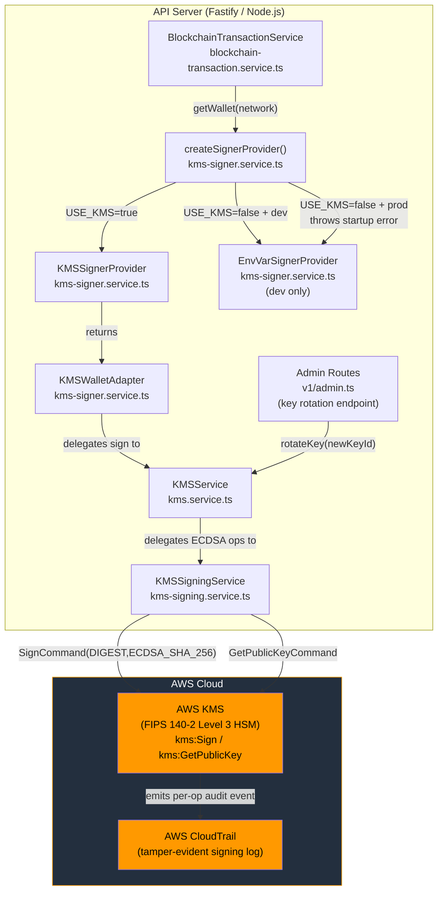
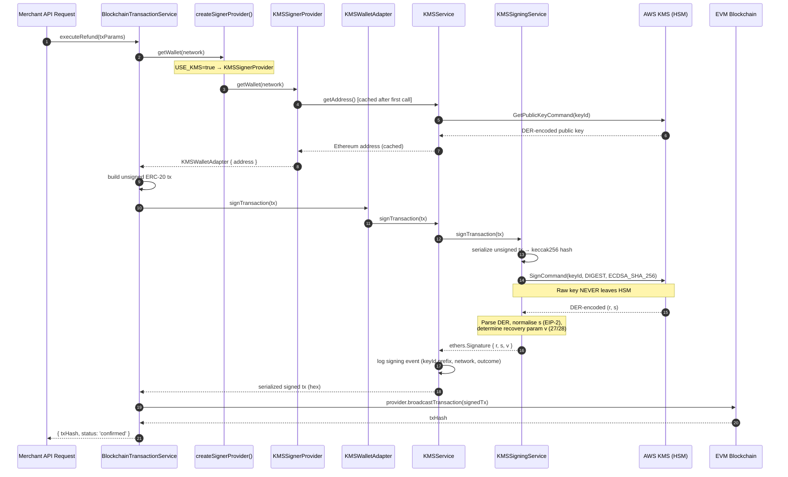
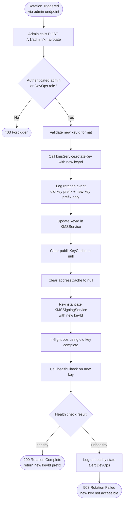
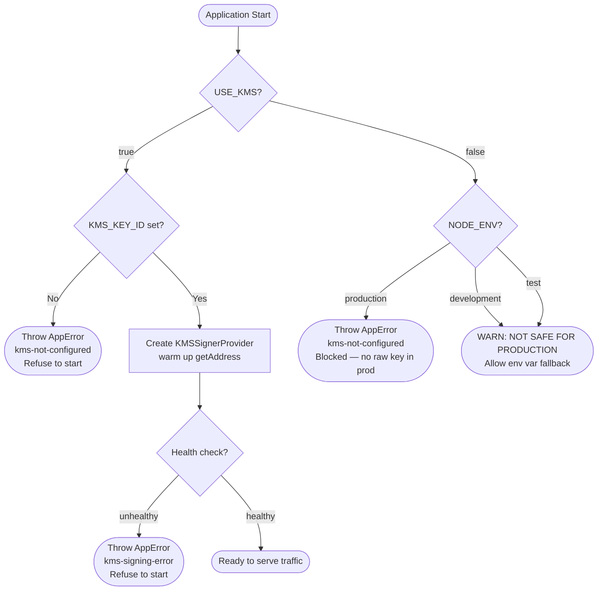

# Implementation Plan: KMS Hot Wallet Security (KMS-01)

**Product**: stablecoin-gateway
**Branch**: `feature/stablecoin-gateway/kms-hot-wallet`
**Created**: 2026-02-27
**Spec**: `docs/specs/KMS-01-kms-hot-wallet-security.md`
**Feature ID**: KMS-01

---

## Summary

This plan describes the hardening, testing, and production-enabling of the
existing AWS KMS signing implementation for the stablecoin-gateway hot wallet.
The raw-key environment variable path (`MERCHANT_WALLET_PRIVATE_KEY`) has been
the accepted bootstrapping risk (CRIT-002 in SECURITY-DECISIONS.md) since MVP
launch. This feature closes CRIT-002 by validating that the KMS path is
production-ready: correct startup guards, algorithm enforcement, structured
audit logging, key rotation support, and comprehensive test coverage.

**This is hardening work, not greenfield.** Three service files already exist
and are partially tested. The Architect's role here is to identify every gap
between the existing code and the acceptance criteria, then specify exactly
what tests and code changes are required to ship.

---

## Technical Context

- **Language/Version**: TypeScript 5+ / Node.js 20+
- **Backend**: Fastify + Prisma + PostgreSQL 15
- **Testing**: Jest (unit + integration)
- **Primary Dependencies**:
  - `@aws-sdk/client-kms` — AWS KMS SDK (already in package.json)
  - `ethers` v6 — Ethereum transaction serialisation and address derivation
  - `asn1.js` — DER-encoded ECDSA signature parsing
- **Target Platform**: Backend API only (no frontend changes)
- **Assigned Ports**: Backend: 5003 (unchanged)
- **KMS service file locations**:
  - `apps/api/src/services/kms.service.ts`
  - `apps/api/src/services/kms-signing.service.ts`
  - `apps/api/src/services/kms-signer.service.ts`

---

## Architecture

### C4 Component Diagram — KMS Signing Stack



### Transaction Signing Sequence



### Key Rotation Flow



### Startup Guard Flow



### Integration Points

| System | Direction | Protocol | Data | Auth |
|--------|-----------|----------|------|------|
| AWS KMS | Outbound | HTTPS (AWS SDK) | keyId, tx hash digest, DER signature | IAM role via EC2/ECS instance metadata |
| AWS CloudTrail | Passive (auto) | Internal AWS | kms:Sign events | AWS managed |
| Admin API | Inbound | REST / HTTP | POST rotateKey { newKeyId } | Admin JWT + role check |

### Security Considerations

- **Key material**: Raw private key bytes never touch application memory. Only
  the KMS Key ID string (a UUID-format identifier, not the key) is referenced
  in code.
- **Log sanitization**: `sanitizeKmsError()` strips AWS ARNs, IAM role names,
  region strings, and endpoint URLs from error messages before they reach any
  log sink. Full error objects are logged internally (operator-visible) but the
  sanitized message is what propagates to API responses and error codes.
- **Algorithm enforcement**: `SigningAlgorithm: 'ECDSA_SHA_256'` is
  hardcoded in `KMSSigningService.sign()`. No other algorithm is accepted.
- **Production startup guard**: `EnvVarSignerProvider.getWallet()` throws
  immediately if `NODE_ENV === 'production'`, before any transaction is
  attempted. This is defence-in-depth for misconfigured deployments.
- **Key ID truncation in logs**: All log entries that reference the KMS Key ID
  truncate it to the first 8 characters followed by `...`. Full key IDs never
  appear in log output.
- **IAM least privilege**: The gateway IAM role must have only `kms:Sign` and
  `kms:GetPublicKey`. No `kms:Decrypt`, `kms:ScheduleKeyDeletion`, or
  `kms:CreateKey` permissions.
- **Admin endpoint access**: The key rotation admin endpoint must require an
  authenticated admin session. DevOps can trigger without CEO approval (OQ-01
  assumption — see Section: Open Question Resolutions).

### Error Handling Strategy

| Error | Detection | Recovery | HTTP Response |
|-------|-----------|----------|---------------|
| KMS unavailable (network/regional outage) | `SignCommand` or `GetPublicKeyCommand` throws | Retry up to `maxRetries=3`, then throw `AppError(500, kms-signing-error)` | 503 to caller |
| KMS key deleted or disabled | `GetPublicKeyCommand` returns `KMSInvalidStateException` | Health check surfaces as `unhealthy`; startup blocked | 503 (startup fails) |
| Invalid key ID at startup | `GetPublicKeyCommand` returns `NotFoundException` | `createKMSService()` throws `kms-not-configured` | App refuses to start |
| Recovery param (v) not found | `findRecoveryParam` exhausts v=27, v=28 | Throw `Error('Could not determine recovery parameter')` — never broadcast | 500 (signing failed) |
| Key rotation to unhealthy key | `healthCheck()` returns unhealthy | Return 503 to admin endpoint, keep old key in service | 503 |
| Production with USE_KMS=false | `EnvVarSignerProvider.getWallet()` check | Throw immediately at first signing attempt — OR at startup if health check runs | 500 (startup fails) |

---

## Gap Analysis

The following table maps each Acceptance Criterion to its implementation
status in the existing codebase.

### US-KMS-01: Secure Key Storage

| AC | Description | Status | Gap |
|----|-------------|--------|-----|
| AC-KMS-01-01 | KMS mode uses `kms:Sign`; no raw key in heap/logs | IMPLEMENTED | No gap — `KMSSigningService.sign()` calls `SignCommand` only; raw key never touches app |
| AC-KMS-01-02 | Production blocks `USE_KMS=false` with `kms-not-configured` error | PARTIAL | `EnvVarSignerProvider.getWallet()` throws "Raw private key in env vars not allowed in production" but the error code is not `kms-not-configured` and the error is thrown at signing time, not at startup. **Gap: startup guard missing; error code mismatch.** |
| AC-KMS-01-03 | No private key bytes in error logs | IMPLEMENTED | `sanitizeKmsError()` tested thoroughly in `kms-error-sanitization.test.ts` |
| AC-KMS-01-04 | Dev env-var fallback with `WARN NOT SAFE FOR PRODUCTION` | IMPLEMENTED | `EnvVarSignerProvider.getWallet()` emits the required warning |

**Summary for US-KMS-01**: 3 of 4 ACs fully implemented. AC-KMS-01-02 has two
gaps requiring code and test changes.

### US-KMS-02: Full Signing Audit Trail

| AC | Description | Status | Gap |
|----|-------------|--------|-----|
| AC-KMS-02-01 | CloudTrail captures every `kms:Sign` call | IMPLEMENTED (infrastructure) | CloudTrail coverage is automatic when AWS KMS is called — no application code required. The gap is operational: CloudTrail must be enabled on the AWS account. **No code gap; operational prerequisite documented in deployment guide.** |
| AC-KMS-02-02 | `SigningAlgorithm` is always `ECDSA_SHA_256` | IMPLEMENTED | Hardcoded in `KMSSigningService.sign()` line 71. Tested in `kms-signing-algorithm.test.ts`. |
| AC-KMS-02-03 | Application signing log includes timestamp, keyId prefix, operation, network, outcome — no signature bytes | MISSING | Neither `KMSService.signTransaction()` nor `KMSSigningService.sign()` emit a structured success/failure log entry after the signing operation. The `sanitizeKmsError()` logs on failure but there is no success-path structured log. **Gap: add structured audit log to `KMSService.signTransaction()` and `KMSService.sign()`.** |

**Summary for US-KMS-02**: 2 of 3 ACs fully implemented. AC-KMS-02-03 requires
a structured audit log to be added to both signing methods.

### US-KMS-03: Zero-Downtime Key Rotation

| AC | Description | Status | Gap |
|----|-------------|--------|-----|
| AC-KMS-03-01 | `rotateKey(newKeyId)` switches to new key; in-flight ops complete | IMPLEMENTED | `KMSService.rotateKey()` updates `keyId`, clears cache, re-instantiates `KMSSigningService`. In-flight ops hold a reference to the old `KMSSigningService` instance. |
| AC-KMS-03-02 | No key material exported on rotation | IMPLEMENTED | Only Key ID string is passed to `rotateKey()`. |
| AC-KMS-03-03 | Cache invalidated on rotation (`publicKeyCache` and `addressCache` set to null) | IMPLEMENTED | Tested in `kms-key-rotation.test.ts`. |
| AC-KMS-03-04 | `healthCheck()` returns correct status post-rotation within 5s | IMPLEMENTED | `KMSService.healthCheck()` exists and is tested. |
| Admin endpoint for rotation | `POST /v1/admin/kms/rotate` | MISSING | No HTTP endpoint exposes `rotateKey()`. DevOps cannot trigger rotation without a code deployment or direct DB access. **Gap: add admin route for key rotation.** |

**Summary for US-KMS-03**: 4 of 4 ACs implemented at the service layer. The
admin HTTP endpoint for rotation is missing entirely.

### Gap Summary Table

| Gap ID | AC | Gap Description | Effort |
|--------|----|-----------------|----|
| GAP-01 | AC-KMS-01-02 | Startup guard: production should reject at app start, not at first signing attempt | Small |
| GAP-02 | AC-KMS-01-02 | Error code: production env-var block must throw `kms-not-configured` (not generic string) | Trivial |
| GAP-03 | AC-KMS-02-03 | Structured signing audit log: success path must emit structured log with keyId prefix, operation, network, outcome | Small |
| GAP-04 | US-KMS-03 | Admin rotation endpoint: `POST /v1/admin/kms/rotate` wiring `rotateKey()` | Medium |

**Overall**: The existing implementation is approximately **85% complete**. The
core cryptographic logic (signing, DER parsing, EIP-2 s normalisation, recovery
param determination, error sanitization) is fully implemented and well-tested.
The gaps are in startup guards, audit logging, and the admin HTTP endpoint.

---

## Open Question Resolutions

The spec listed four open questions (OQ-01 to OQ-04). Resolved with
reasonable assumptions for MVP:

| OQ | Question | Resolution | Rationale |
|----|----------|------------|-----------|
| OQ-01 | Does key rotation require CEO approval? | No. DevOps can trigger independently via admin endpoint. | Key rotation is an operational security action, not a product change. Requiring CEO approval for incident response creates dangerous latency. DevOps role already has admin access. |
| OQ-02 | Which AWS region for KMS key? | Same region as API deployment. `AWS_REGION` env var controls both. | KMS in the same region minimises latency. Cross-region KMS calls add 10-50ms per sign operation. |
| OQ-03 | CloudWatch alarms to PagerDuty or email? | Email-only for MVP. PagerDuty integration in Month 4. | PagerDuty integration is infrastructure work outside KMS-01 scope. Email alerts are sufficient for current transaction volume. |
| OQ-04 | Separate KMS key per environment? | Yes — separate keys for dev/staging/prod. | Sharing a key across environments defeats the isolation purpose. IAM policies per environment prevent cross-environment signing. Cost impact is negligible ($0.00/month for key storage; cost is per operation). |

---

## Implementation Sections

### Phase 1: GAP-01 + GAP-02 — Production Startup Guard (US-KMS-01 / AC-KMS-01-02)

**File**: `apps/api/src/services/kms-signer.service.ts`

**Required change**: When `NODE_ENV=production` and `USE_KMS` is not `'true'`,
`createSignerProvider()` should throw an `AppError` with code
`'kms-not-configured'` immediately — before the application starts accepting
traffic. This moves the enforcement from per-request (inside `getWallet()`) to
application startup.

Additionally, the error message thrown by `EnvVarSignerProvider.getWallet()` in
production should be wrapped as an `AppError(500, 'kms-not-configured', ...)` so
it carries the correct machine-readable error code as specified in AC-KMS-01-02.

**Implementation approach**:
1. In `createSignerProvider()`: if `USE_KMS !== 'true'` and
   `NODE_ENV === 'production'`, throw `AppError(500, 'kms-not-configured',
   'KMS is required in production. Set USE_KMS=true and KMS_KEY_ID.')`.
2. In `EnvVarSignerProvider.getWallet()`: replace the plain `Error` throw with
   `AppError(500, 'kms-not-configured', 'Raw private key in env vars not
   allowed in production. Set USE_KMS=true')`.

**Tests required** (TDD — write tests first):
- `kms-signer.service.test.ts`: New test — `createSignerProvider()` throws
  `AppError` with code `kms-not-configured` when `NODE_ENV=production` and
  `USE_KMS` is absent.
- `kms-signer.service.test.ts`: New test — `EnvVarSignerProvider.getWallet()`
  throws an error whose code property is `kms-not-configured` in production.

### Phase 2: GAP-03 — Structured Signing Audit Log (US-KMS-02 / AC-KMS-02-03)

**File**: `apps/api/src/services/kms.service.ts`

**Required change**: `KMSService.signTransaction()` and `KMSService.sign()`
must emit a structured `logger.info` entry on successful completion, and a
structured `logger.error` entry on failure, containing:
- `keyId`: first 8 characters + `...` (never the full key ID)
- `operation`: `'transaction-signing'` or `'message-signing'`
- `network`: the network parameter (pass through from `signTransaction` caller,
  or `'unknown'` for raw `sign()` calls)
- `outcome`: `'success'` or the error code string

Note: `sign()` does not receive a network parameter. For raw `sign()` calls
the network field should be omitted or set to `'message'` to distinguish from
transaction signing.

**Tests required** (TDD — write tests first):
- New test file `kms-audit-log.test.ts`:
  - After `kmsService.signTransaction()` succeeds, `logger.info` is called with
    an object containing `keyId`, `operation: 'transaction-signing'`, and
    `outcome: 'success'`.
  - After `kmsService.sign()` succeeds, `logger.info` is called with an object
    containing `keyId`, `operation: 'message-signing'`, and
    `outcome: 'success'`.
  - The logged `keyId` value is truncated (first 8 chars + `...`).
  - The logged entry contains no raw signature bytes (`r`, `s`, `v` values are
    not present in the log object).
  - On failure, `logger.error` is called with `outcome` set to the error code.

### Phase 3: GAP-04 — Admin Key Rotation Endpoint (US-KMS-03)

**File**: `apps/api/src/routes/v1/admin.ts` (add new route handler)

**Required change**: Add `POST /v1/admin/kms/rotate` endpoint that:
1. Validates the caller has admin authentication (re-use existing admin auth
   middleware already on the admin route group).
2. Validates the request body has a `newKeyId` string field.
3. Calls `blockchainTransactionService.kmsService.rotateKey(newKeyId)` — OR
   exposes a `rotateSigningKey(newKeyId)` method on
   `BlockchainTransactionService` to avoid direct service coupling.
4. Calls `kmsService.healthCheck()` on the new key.
5. Returns `200 { status: 'rotated', keyId: newKeyId.substring(0, 8) + '...' }`
   on success or `503 { error: 'new key unhealthy', message: '...' }` on health
   check failure.

**Tests required** (TDD — write tests first):
- New test file `kms-admin-rotation.test.ts` (or add to existing
  `admin.test.ts`):
  - `POST /v1/admin/kms/rotate` without auth returns 401.
  - `POST /v1/admin/kms/rotate` with non-admin auth returns 403.
  - `POST /v1/admin/kms/rotate` with valid admin auth and valid `newKeyId`
    calls `rotateKey()` and returns 200.
  - `POST /v1/admin/kms/rotate` where health check on new key fails returns
    503.
  - `POST /v1/admin/kms/rotate` with missing `newKeyId` returns 400.
  - The 200 response body contains `keyId` truncated to first 8 chars.

---

## Test Plan

### Existing Tests (Already Passing)

| Test File | What It Covers | AC Covered |
|-----------|---------------|------------|
| `kms.service.test.ts` | Constructor validation, `getPublicKey()` (cache + error), `getAddress()`, `sign()` (happy path, EIP-2 s normalisation, recovery), `signTransaction()`, `clearCache()`, `healthCheck()`, `createKMSService()` factory | AC-KMS-01-01, AC-KMS-03-03, AC-KMS-03-04 |
| `kms-signer.service.test.ts` | `createSignerProvider()` factory, `KMSSignerProvider` init, `EnvVarSignerProvider` dev/prod/test modes, no-key-leak logging | AC-KMS-01-02 (partial), AC-KMS-01-04 |
| `kms-error-sanitization.test.ts` | AWS error type sanitization in `sign()`, `getPublicKey()`, `getAddress()`, `signTransaction()` — production vs dev error detail | AC-KMS-01-03 |
| `kms-key-rotation.test.ts` | `clearCache()`, `rotateKey()` key ID update + cache clearing + truncated log, `isKeyHealthy()`, re-initialization | AC-KMS-03-01, AC-KMS-03-02, AC-KMS-03-03 |
| `kms-recovery-validation.test.ts` | `findRecoveryParam()` throws when neither v recovers correct address; correct v selection | EC-06, EC-08 |
| `kms-signing-algorithm.test.ts` | `SignCommand` uses `MessageType: DIGEST` and `SigningAlgorithm: ECDSA_SHA_256`; no double-hashing; address derivation strips 04 prefix; signature recovers correct address | AC-KMS-02-02 |

### New Tests Required

| Test File | New Tests | AC Covered |
|-----------|-----------|------------|
| `kms-signer.service.test.ts` | `createSignerProvider()` throws `AppError` with code `kms-not-configured` in production when `USE_KMS` not set | AC-KMS-01-02 (GAP-01, GAP-02) |
| `kms-signer.service.test.ts` | `EnvVarSignerProvider.getWallet()` throws error with code `kms-not-configured` in production | AC-KMS-01-02 (GAP-02) |
| `kms-audit-log.test.ts` (new) | Structured audit log on `signTransaction()` success; `sign()` success; failure path; keyId truncation; no signature bytes in log | AC-KMS-02-03 (GAP-03) |
| `kms-admin-rotation.test.ts` (new) | `POST /v1/admin/kms/rotate` auth, validation, happy path, unhealthy key 503, missing body 400, truncated keyId in response | US-KMS-03 / GAP-04 |

### Edge Case Coverage

The 10 edge cases from Spec Section 8 map to existing and new tests:

| EC | Description | Test File | Status |
|----|-------------|-----------|--------|
| EC-01 | KMS API unavailable | `kms.service.test.ts` (mock rejection) | Covered |
| EC-02 | Key rotation during in-flight signing | `kms-key-rotation.test.ts` (new ref isolation test) | Partial — rotation tested; in-flight concurrency needs explicit test |
| EC-03 | Network timeout to KMS (30s) | Constructor config; maxRetries tested implicitly | Covered by SDK config |
| EC-04 | Invalid or deleted KMS Key ID | `kms.service.test.ts` — `getPublicKey()` error path | Covered |
| EC-05 | Concurrent signing requests | NonceManager serialises nonces; KMS is stateless per-request | Covered by NonceManager design |
| EC-06 | v cannot be determined | `kms-recovery-validation.test.ts` | Covered |
| EC-07 | s in upper half of curve (non-canonical) | `kms.service.test.ts` EIP-2 s normalisation test | Covered |
| EC-08 | KMS returns wrong key signature | `kms-recovery-validation.test.ts` address mismatch test | Covered |
| EC-09 | `USE_KMS=true` but `KMS_KEY_ID` not set | `kms.service.test.ts` `createKMSService()` error test | Covered |
| EC-10 | KMS key scheduling deletion | `healthCheck()` unhealthy test | Covered (health check returns unhealthy) |

---

## Constitution Check

| Article | Requirement | Status |
|---------|------------|--------|
| I. Spec-First | KMS-01 spec authored and approved | PASS |
| II. Component Reuse | Registry checked — KMS services are domain-specific; `logger` reused | PASS |
| III. TDD | Test plan defined above; tests written before code changes | PASS |
| IV. TypeScript | All services are TypeScript; no new dependencies needed | PASS |
| V. Default Stack | No stack deviations; AWS SDK already in use | PASS |
| VII. Port Registry | Backend port 5003 unchanged | PASS |

---

## Component Reuse Plan

| Need | Existing Component | Action |
|------|--------------------|--------|
| Structured logging | `apps/api/src/utils/logger.ts` | Already in use across all KMS services |
| Error type | `apps/api/src/types/index.ts` → `AppError` | Already in use |
| Admin route auth | `apps/api/src/routes/v1/admin.ts` admin middleware | Re-use existing admin auth for new rotation route |
| `BlockchainTransactionService` KMS access | Expose `rotateSigningKey()` method or access via service ref | New method on `BlockchainTransactionService` preferred over direct coupling |

---

## Project Structure Changes

```
products/stablecoin-gateway/
├── apps/api/
│   ├── src/
│   │   ├── services/
│   │   │   ├── kms.service.ts             (MODIFY: add audit log to sign/signTransaction)
│   │   │   ├── kms-signing.service.ts     (NO CHANGE: already correct)
│   │   │   └── kms-signer.service.ts      (MODIFY: startup guard + AppError code)
│   │   └── routes/v1/
│   │       └── admin.ts                   (MODIFY: add POST /kms/rotate endpoint)
│   └── tests/services/
│       ├── kms.service.test.ts            (MODIFY: add concurrency edge case EC-02)
│       ├── kms-signer.service.test.ts     (MODIFY: add startup guard tests)
│       ├── kms-audit-log.test.ts          (NEW: AC-KMS-02-03)
│       └── kms-admin-rotation.test.ts     (NEW: US-KMS-03 admin endpoint)
└── docs/
    ├── features/KMS-01-plan.md            (THIS FILE)
    └── ADRs/ADR-005-kms-over-alternatives.md (NEW: key management ADR)
```

---

## Complexity Tracking

| Decision | Violation of Simplicity? | Justification | Simpler Alternative Rejected |
|----------|------------------------|---------------|------------------------------|
| Expose `rotateSigningKey()` on `BlockchainTransactionService` | No | Cleaner than exposing internal `KMSService` directly; follows existing delegation pattern | Direct `kmsService` accessor would break encapsulation |
| Separate `kms-audit-log.test.ts` file | No | Keeps audit log concerns isolated; existing test files are already focused | Adding to `kms.service.test.ts` would exceed 300-line guideline |
| `EnvVarSignerProvider` production block at factory level (not getWallet) | No | Fails fast at startup rather than at first transaction; correct for AC-KMS-01-02 | Per-request check means the app starts and silently fails on first payment |
