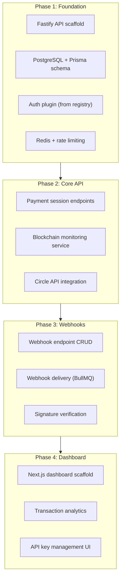
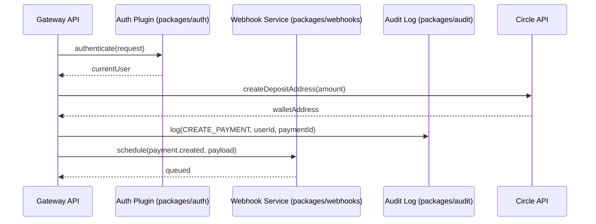

# Implementation Plan: Stablecoin Gateway — Core Features

**Product**: stablecoin-gateway
**Spec**: docs/specs/core-features.md
**Created**: 2026-01-28
**Status**: Complete
**Architect**: Claude Architect

## Constitution Check (Pre-Plan Gate)

| Article | Requirement | Status |
|---------|------------|--------|
| I. Spec-First | Spec approved (core-features.md) | PASS |
| II. Component Reuse | Auth plugin, webhook delivery, audit log from registry | PASS |
| III. TDD | Tests before implementation in all phases | PASS |
| IV. TypeScript | Strict mode configured | PASS |
| V. Default Stack | Fastify + Prisma + PostgreSQL | PASS |
| VI. Traceability | All phases map to FR requirements | PASS |
| VII. Port Registry | API: 5001, Web: 3101 registered | PASS |
| VIII. Git Safety | Feature branch, specific staging | PASS |
| IX. Diagram-First | C4, ER, sequence diagrams in spec | PASS |
| X. Quality Gates | 6 gates planned in Phase 8 | PASS |

## Architecture Overview

## Integration Points

## Phase Breakdown

### Phase 1: Foundation (Days 1-2)

**Objectives**: Project scaffold, database schema, auth

| Task ID | Task | Agent | Dependencies | FR Refs |
|---------|------|-------|-------------|---------|
| T001 | Write auth integration tests | Backend | None | FR-004 |
| T002 | Fastify project scaffold with TypeScript | Backend | None | — |
| T003 | Prisma schema: User, ApiKey, Transaction, WebhookEndpoint, AuditLog | Data | T002 | FR-001, FR-005, FR-008 |
| T004 | Install auth plugin from packages/auth | Backend | T002, T003 | FR-004 |
| T005 | Redis plugin from packages/shared | Backend | T002 | NFR-003 |
| T006 | Verify auth tests pass | Backend | T001, T004 | FR-004 |

### Phase 2: Core Payment API (Days 3-4)

| Task ID | Task | Agent | Dependencies | FR Refs |
|---------|------|-------|-------------|---------|
| T010 | Write payment session tests | Backend | T006 | FR-001, FR-002 |
| T011 | Payment session endpoint (POST /api/v1/payments) | Backend | T010 | FR-001 |
| T012 | Circle API integration service | Backend | T011 | FR-001 |
| T013 | Blockchain monitoring service (Alchemy) | Backend | T012 | FR-002 |
| T014 | Payment status update flow | Backend | T013 | FR-002 |
| T015 | Verify payment tests pass | Backend | T010, T011-T014 | FR-001, FR-002 |

### Phase 3: Webhooks (Days 5-6)

| Task ID | Task | Agent | Dependencies | FR Refs |
|---------|------|-------|-------------|---------|
| T020 | Write webhook delivery tests | Backend | T015 | FR-003, FR-010 |
| T021 | Webhook endpoint CRUD API | Backend | T020 | FR-010 |
| T022 | BullMQ delivery queue with retry | Backend | T021 | FR-003 |
| T023 | HMAC signature signing and verification | Backend | T022 | FR-003 |
| T024 | Verify webhook tests pass | Backend | T020-T023 | FR-003 |

### Phase 4: Dashboard (Days 7-9)

| Task ID | Task | Agent | Dependencies | FR Refs |
|---------|------|-------|-------------|---------|
| T030 | Write dashboard component tests | Frontend | None | FR-007, FR-009 |
| T031 | Next.js dashboard scaffold (port 3101) | Frontend | None | — |
| T032 | Auth pages (login, register) | Frontend | T031 | FR-004 |
| T033 | Transaction list with filters | Frontend | T032 | FR-007 |
| T034 | Analytics charts (volume, success rate) | Frontend | T033 | FR-007 |
| T035 | API key management UI | Frontend | T032 | FR-005 |
| T036 | CSV export | Frontend | T033 | FR-009 |
| T037 | Verify dashboard tests pass | Frontend | T030-T036 | FR-007 |

### Phase 5: Quality Gates (Day 10)

| Task ID | Task | Agent |
|---------|------|-------|
| T040 | Spec consistency gate (/speckit.analyze) | QA |
| T041 | Security gate (npm audit, secret scan) | Security |
| T042 | Performance gate (Lighthouse, bundle) | Performance |
| T043 | E2E tests (Playwright) | QA |
| T044 | Testing gate report | QA |

## Technology Decisions

| Decision | Choice | Rationale |
|----------|--------|-----------|
| Backend framework | Fastify | 2x faster than Express, TypeScript native |
| ORM | Prisma | Type-safe queries, migration management |
| Queue | BullMQ + Redis | Reliable webhook delivery with retry |
| Blockchain | Alchemy + Circle API | Managed infrastructure, no node operation |
| Frontend | Next.js 14 | SSR for SEO, App Router |

## Security Considerations

- API keys: HMAC-SHA256 hash only stored (never plaintext)
- JWT secrets: environment variable, never committed
- Rate limiting: per API key, Redis-backed for distributed enforcement
- Audit logging: every financial operation immutably logged
- Webhook signatures: HMAC-SHA256 with customer secret
- CORS: allowlist of permitted origins only
