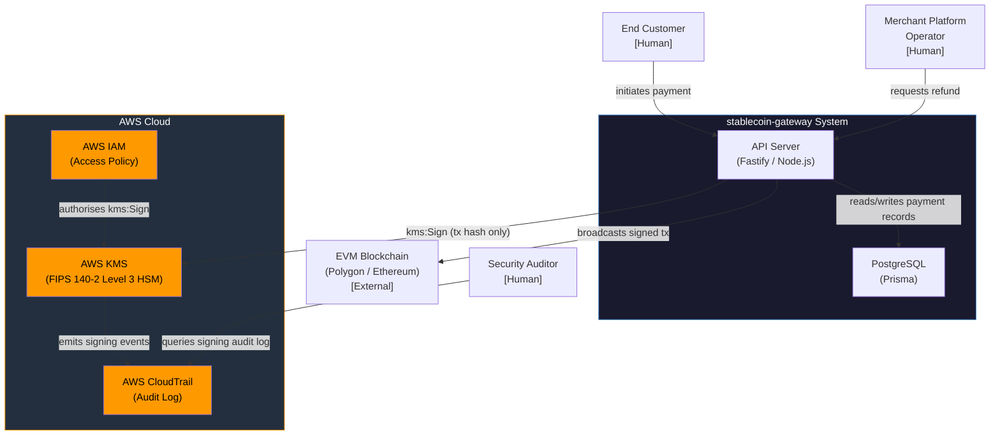
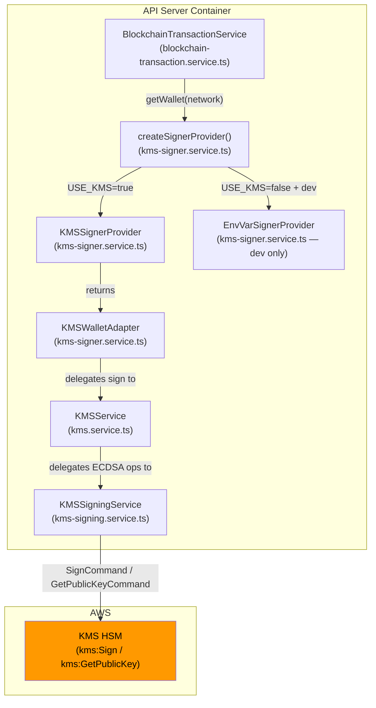
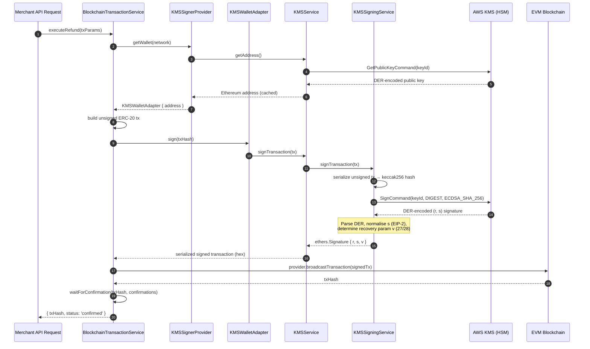
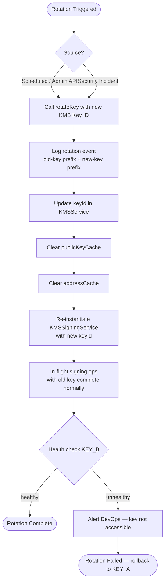

# Feature Specification: KMS Hot Wallet Security

**Feature ID**: KMS-01
**Product**: stablecoin-gateway
**Status**: Draft
**Date**: 2026-02-27
**Author**: Product Manager (ConnectSW)
**Branch**: feature/stablecoin-gateway/kms-hot-wallet

---

## 1. Overview

### 1.1 Feature Name

KMS Hot Wallet Security — Replace raw private key env var with AWS KMS-backed signing

### 1.2 Problem Statement

The stablecoin-gateway hot wallet originally stored its Ethereum private key
directly in the `HOT_WALLET_PRIVATE_KEY` environment variable. This was
accepted as a calculated risk at MVP launch (CRIT-002 in SECURITY-DECISIONS.md)
with a hard review date of 2026-03-01.

Storing a raw private key in any environment variable is a critical security
risk for the following reasons:

- Any process on the host with memory access (or log aggregation leak) can
  extract the raw key and drain the wallet without limit.
- Log scraping, exception dumps, or misconfigured observability tooling can
  accidentally surface the key value.
- Key rotation requires restarting the application and coordinating across all
  deployment environments simultaneously.
- There is no tamper-evident audit trail of individual signing operations.

Although the hot wallet maximum balance is capped at $100, the principal risk
is architectural: a compromised signing key pattern establishes a weak security
posture for future wallet expansion and erodes merchant trust.

### 1.3 Proposed Solution

Replace direct private-key access with AWS Key Management Service (KMS). The
raw private key is generated and stored exclusively inside an AWS HSM (FIPS
140-2 Level 3). Application code calls `KMS:Sign` to sign Ethereum transactions;
the signing operation executes inside the HSM and only the signature output
(r, s, v) is returned to the application. The raw key material never leaves
AWS KMS and is never present in application memory, logs, or environment
variables.

**Note on existing implementation**: A code review of the repository reveals
that `kms.service.ts`, `kms-signing.service.ts`, and `kms-signer.service.ts`
have already been authored and are present in the codebase. The
`BlockchainTransactionService` already uses the `createSignerProvider()`
abstraction, gated behind `USE_KMS=true`. This spec therefore serves as the
formal requirements artifact that authorises the feature, defines acceptance
criteria, and captures the full security contract — enabling the implementation
to be reviewed, tested, and shipped against a verified baseline.

### 1.4 Scheduled Delivery

Per SECURITY-DECISIONS.md: **2026-03-01** (Month 3, post-launch)

---

## 2. Business Context

### 2.1 Why This Feature Exists

ConnectSW accepted CRIT-002 as a bootstrapping trade-off: no KMS costs (~$50/mo)
during beta, maximum hot wallet exposure capped at $100. With the product now
generating revenue and growing transaction volume, the risk calculus has changed:

| Factor | At MVP Launch | Now (Month 3) |
|--------|--------------|----------------|
| Hot wallet balance cap | $100 | $100 (unchanged) |
| Monthly transaction volume | ~$0 | Growing |
| Merchant count | 0 | Growing |
| Brand trust stakes | Low | Medium/High |
| AWS KMS cost | Not affordable | Affordable ($0.03/signing op) |
| Audit requirement | None | Customer SOC2 requests starting |

### 2.2 Target Personas

| Persona | Role | Concern |
|---------|------|---------|
| Merchant Platform Operator | Deploys and operates the gateway | Signing keys must not be exposed in memory or logs |
| Security Auditor | Reviews security posture for SOC2 / PCI | Every signing event must be audit-trailed through KMS CloudTrail |
| DevOps Engineer | Manages infrastructure and key lifecycle | Key rotation must not require downtime or key re-export |

---

## 3. User Stories

### US-KMS-01: Secure Key Storage (Merchant Platform Operator)

**As a** merchant platform operator,
**I want** the hot wallet signing key stored exclusively in AWS KMS
**so that** the raw private key is never accessible in application memory,
environment variables, or log output.

#### Acceptance Criteria

**AC-KMS-01-01** — KMS mode enabled:
- **Given** the application is deployed with `USE_KMS=true` and a valid
  `KMS_KEY_ID`,
- **When** a refund transaction is requested,
- **Then** the transaction is signed via `KMS:Sign` API; no raw private key
  bytes are present in application heap or logs.

**AC-KMS-01-02** — Env var blocked in production:
- **Given** the application is deployed with `NODE_ENV=production` and
  `USE_KMS=false` (or `USE_KMS` is absent),
- **When** the application attempts to initialise the signer,
- **Then** the application throws a startup error with code
  `kms-not-configured` and refuses to start; it does NOT fall back to any
  env-var key.

**AC-KMS-01-03** — No key in logs:
- **Given** KMS mode is active,
- **When** any error occurs during a signing operation,
- **Then** the logged error message contains no private key bytes, no AWS
  key ARN beyond a truncated prefix (first 8 chars), and no signature
  intermediate values.

**AC-KMS-01-04** — Env var fallback available in development only:
- **Given** the application is deployed with `NODE_ENV=development` and
  `USE_KMS=false`,
- **When** a transaction is signed,
- **Then** the env var fallback path is used with a `WARN`-level log entry
  stating "NOT SAFE FOR PRODUCTION".

---

### US-KMS-02: Full Signing Audit Trail (Security Auditor)

**As a** security auditor,
**I want** all transaction signing operations to pass through AWS KMS
**so that** I can use AWS CloudTrail to produce a tamper-evident, per-operation
signing log for compliance reviews.

#### Acceptance Criteria

**AC-KMS-02-01** — CloudTrail coverage:
- **Given** KMS mode is enabled and CloudTrail is configured on the AWS account,
- **When** any EVM transaction is signed (refund, gas top-up, or test),
- **Then** a `kms:Sign` event appears in CloudTrail within 60 seconds,
  containing: KeyId, CallerIdentity (IAM role ARN), EventTime, and
  RequestParameters.MessageType = DIGEST.

**AC-KMS-02-02** — Signing algorithm enforced:
- **Given** a signing request is submitted to KMS,
- **When** the `SignCommand` is issued,
- **Then** `SigningAlgorithm` is always `ECDSA_SHA_256`; no other algorithm is
  permitted by the application layer.

**AC-KMS-02-03** — Application-level signing log:
- **Given** a signing operation completes (success or failure),
- **When** the application logger records the event,
- **Then** the log entry includes: timestamp, keyId prefix (first 8 chars),
  operation type (`transaction-signing` or `message-signing`), network
  (polygon/ethereum), and outcome (success/error-code). No signature bytes
  are logged.

---

### US-KMS-03: Zero-Downtime Key Rotation (DevOps Engineer)

**As a** DevOps engineer,
**I want** KMS key rotation to be supported without application restart or
raw-key export
**so that** we can rotate signing keys on a scheduled basis or in response
to a security incident without service interruption.

#### Acceptance Criteria

**AC-KMS-03-01** — In-process rotation API:
- **Given** the `KMSService` is running with key `KEY_A`,
- **When** `kmsService.rotateKey('KEY_B')` is called (e.g. via an internal
  admin endpoint or a config reload),
- **Then** subsequent signing operations use `KEY_B`; in-flight operations
  using `KEY_A` complete without error; cache is cleared.

**AC-KMS-03-02** — No key material ever exported:
- **Given** a rotation is triggered,
- **When** the rotation completes,
- **Then** neither `KEY_A` nor `KEY_B` raw key bytes are written to disk,
  emitted to logs, or passed between services; only the KMS Key ID string
  is referenced.

**AC-KMS-03-03** — Cache invalidation on rotation:
- **Given** the public key and address have been cached from `KEY_A`,
- **When** `rotateKey('KEY_B')` is called,
- **Then** `publicKeyCache` and `addressCache` are set to `null`; the next
  call to `getAddress()` or `getPublicKey()` fetches fresh values from
  `KEY_B`.

**AC-KMS-03-04** — Health check post-rotation:
- **Given** rotation to `KEY_B` has occurred,
- **When** `healthCheck()` is called,
- **Then** it returns `{ status: 'healthy' }` if `KEY_B` is accessible and
  `{ status: 'unhealthy', message: '...' }` if not — within 5 seconds.

---

## 4. C4 Context Diagram

---

## 5. C4 Component Diagram — KMS Signing Stack

---

## 6. Transaction Signing Sequence Diagram

---

## 7. Key Rotation Flow Diagram

---

## 8. Edge Cases Table

| # | Scenario | Expected Behaviour | Failure Mode |
|---|----------|--------------------|--------------|
| EC-01 | KMS API unavailable (network outage, AWS regional incident) | `KMSService` throws `AppError(500, 'kms-signing-error', 'KMS signing failed')`. Application returns `503` to caller. No raw key fallback in production. | If not handled: silent failure or unhandled promise rejection |
| EC-02 | Key rotation in-flight while signing op is running | In-flight ops using old key complete normally (they hold a reference to the old `KMSSigningService` instance). New ops after `rotateKey()` returns use the new key. | Race condition if `signingService` ref is not atomically updated |
| EC-03 | Network timeout to KMS (latency > 30 s) | SDK `requestTimeout` is set to 30,000 ms. After timeout, `SignCommand` throws; `sanitizeKmsError` wraps it as `AppError`. Retry logic (maxRetries=3) applies before surfacing to caller. | If timeout is too long: transaction throughput degrades; queue backs up |
| EC-04 | Invalid or deleted KMS Key ID configured | `GetPublicKeyCommand` returns `NotFoundException`. `getAddress()` throws `AppError(500, 'kms-public-key-retrieval-error')`. Startup health check surfaces this as `unhealthy` before first transaction. | If health check not run at startup: first transaction fails with opaque 500 |
| EC-05 | Concurrent signing requests (burst traffic) | Each request independently calls `KMSSigningService.sign()`. AWS KMS is stateless per-request; concurrency is safe. `NonceManager` (Redis-based) serialises nonce assignment to prevent nonce collisions. | Without NonceManager: concurrent txs may share a nonce and only one confirms |
| EC-06 | Recovery parameter (v) cannot be determined | `findRecoveryParam` tries v=27 and v=28; if neither produces the expected address it throws `'Could not determine recovery parameter (v)'`. This is theoretically impossible for a correctly formed ECDSA sig but guards against KMS key misconfiguration (e.g. wrong key type). | If not guarded: invalid transaction broadcast, wasted gas, stuck payment |
| EC-07 | `s` value in upper half of curve order (non-canonical) | `KMSSigningService.sign()` normalises `s` to lower half (`s = N - s`) per EIP-2 before using it. This prevents tx malleability. | Without normalisation: transaction rejected by Ethereum mempool |
| EC-08 | KMS returns signature with wrong key (misconfigured key alias) | `findRecoveryParam` fails for both v values and throws. The signed transaction is never broadcast. | Without address verification: wrong-signer tx broadcast, certain chain rejection |
| EC-09 | `USE_KMS=true` but `KMS_KEY_ID` not set | `createKMSService()` throws `AppError(500, 'kms-not-configured', 'KMS_KEY_ID environment variable is required')` at startup. | If not caught at startup: first transaction attempt fails with confusing 500 |
| EC-10 | KMS key scheduling deletion (30-day window) | `GetPublicKeyCommand` returns `KMSInvalidStateException`. Health check returns `unhealthy`. PagerDuty/CloudWatch alarm triggers. DevOps must cancel deletion or rotate before window closes. | Without monitoring: signing silently fails post-deletion |

---

## 9. Component Reuse Check

Checked against `.claude/COMPONENT-REGISTRY.md` (last updated: 2026-02-14).

| Need | Registry Entry | Decision |
|------|---------------|----------|
| Structured logging with PII redaction | `@connectsw/shared/utils/logger` | REUSE — `kms.service.ts` and `kms-signing.service.ts` already import `../utils/logger.js` (product-local copy of same pattern) |
| Crypto utilities | `@connectsw/shared/utils/crypto` | NOT APPLICABLE — KMS signing uses AWS SDK + ethers.js; no symmetric crypto needed |
| Auth plugin (JWT / API key) | `@connectsw/auth/backend` | NOT APPLICABLE — KMS operates at signing layer, not HTTP auth layer |
| Redis plugin | `@connectsw/shared/plugins/redis` | APPLICABLE for NonceManager (already integrated in BlockchainTransactionService) |
| KMS signing | Not in registry | NEW — `KMSService`, `KMSSigningService`, `KMSSignerProvider` are domain-specific to blockchain. Should be documented in registry as a stablecoin-gateway pattern for reuse if ConnectSW launches additional blockchain products. |

**Registry Update Required**: After this feature ships, add a "Blockchain KMS Signing" entry to `.claude/COMPONENT-REGISTRY.md` referencing the three KMS service files.

---

## 10. Out of Scope

The following are explicitly out of scope for KMS-01:

| Item | Rationale |
|------|-----------|
| Key generation procedure | Assumed pre-existing: key already exists in KMS. DevOps runs `aws kms create-key` separately before deploying with `USE_KMS=true`. |
| Multi-cloud KMS support (GCP KMS, Azure Key Vault, HashiCorp Vault) | AWS-only for now. Vault noted as viable alternative in ADR (`kms.service.ts` header). Abstracted behind `SignerProvider` interface for future extension. |
| Customer fund custody / merchant wallet KMS | Hot wallet only holds gas fees. Merchants receive funds directly to their own wallets; stablecoin-gateway never custodies merchant funds. |
| Hardware Security Module beyond AWS KMS | KMS already uses FIPS 140-2 Level 3 HSMs internally; no additional HSM hardware is required. |
| Multi-region KMS key replication | Single-region AWS KMS for MVP. Multi-region keys can be added in a future sprint if RTO requirements change. |
| Key material backup / escrow | AWS KMS manages key durability. No manual key material backup is required or permitted (would defeat the purpose). |

---

## 11. Risks

| Risk | Likelihood | Impact | Mitigation |
|------|-----------|--------|------------|
| KMS API latency degrades transaction throughput | Medium | Medium | AWS KMS p99 latency is typically < 50 ms within same region. Each signing op adds one KMS round trip. For current volume (< 100 tx/day) this is negligible. Monitor with CloudWatch `KMS.Sign.Latency` metric. |
| AWS KMS cost per signing operation | Low | Low | Pricing: $0.03 per 10,000 signing operations. At 1,000 tx/day, cost is $0.003/day ($1.09/year). Well within budget. |
| KMS unreachable — no fallback in production | Medium | High | Implement startup health check; alert if KMS is unhealthy before accepting traffic. Use AWS KMS SLA (99.999% availability). For disaster recovery, document manual procedure to temporarily allow env-var fallback with CEO sign-off. |
| Developer accidentally deploys with `USE_KMS=false` in production | Low | Critical | `EnvVarSignerProvider.getWallet()` throws immediately if `NODE_ENV=production`. CI/CD pipeline should validate `USE_KMS=true` in production env config before deploy. |
| KMS key IAM policy too permissive | Low | High | IAM policy must grant `kms:Sign` and `kms:GetPublicKey` only to the gateway's IAM role. No `kms:Decrypt`, `kms:GenerateDataKey`, or `kms:ScheduleKeyDeletion` permissions. Reviewed in security audit. |
| Recovery parameter (v) computation error | Very Low | High | Mitigated by `findRecoveryParam` address verification loop. Any signature that cannot be attributed to the expected address is rejected before broadcast. |

---

## 12. Non-Functional Requirements

| Requirement | Target |
|-------------|--------|
| KMS signing latency overhead | < 100 ms per transaction (p99) |
| Signing availability | Matches AWS KMS SLA: 99.999% |
| Audit log completeness | 100% of signing ops appear in CloudTrail |
| Key rotation time (in-process) | < 5 seconds with zero dropped transactions |
| Error message information leakage | Zero private key bytes in any log or error response |
| Production deployment validation | CI/CD must reject deploys with `USE_KMS!=true` in production |

---

## 13. Definition of Done

- [ ] `USE_KMS=true` mode uses AWS KMS for all signing operations (AC-KMS-01-01)
- [ ] Production blocks env-var fallback with clear error (AC-KMS-01-02)
- [ ] No key bytes appear in any log or error output (AC-KMS-01-03)
- [ ] CloudTrail captures every `kms:Sign` call (AC-KMS-02-01)
- [ ] Signing algorithm enforced as `ECDSA_SHA_256` (AC-KMS-02-02)
- [ ] Application signing log includes required fields without sensitive data (AC-KMS-02-03)
- [ ] `rotateKey()` switches to new key without restart (AC-KMS-03-01)
- [ ] Cache invalidated on rotation (AC-KMS-03-03)
- [ ] Health check returns correct status post-rotation (AC-KMS-03-04)
- [ ] Unit tests cover all 10 edge cases in Section 8
- [ ] Integration test demonstrates end-to-end signing via KMS mock/localstack
- [ ] `SECURITY-DECISIONS.md` CRIT-002 signed off by Security Engineer and DevOps
- [ ] Component registry updated with KMS signing pattern entry

---

## 14. Open Questions

| # | Question | Owner | Status |
|---|----------|-------|--------|
| OQ-01 | Should the internal admin endpoint for `rotateKey()` require CEO approval or can DevOps trigger independently? | CEO / Security | [NEEDS CLARIFICATION] |
| OQ-02 | What is the target AWS region for KMS key? Must match API deployment region for lowest latency. | DevOps | [NEEDS CLARIFICATION] |
| OQ-03 | Should CloudWatch alarms for KMS health be wired to PagerDuty immediately, or email-only for MVP? | DevOps | [NEEDS CLARIFICATION] |
| OQ-04 | Is a separate KMS key required per environment (dev/staging/prod) or is a single key with IAM policies sufficient? | Security / DevOps | [NEEDS CLARIFICATION] |

---

*Specification authored by: Product Manager (ConnectSW)*
*Review required by: Security Engineer, Backend Engineer, DevOps Engineer*
*Approved by CEO risk acceptance: 2026-01-28 (CRIT-002, SECURITY-DECISIONS.md)*
