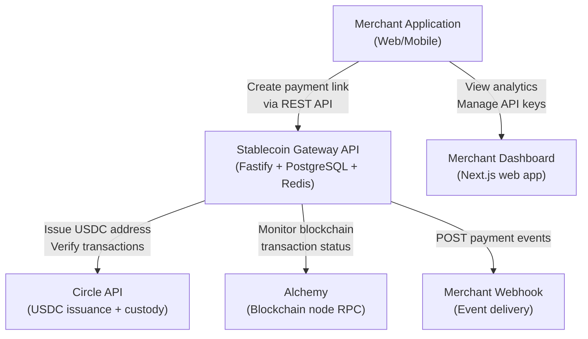
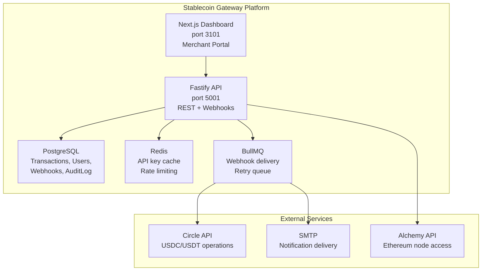
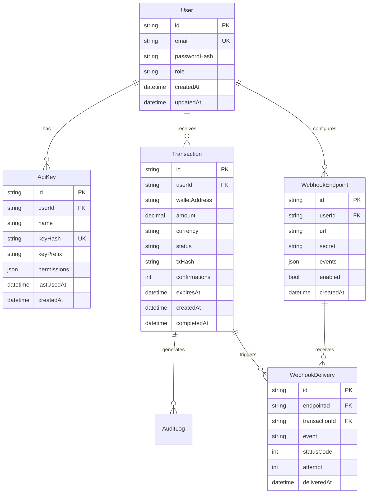
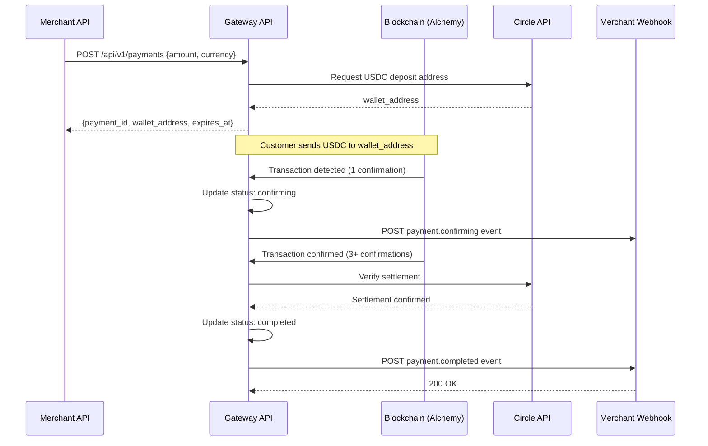

# Feature Specification: Stablecoin Gateway — Core Features

**Product**: stablecoin-gateway
**Feature Branch**: `feature/stablecoin-gateway/core-mvp`
**Created**: 2026-01-28
**Status**: Accepted
**Version**: 1.0

## Business Context

### Problem Statement

Online merchants lose 2-3% of revenue to credit card processing fees. Stablecoins (USDC/USDT) offer sub-1% fees and instant settlement — but no developer-friendly solution exists. Stablecoin Gateway bridges traditional commerce and blockchain payments by providing a Stripe-like API experience for stablecoin acceptance.

### Target Users

| Persona | Role | Pain Point | Expected Outcome |
|---------|------|-----------|-----------------|
| Alex (Developer) | Backend engineer at e-commerce company | Existing crypto APIs are complex and poorly documented | Integrate stablecoin payments in <1 hour with clear docs and SDK |
| Sarah (Merchant) | E-commerce founder ($200k ARR) | Paying 2.9% + $0.30 per Stripe transaction | Reduce payment fees to 0.5% and get instant settlement |
| Bob (Finance) | CFO at SaaS company | Slow settlement delays cash flow planning | Same-day USDC settlement with clear reconciliation |

### Business Value

- **Revenue Impact**: 0.5% fee per transaction. $1M volume = $5,000 MRR
- **User Retention**: Developer-first experience creates sticky integrations. API changes require SDK updates — high switching cost
- **Competitive Position**: Only stablecoin payment gateway with Stripe-quality DX and <0.5% fees
- **Strategic Alignment**: Phase 1 of ConnectSW fintech product portfolio

## System Context (C4 Level 1)

## Container Diagram (C4 Level 2)

## User Scenarios & Testing

### User Story 1 — Merchant API Integration (Priority: P1)

**As a** developer integrating a payment system, **I want to** create a payment session via REST API and receive a wallet address, **so that** my customers can pay with USDC without me handling crypto infrastructure.

**Acceptance Criteria**:

1. **Given** a merchant with a valid API key, **When** they POST to `/api/v1/payments` with amount and currency, **Then** the API returns a payment object with a unique USDC wallet address, expiry, and payment ID within 500ms
2. **Given** a payment session exists, **When** a customer sends USDC to the wallet address, **Then** the payment status updates to `confirming` within 60 seconds of blockchain confirmation
3. **Given** a payment has 3+ block confirmations, **When** the blockchain confirms the transaction, **Then** the payment status becomes `completed` and a webhook is fired to the merchant endpoint

### User Story 2 — Webhook Event Delivery (Priority: P1)

**As a** merchant's backend system, **I want to** receive signed webhook events for payment state changes, **so that** I can fulfil orders automatically without polling the API.

**Acceptance Criteria**:

1. **Given** a payment status changes, **When** the event occurs, **Then** a signed webhook POST is sent to the merchant's registered endpoint within 5 seconds
2. **Given** webhook delivery fails (non-2xx response), **When** the system retries, **Then** exponential backoff is applied: 1min, 5min, 30min, 2hr, 8hr (5 total attempts)
3. **Given** a webhook payload, **When** the merchant verifies the signature, **Then** HMAC-SHA256 with the webhook secret matches the `X-Signature` header

### User Story 3 — Merchant Dashboard (Priority: P2)

**As a** merchant, **I want to** view my payment history, analytics, and manage API keys, **so that** I can monitor my business and control system access.

**Acceptance Criteria**:

1. **Given** a logged-in merchant, **When** they view the dashboard, **Then** they see transaction volume, success rate, and revenue for the last 30 days
2. **Given** a merchant navigates to API Keys, **When** they create a new key, **Then** a key is generated once (shown once, not stored in plaintext) with configurable permissions
3. **Given** a merchant views transactions, **When** they filter by date or status, **Then** results update without page reload and can be exported to CSV

### User Story 4 — Security & Compliance (Priority: P1)

**As a** merchant using the API, **I want to** trust that my API keys are secure and my transactions are auditable, **so that** I can use Stablecoin Gateway for production payments.

**Acceptance Criteria**:

1. **Given** any API key, **When** it is stored in the database, **Then** only the HMAC-SHA256 hash is stored — plaintext never persists
2. **Given** any financial operation, **When** it completes, **Then** an immutable audit log entry is created with actor, action, resource, timestamp, and IP
3. **Given** a rate limit is exceeded, **When** the next request arrives, **Then** a 429 response with retry-after header is returned (100 req/min for free tier, 1000 req/min for paid)

## Functional Requirements

| ID | Requirement | Priority | Story |
|----|-------------|----------|-------|
| FR-001 | Create payment session with wallet address | P1 | US-1 |
| FR-002 | Monitor blockchain transaction confirmations | P1 | US-1 |
| FR-003 | Signed webhook delivery with retry | P1 | US-2 |
| FR-004 | Merchant authentication (email + password + JWT) | P1 | US-4 |
| FR-005 | API key management (HMAC hash storage) | P1 | US-4 |
| FR-006 | Rate limiting per API key tier | P1 | US-4 |
| FR-007 | Transaction dashboard with filters | P2 | US-3 |
| FR-008 | Audit log for all financial operations | P1 | US-4 |
| FR-009 | CSV export of transactions | P2 | US-3 |
| FR-010 | Webhook endpoint management | P1 | US-2 |

## Non-Functional Requirements

| ID | Requirement | Target |
|----|-------------|--------|
| NFR-001 | API response time (P95) | < 200ms |
| NFR-002 | Payment session creation | < 500ms |
| NFR-003 | Webhook delivery latency | < 5 seconds |
| NFR-004 | System uptime | 99.9% |
| NFR-005 | WCAG 2.1 AA accessibility | Dashboard only |

## Data Model

## Payment Flow Sequence

