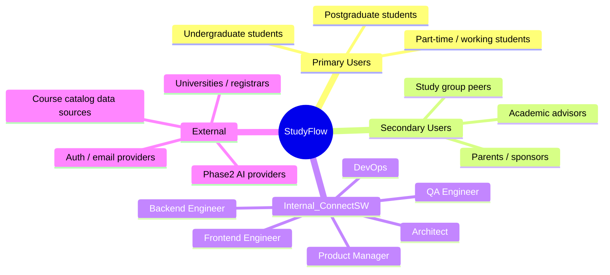
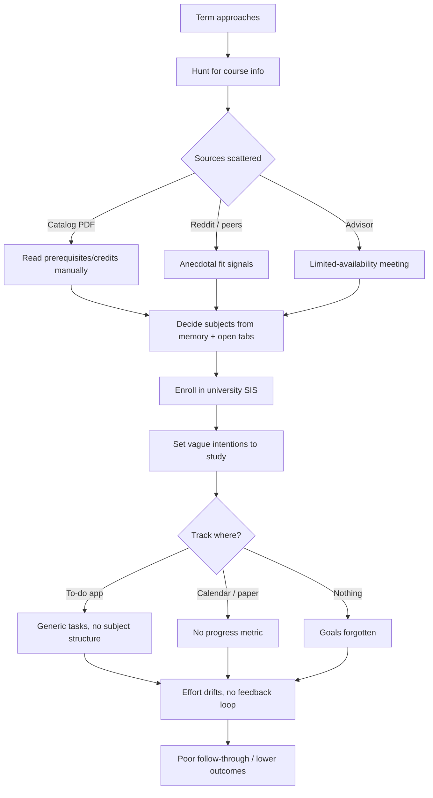
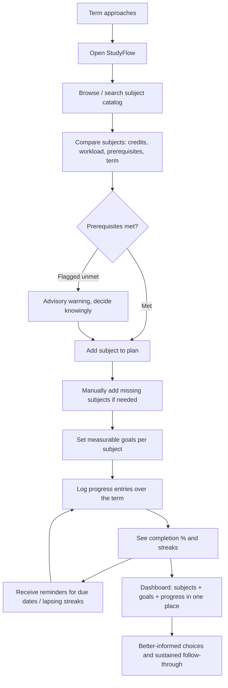
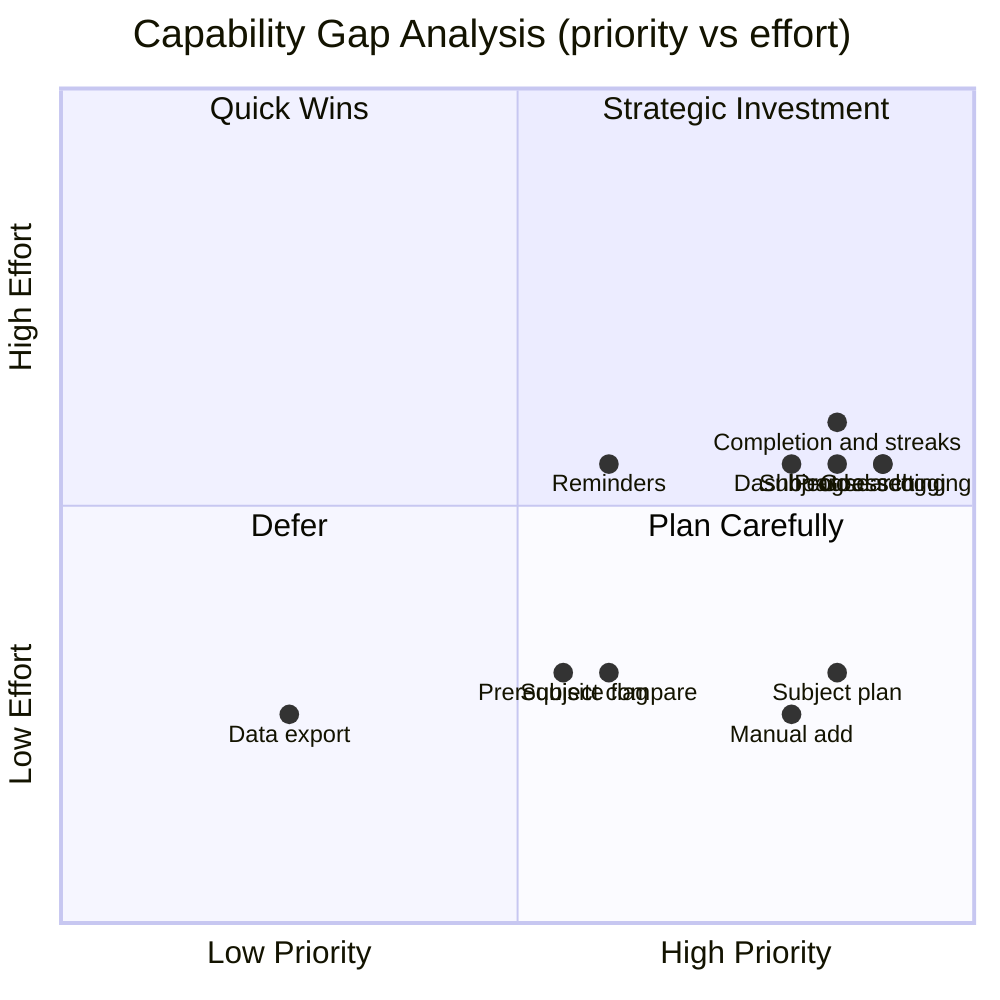

# Business Analysis Report: StudyFlow

**Product:** StudyFlow
**Author:** Business Analyst (ConnectSW)
**Date:** 2026-06-17
**Task:** BA-01 — Conduct Business Analysis
**Status:** Complete — input for SPEC-01 / PRD-01
**Source brief:** `products/studyflow/notes/ceo-brief.md`

---

## 1. Executive Summary

StudyFlow is a web application that helps **university students** close the loop between *deciding what to study* and *actually following through on study goals*. Today, students make subject/course decisions with fragmented information (siloed catalog PDFs, Reddit threads, word-of-mouth) and then manage their study effort in tools that were never designed for academic goal-tracking (generic to-do apps, calendars, paper). The result is poorly-informed enrollment choices and study goals that are set once and abandoned.

The MVP deliberately ships **without AI** — a pure CRUD experience covering the full integrated loop: **choose subjects → set measurable study goals per subject → track progress**. This is a strategic advantage, not a limitation: the competitive landscape is split between *course-discovery* tools (Coursicle, university planners) and *productivity* tools (Notion, Todoist, MyStudyLife) that students manually duct-tape together. No mainstream tool owns the combined "discover subjects AND track structured study goals against them" workflow with a purpose-built data model. StudyFlow's differentiation is **integration and academic-native structure**, which requires zero AI to deliver.

**Recommendation: GO.** The build is low technical risk (standard ConnectSW stack, pure CRUD, no third-party integrations in MVP), the problem is well-evidenced, and the no-AI MVP de-risks scope while establishing the proprietary data model (subjects → goals → progress) that becomes the moat and the training/feature substrate for Phase 2 AI. The principal risks are not technical but **adoption and retention** — students churn out of study tools quickly — so the report places heavy emphasis on activation, habit-loop, and retention metrics.

---

## 2. Business Context

### 2.1 Problem Statement

University students experience two connected, recurring failures:

1. **Subject/course selection is high-stakes but information-poor.** A wrong elective or an unmet prerequisite costs real money (re-enrollment, extra terms), GPA, and time. Information lives in disconnected places — course catalog PDFs, departmental advisors with limited availability, informal peer channels. Students compare subjects on credits, workload, prerequisites, and "fit" largely from memory and open browser tabs.
2. **Study goals are set but not sustained.** Even motivated students set goals ("finish 3 chapters/week", "grade target A") and then lose them in generic tools that have no concept of a *subject*, a *measurable academic target*, or *progress over a term*. There is no structured feedback loop (streaks, completion %, reminders) tied to the subjects they actually enrolled in.

**Who experiences it:** Undergraduate and postgraduate university students, across the term lifecycle — heaviest at enrollment windows (selection) and continuously during the term (goal-tracking).

**Cost of inaction (to the student):** wasted tuition on poorly-chosen subjects, additional terms to graduate, lower grades from unmanaged effort, and chronic stress. **Cost of inaction (to ConnectSW):** the discover→track workflow remains fragmented across 3-4 tools, and the proprietary academic data model that enables Phase 2 AI never gets built.

### 2.2 Market Landscape

- **EdTech / student productivity** is a large, durable market with a continuously renewing user base (every cohort of new students). Global higher-education enrollment is in the hundreds of millions; the addressable wedge is digitally-native students who already use apps to manage life and study.
- **Trends favouring StudyFlow:** (1) students already self-organise in Notion/Todoist, proving demand for structure; (2) post-pandemic normalisation of self-directed/online study increases the need for personal goal-tracking; (3) growing "academic comeback"/study-with-me/productivity culture (TikTok, YouTube) drives intent.
- **Disruption opportunity:** the gap between *discovery* tools and *productivity* tools. Each side individually is crowded; the **integrated, academic-native middle is underserved**. Owning it with a clean CRUD product first (then AI) is a defensible entry.

### 2.3 Target Segments

| Segment | Description | Relative size | Priority |
|---------|-------------|---------------|----------|
| **Primary** | Undergraduate university students actively choosing subjects each term and wanting to manage study effort | Largest | P0 |
| **Secondary** | Postgraduate / returning / part-time students balancing study with work | Medium | P1 |
| **Tertiary** | Highly-organised "productivity-native" students currently using Notion/Todoist setups (early adopters, advocates) | Smaller but high-influence | P1 |

---

## 3. Stakeholder Analysis

### 3.1 Stakeholder Map

### 3.2 Stakeholder Register

| Stakeholder | Role | Interest | Influence | Needs | Communication |
|-------------|------|----------|-----------|-------|---------------|
| Undergraduate student | Primary user | High — career/GPA outcomes | High (adoption decides success) | Fast subject comparison, simple goal-setting, motivating progress feedback | In-product UX, reminders |
| Postgraduate / part-time student | Primary user | High — time-constrained | Medium | Low-friction tracking that fits a busy life | In-product UX, email reminders |
| Productivity-native student | Early adopter / advocate | High — wants the "right tool" | Medium-High (word of mouth) | Structure, data ownership, export | In-product, community |
| Academic advisor | Secondary | Medium — wants students to make sound choices | Low (not a user in MVP) | Visibility into student plans (Phase 2+) | N/A in MVP |
| University registrar / catalog source | Data provider (Phase 2) | Low-Medium | Low in MVP (seed catalog only) | Accurate catalog representation | N/A in MVP (manual seed) |
| ConnectSW Product Manager | Spec owner | High | High | Clear BNs + US mapping (this doc) | Spec/PRD handoff |
| ConnectSW Engineering/QA | Builders | High | High | Unambiguous, testable requirements | Spec, ADRs, tasks |
| Phase 2 AI provider | Future integration | Low in MVP | Low | Clean structured data model to build on | Deferred |

### 3.3 Power/Interest Grid

| | **Low Interest** | **High Interest** |
|---|---|---|
| **High Power** | (none significant) | **Manage Closely:** Students (primary users), ConnectSW PM & Engineering |
| **Low Power** | **Monitor:** Registrars/catalog sources (MVP), Phase 2 AI providers | **Keep Informed:** Advisors, parents/sponsors, advocate students |

---

## 4. Requirements Elicitation

### 4.1 Business Needs

| ID | Need | Source | Priority (MoSCoW) | Rationale |
|----|------|--------|-------------------|-----------|
| BN-001 | Students can register and securely sign in to a personal account | CEO brief (auth: email/password) | Must | Data is per-student; everything depends on identity |
| BN-002 | Students can browse and search a catalog of subjects/courses with key attributes (code, credits, workload, prerequisites, term, description) | CEO brief, problem statement | Must | Discovery is half the core loop; without it students can't choose informed |
| BN-003 | Students can compare subjects side-by-side on the attributes that drive choice | Problem statement, competitive gap | Should | Comparison is the differentiator vs. flat catalog PDFs |
| BN-004 | Students can add subjects to a personal plan/selection for a term | CEO brief (Enrollment/Selection) | Must | The bridge between discovery and goal-setting |
| BN-005 | Students can manually add a subject not in the seed catalog | Addendum (manual add) | Must | Seed catalog is incomplete by design; avoids dead-ends |
| BN-006 | Students can set one or more measurable study goals per chosen subject (title, metric, target value, due date) | CEO brief (Goal) | Must | Core value prop part 2; goals must be structured/measurable |
| BN-007 | Students can log progress entries against a goal (date, value/note) | CEO brief (ProgressEntry) | Must | Tracking is the loop's third leg; data for streaks/completion |
| BN-008 | Students can see goal completion % and streaks derived from progress entries | CEO brief (track progress, streaks) | Must | The motivating feedback that drives retention |
| BN-009 | Students receive reminders/nudges about upcoming goal due dates and lapsing streaks | CEO brief (reminders) | Should | Retention lever; closes the habit loop |
| BN-010 | Students can view a dashboard summarising chosen subjects, active goals, and overall progress | Problem statement (single place) | Must | "Single place" is the headline promise |
| BN-011 | Students can edit/delete subjects, goals, and progress entries (full CRUD) | Implied by data model | Must | Plans change; data must be correctable |
| BN-012 | Students can export or retain their own data (data ownership) | Advocate persona, trust | Could | Trust/lock-in concern; differentiator vs. closed tools |
| BN-013 | System enforces academic-meaningful validation (e.g. flag unmet prerequisites when selecting) | Problem statement (prerequisites) | Should | Turns the catalog from passive to decision-supporting |

### 4.2 Business Rules

| ID | Rule | Source | Impact |
|----|------|--------|--------|
| BR-001 | A goal MUST belong to exactly one subject the student has selected | Domain model | Prevents orphan goals; constrains goal-creation UX |
| BR-002 | A progress entry MUST belong to exactly one goal | Domain model | Drives completion/streak calculation integrity |
| BR-003 | Completion % = aggregate of progress values against the goal target (capped at 100%) | Tracking requirement | Defines the streak/completion calculation contract |
| BR-004 | A student can only view/modify their own data | Security/privacy | Authorization boundary on every endpoint |
| BR-005 | Subjects in the seed catalog are read-only; manually-added subjects are owned/editable by the creating student | Addendum (seed + manual) | Two-class subject model in schema |
| BR-006 | A goal's due date MUST NOT be in the past at creation time | Data quality | Validation rule (Zod) |
| BR-007 | Selecting a subject with unmet prerequisites is allowed but MUST be flagged (advisory, not blocking) in MVP | Brief (no SIS integration) | Keeps MVP non-authoritative; avoids false hard-blocks |

### 4.3 Assumptions

| ID | Assumption | Risk if Wrong | Validation Plan |
|----|-----------|---------------|-----------------|
| ASM-001 | A static seed catalog + manual add is enough for MVP utility | Catalog feels empty/irrelevant; weak discovery value | Seed a realistic catalog (one representative faculty); measure manual-add rate |
| ASM-002 | Students will set measurable goals if the form makes structure easy | Goals left vague or skipped; tracking has nothing to track | Usability test goal-creation; track goals-set-per-activated-user |
| ASM-003 | Streaks + completion % are sufficient motivation without AI nudges | Low retention; habit loop too weak | A/B reminders on/off; measure D30 retention delta |
| ASM-004 | Email/password auth is acceptable to students at launch | Drop-off at signup (no SSO/Google) | Track signup funnel; add OAuth in fast-follow if drop-off high |
| ASM-005 | Web-only (responsive) covers the on-the-go logging need | Students won't log progress without a mobile app | Measure progress-entry frequency on mobile browser |
| ASM-006 | The discover+track integration is the felt differentiator (not just nice-to-have) | Users treat it as two disconnected tools | Track % of goals attached to selected subjects; interview |

---

## 5. Process Analysis

### 5.1 Current State (As-Is)

### 5.2 Future State (To-Be)

### 5.3 Process Improvement Opportunities

| As-Is pain | To-Be improvement | Quantified benefit |
|------------|-------------------|--------------------|
| Info scattered across 3-4 sources | Single searchable catalog with comparison | Cut subject-research time per term (target: from hours to minutes) |
| Decisions made from memory/open tabs | Structured comparison + prerequisite flag | Fewer mis-enrollments (proxy: manual-add + flag-acknowledged rate) |
| Goals vague and tool-less | Measurable goals bound to real subjects | Goals-set-per-user > 0 with a structured metric (vs. "intentions") |
| No feedback loop | Completion %, streaks, reminders | Higher D30 retention vs. generic to-do baseline |
| Discover and track are separate tools | One integrated loop | Reduced tool-switching; % goals linked to selected subjects |

---

## 6. Gap Analysis

### 6.1 Capability Gap Matrix

| Capability | Current State | Desired State | Gap | Priority | Effort |
|-----------|---------------|---------------|-----|----------|--------|
| Subject discovery/search | None (PDFs, peers) | Searchable catalog | Full | P0 | M |
| Subject comparison | Manual/memory | Side-by-side compare | Full | P1 | S |
| Personal subject plan | SIS only (no personal layer) | Per-term selection list | Full | P0 | S |
| Manual subject add | N/A | Student-owned subjects | Full | P0 | S |
| Measurable goal-setting | Generic to-do | Subject-bound structured goals | Full | P0 | M |
| Progress logging | Ad hoc/none | Progress entries per goal | Full | P0 | M |
| Completion % / streaks | None | Derived metrics + streaks | Full | P0 | M |
| Reminders | Calendar (manual) | Automated due/streak nudges | Partial | P1 | M |
| Unified dashboard | None | One place for all three | Full | P0 | M |
| Prerequisite checking | Manual reading | Advisory flag | Partial | P1 | S |
| Data export/ownership | Lock-in | Export | Partial | P3 | S |
| AI recommendations | None | (Phase 2) | Deferred | — | — |

### 6.2 Gap Visualization

---

## 7. Competitive Analysis

### 7.1 Competitive Landscape

| Competitor | Strengths | Weaknesses | Market position | Differentiator vs. StudyFlow |
|-----------|-----------|------------|-----------------|------------------------------|
| **Notion / Todoist study setups** | Flexible, popular, free tiers | Not academic-native; user must build structure; goals not bound to subjects | Productivity generalists | StudyFlow ships the structure out-of-the-box |
| **MyStudyLife** | Purpose-built student planner (timetable, tasks, exams) | Timetable/task focus, weak on subject *discovery* and measurable goal-tracking with streaks | Student planner niche | StudyFlow adds discovery + measurable goal loop |
| **Coursicle** | Strong course discovery, real-time section availability | Discovery only; no study-goal tracking | Course-discovery niche | StudyFlow connects discovery to follow-through |
| **Trello / generic Kanban** | Visual, flexible | No academic model, no progress metrics/streaks | Generalist PM | StudyFlow is academic-native |
| **University planners / SIS portals** | Authoritative catalog & enrollment | Clunky, no personal goal/study layer, no comparison UX | Institutional | StudyFlow is the student's personal layer on top |

### 7.2 Feature Comparison Matrix

| Feature | StudyFlow (MVP) | Notion/Todoist | MyStudyLife | Coursicle | Uni planner |
|---------|-----------------|----------------|-------------|-----------|-------------|
| Subject discovery/search | Yes | No | Partial | Yes | Yes |
| Subject comparison | Yes | No | No | Partial | No |
| Personal subject plan | Yes | Manual | Yes | No | Partial |
| Subject-bound measurable goals | Yes | Manual | Partial | No | No |
| Progress logging + completion % | Yes | Manual | Partial | No | No |
| Streaks | Yes | No | No | No | No |
| Reminders | Yes | Yes | Yes | Partial | No |
| Integrated discover→track loop | **Yes** | No | No | No | No |
| AI recommendations | No (Phase 2) | No | No | No | No |

### 7.3 Competitive Positioning

StudyFlow occupies the **integrated, academic-native middle** between course-discovery tools and generic productivity tools. The blue-ocean wedge is the *single product that owns the full discover→set-goals→track loop with a purpose-built subject/goal/progress data model*. The no-AI MVP is not a competitive weakness — none of the listed competitors lead with AI either — and shipping clean CRUD first builds the proprietary structured dataset that makes the Phase 2 AI (subject recommendations, auto-goal generation) genuinely differentiated rather than a thin LLM wrapper.

---

## 8. Feasibility Assessment

### 8.1 Technical Feasibility

- **Stack alignment:** Fully aligned with ConnectSW defaults (Fastify + Prisma + PostgreSQL, Next.js + Tailwind, Zod, TS strict). No exotic dependencies.
- **Complexity:** **Simple-to-moderate.** Pure CRUD over a clean 5-entity model (Student, Subject, Selection, Goal, ProgressEntry). Derived metrics (completion %, streaks) are straightforward aggregations. No AI, no third-party integrations, no real-time, no payments in MVP.
- **Risks & mitigations:** (1) Streak/completion calc correctness → cover with TDD against real DB. (2) Reminders require a scheduled job → use a simple cron/worker; keep advisory. (3) Seed catalog data quality → curate one representative faculty's catalog.

### 8.2 Market Feasibility

- **Demand evidence:** Students already self-assemble this workflow in Notion/Todoist (proven intent); discovery tools (Coursicle) and planners (MyStudyLife) each have traction on one half of the loop.
- **Timing:** Aligns with enrollment windows; productivity/study culture is tailwind.
- **Go-to-market barriers:** Distribution to students (acquisition cost, seasonality) and habit-formation are the real barriers — addressed via metrics focus and reminders, not tech.

### 8.3 Resource Feasibility

- **Effort estimate:** Foundation + full MVP loop is a small set of CRUD slices — estimate **2-3 sprints** with the default agent team (schema/migrations, API CRUD, web UI, dashboard, reminders, E2E).
- **Infrastructure:** Local Postgres (`studyflow_dev`), web `3122`, api `5017`. Standard CI. Email provider for reminders.
- **Third-party dependencies (MVP):** Auth (email/password to start), an email-sending service for reminders. No catalog/SIS integrations.

### 8.4 Feasibility Summary

| Dimension | Rating | Confidence | Key Risk |
|-----------|--------|------------|----------|
| Technical | High | High | Streak/completion correctness, reminder scheduling |
| Market | Medium-High | Medium | Adoption & habit-formation; seasonal acquisition |
| Resource | High | High | Seed catalog curation effort |

---

## 9. Success Metrics

### 9.1 Key Performance Indicators

| KPI | Baseline | Target | Measurement | Frequency |
|-----|----------|--------|-------------|-----------|
| **Activation rate** (signup → selected ≥1 subject AND set ≥1 goal) | N/A (new) | ≥ 40% of signups | Funnel event tracking | Weekly |
| **Goals set per activated user** | N/A | ≥ 3 within first week | Count of goals / activated users | Weekly |
| **Goal-completion rate** (goals reaching 100%) | N/A | ≥ 35% of goals due | Completed / due goals | Monthly |
| **D30 retention** (active in week 4) | N/A | ≥ 25% | Returning active users | Monthly |
| Progress-entry frequency | N/A | ≥ 2 entries/active user/week | Progress events / active users | Weekly |
| Subjects selected per user | N/A | ≥ 4 (a term load) | Selections / user | Weekly |
| Signup funnel completion | N/A | ≥ 70% start→account | Funnel | Weekly |
| Reminder→action conversion | N/A | ≥ 15% reminders lead to a progress entry within 24h | Attributed events | Monthly |
| % goals linked to a selected subject | N/A | 100% (enforced by BR-001) | Data integrity check | Continuous |

### 9.2 Success Criteria

The MVP is successful when, within 60 days of launch: (1) activation ≥ 40%, (2) median activated user has ≥ 3 goals and continues logging progress (≥ 2 entries/week), (3) D30 retention ≥ 25%, and (4) ≥ 35% of due goals reach completion. These are quantified, event-measurable, and gate the decision to invest in Phase 2 AI.

---

## 10. Risk Register

| ID | Risk | Probability | Impact | Score (1-9) | Mitigation | Owner |
|----|------|-------------|--------|-------------|------------|-------|
| RSK-001 | Low retention — students abandon the study tracker (habit loop too weak without AI) | H | H | 9 | Streaks + completion + reminders; A/B test reminders; measure D30 early | PM / Frontend |
| RSK-002 | Seed catalog too small/irrelevant → discovery feels empty | M | H | 6 | Curate a realistic faculty catalog; first-class manual-add; track manual-add rate | Data Engineer / PM |
| RSK-003 | Signup friction (email/password only, no SSO) causes drop-off | M | M | 4 | Monitor funnel; fast-follow Google OAuth if drop-off > target | Backend / PM |
| RSK-004 | Web-only insufficient for on-the-go progress logging | M | M | 4 | Mobile-first responsive UX; measure mobile-browser logging; revisit native in roadmap | Frontend |
| RSK-005 | Completion %/streak calculation bugs erode trust in core feedback | M | H | 6 | TDD against real DB on BR-003; explicit edge-case tests | Backend / QA |
| RSK-006 | Goals set vaguely or not at all → nothing to track | M | H | 6 | Structured goal form (metric + target + due); usability test; default templates | UI/UX / PM |
| RSK-007 | Seasonal acquisition (demand spikes at enrollment, dips mid-term) | M | M | 4 | Position year-round value via tracking loop; reminders sustain engagement | Product Strategist |
| RSK-008 | Scope creep toward AI before CRUD loop is solid | L | M | 3 | Constitution/brief lock AI to Phase 2; gate AI on MVP KPIs | Orchestrator |

---

## 11. Recommendations

### 11.1 Go/No-Go Recommendation

**GO.** The problem is well-evidenced, the technical build is low-risk and stack-aligned, and the no-AI MVP both de-risks scope and builds the proprietary academic data model that is the foundation for differentiated Phase 2 AI. The dominant risk is adoption/retention (RSK-001), which is a product/metrics problem to manage, not a reason to delay. Proceed to SPEC-01 → CLARIFY-01 → PRD-01.

### 11.2 Prioritized Action Items

1. Lock the 5-entity domain model and business rules (BR-001…BR-007) into the spec; these are the integrity backbone.
2. Specify the full P0 loop first (BN-001, 002, 004, 005, 006, 007, 008, 010, 011) — discovery → selection → goals → progress → dashboard — before P1 niceties.
3. Curate a realistic seed catalog (one faculty) to validate ASM-001 and make discovery feel real on day one.
4. Build streak/completion (BR-003) under TDD with real-DB tests from the start (RSK-005).
5. Instrument activation, goals-per-user, and D30 retention from launch — these gate the Phase 2 AI decision.

### 11.3 Traceability: Business Need → User Story Mapping

| Business Need | Suggested User Stories | Priority (MoSCoW) |
|---------------|------------------------|-------------------|
| BN-001 | US-01: As a student, I can register and log in securely | Must |
| BN-002 | US-02: As a student, I can browse/search the subject catalog | Must |
| BN-003 | US-03: As a student, I can compare subjects side-by-side | Should |
| BN-004 | US-04: As a student, I can add a subject to my term plan | Must |
| BN-005 | US-05: As a student, I can manually add a subject not in the catalog | Must |
| BN-006 | US-06: As a student, I can set a measurable goal for a chosen subject | Must |
| BN-007 | US-07: As a student, I can log progress entries against a goal | Must |
| BN-008 | US-08: As a student, I can see completion % and streaks for my goals | Must |
| BN-009 | US-09: As a student, I get reminders for due dates and lapsing streaks | Should |
| BN-010 | US-10: As a student, I can see a dashboard of subjects, goals, and progress | Must |
| BN-011 | US-11: As a student, I can edit/delete my subjects, goals, and progress entries | Must |
| BN-012 | US-12: As a student, I can export my data | Could |
| BN-013 | US-13: As a student, I am warned when I select a subject with unmet prerequisites | Should |

---

## Appendix A — Conventions Established (for downstream PM)

- **Business Need IDs:** `BN-001` … `BN-013` (zero-padded, sequential).
- **User Story IDs:** `US-01` … `US-13` (one suggested story per BN as a starting point; PM may split/merge).
- **Business Rule IDs:** `BR-001` … `BR-007`.
- **Assumption IDs:** `ASM-001` … `ASM-006`.
- **Risk IDs:** `RSK-001` … `RSK-008` (score = probability × impact on a 1-3 scale each, 1-9 range).
- **Prioritization scheme:** **MoSCoW** (Must / Should / Could / Won't) for BNs and US mapping. (The PM may map MoSCoW to P0-P3 if the spec template requires: Must≈P0, Should≈P1, Could≈P2.)
- **Domain entities (canonical):** Student, Subject, Selection (Enrollment), Goal, ProgressEntry.
