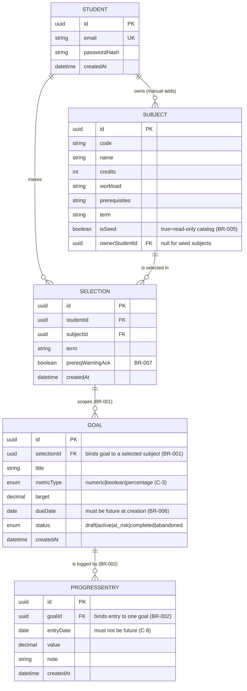
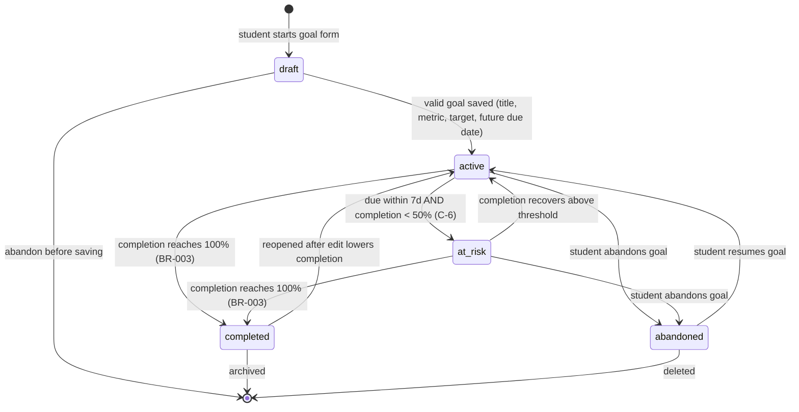
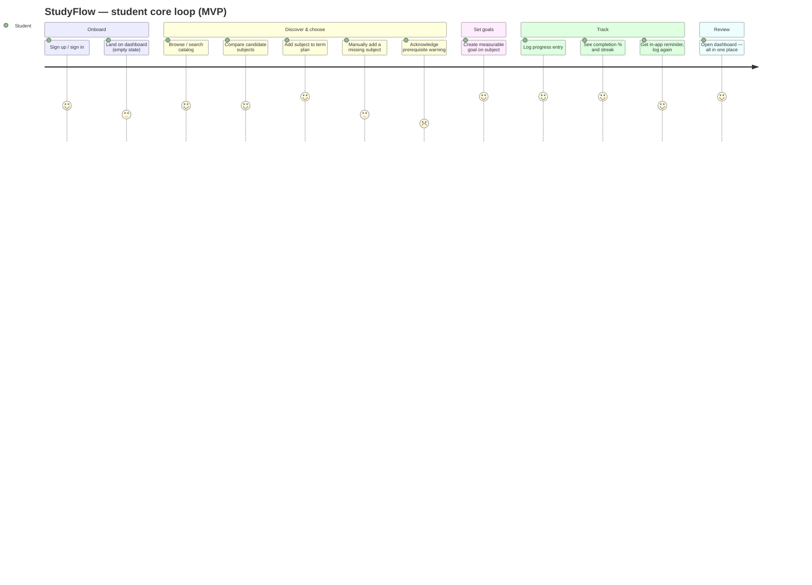
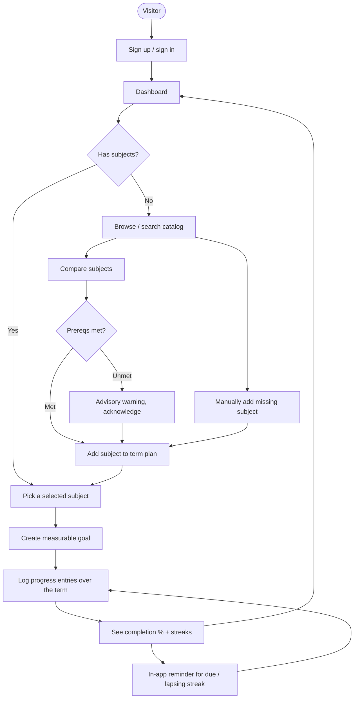

# StudyFlow — Product Requirements Document

**Product:** StudyFlow
**Author:** Product Manager (ConnectSW)
**Date:** 2026-06-17
**Task:** PRD-01
**Status:** Complete — CEO checkpoint (PRD complete) before architecture
**Sources:** `notes/ceo-brief.md`, `.claude/addendum.md`, `BA-01-business-analyst-analysis.md`, `docs/specs/spec.md`

---

## 1. Executive Summary

StudyFlow is a **web application** for **university students** that closes the loop between
*deciding what to study* and *following through on study goals*. Today students choose subjects
from fragmented sources (catalog PDFs, peer threads, advisors) and then manage study effort in
generic tools that have no concept of a subject, a measurable academic target, or progress over a
term. StudyFlow unifies the three into one product: **choose subjects → set measurable goals per
subject → track progress**.

The MVP ships **without AI** — pure CRUD over a clean five-entity model. This is strategic, not a
limitation: the competitive landscape is split between *course-discovery* tools and *productivity*
tools that students duct-tape together; no mainstream product owns the integrated, academic-native
middle. Shipping clean CRUD first builds the proprietary structured dataset (subjects → goals →
progress) that becomes the moat and the substrate for Phase 2 AI.

---

## 2. Problem & Target Users

### 2.1 Problem
University students face two connected failures: (1) **subject selection is high-stakes but
information-poor** — wrong electives/unmet prerequisites cost money, GPA, and time; (2) **study
goals are set but not sustained** — goals get lost in tools with no academic structure and no
feedback loop (streaks, completion %, reminders).

### 2.2 Target users (BA personas, §2.3)
| Persona | Description | Priority |
|---------|-------------|----------|
| **Undergraduate student** | Actively chooses subjects each term and wants to manage study effort. | P0 (primary) |
| **Postgraduate / part-time student** | Time-constrained, balancing study and work; needs low-friction tracking. | P1 (secondary) |
| **Productivity-native student** | Already runs Notion/Todoist study setups; early adopter and advocate; wants structure + data ownership. | P1 (tertiary) |

---

## 3. Goals & Success Metrics

Carrying the BA's top KPIs (§9). The MVP is successful when, within 60 days of launch:

| KPI | Target | Why it matters |
|-----|--------|----------------|
| **Activation rate** (signup → ≥1 subject AND ≥1 goal) | **≥ 40%** of signups | Proves the integrated loop lands. |
| **Goal-completion rate** (goals reaching 100%) | **≥ 35%** of due goals | Proves follow-through, the core promise. |
| **D30 retention** (active in week 4) | **≥ 25%** | The dominant risk (RSK-001); gates Phase 2. |
| Goals set per activated user | ≥ 3 in first week | Depth of engagement. |
| Progress-entry frequency | ≥ 2 entries/active user/week | Habit-loop health. |
| % goals linked to a selected subject | 100% (enforced by BR-001) | Integration integrity. |

These KPIs gate the decision to invest in Phase 2 AI.

---

## 4. Scope

### 4.1 MVP — the full integrated loop (this release)
Email/password auth · subject catalog browse/search/compare · per-term selection · manual subject
add · subject-bound measurable goals (numeric / boolean / percentage) · progress logging ·
completion % + streaks · in-app reminders · unified dashboard · full CRUD · prerequisite advisory
warning · data export (JSON, "Could").

### 4.2 Later phases
| Phase | Scope |
|-------|-------|
| **Phase 2 — AI** | Subject **recommendations**, **auto-goal generation**, smart nudges — built on the MVP's structured dataset. |
| **Phase 2+ — Reach** | Native **mobile** app, **email/push** reminder delivery, OAuth/SSO. |
| **Phase 3 — Integrations** | University **SIS/LMS** catalog sync, advisor visibility, multi-term planning, social/collaboration. |

> Detailed out-of-scope list: `docs/specs/spec.md §5`.

---

## 5. User Stories & Traceability Matrix

> Full traceability **US ↔ FR ↔ BN** with MoSCoW priority. Story IDs are stable across BA, spec, and PRD.
> Acceptance criteria live in `docs/specs/spec.md §2`; functional requirements in `§3`.

| US | User story (abbrev.) | MoSCoW | FRs | BN |
|----|----------------------|--------|-----|----|
| US-01 | Register & sign in securely | Must | FR-001, FR-002, FR-003 | BN-001 |
| US-02 | Browse/search the subject catalog | Must | FR-004, FR-005 | BN-002 |
| US-03 | Compare subjects side-by-side | Should | FR-006 | BN-003 |
| US-04 | Add a subject to my term plan | Must | FR-007, FR-008 | BN-004 |
| US-05 | Manually add a subject not in catalog | Must | FR-009, FR-010 | BN-005 |
| US-06 | Set a measurable goal on a chosen subject | Must | FR-011, FR-012, FR-013 | BN-006 |
| US-07 | Log progress entries against a goal | Must | FR-014, FR-015 | BN-007 |
| US-08 | See completion % and streaks | Must | FR-016, FR-017, FR-018 | BN-008 |
| US-09 | Reminders for due dates & lapsing streaks | Should | FR-019, FR-020 | BN-009 |
| US-10 | Unified dashboard | Must | FR-021 | BN-010 |
| US-11 | Edit/delete subjects, goals, progress | Must | FR-022, FR-023 | BN-011 |
| US-12 | Export my data | Could | FR-024 | BN-012 |
| US-13 | Prerequisite warning on selection | Should | FR-025 | BN-013 |

**Coverage:** every US → ≥1 FR; every BN-001…013 → exactly one US (1:1). No orphan FRs.

---

## 6. Domain Model (ER Diagram)

Canonical entities and cardinality. Business rules BR-001 (every Goal binds to a selected Subject)
and BR-002 (every ProgressEntry binds to one Goal) are enforced by the relationships below.

---

## 7. Goal Lifecycle (State Diagram)

A goal's status transitions. `at_risk` is defined as due within 7 days AND completion < 50%
(Clarification C-6); `completed` is reached at 100% completion (BR-003).

---

## 8. Core User Flow (Journey)

The end-to-end MVP loop from signup to the dashboard habit loop.

### 8.1 Happy-path flow (flowchart, alternate view)

---

## 9. Site Map

All navigable routes. Every route renders a real page or a designed empty/skeleton state — **no
404s, no "Coming Soon"** (NFR-009).

| Route | Status | Description |
|-------|--------|-------------|
| `/` | MVP | Landing / marketing entry; CTA to sign up. |
| `/signup` | MVP | Registration (email/password). |
| `/login` | MVP | Sign-in. |
| `/dashboard` | MVP | Unified dashboard: subjects, active goals, progress, reminders (empty state for new users). |
| `/catalog` | MVP | Browse/search subject catalog. |
| `/catalog/[subjectId]` | MVP | Subject detail. |
| `/catalog/compare` | MVP | Side-by-side comparison (2–4 subjects). |
| `/subjects` | MVP | "My Subjects" — current-term selections; manual-add entry point. |
| `/subjects/[selectionId]` | MVP | Selected-subject detail with its goals. |
| `/goals/[goalId]` | MVP | Goal detail: progress log, completion %, streak. |
| `/settings` | MVP | Account settings; data export (JSON). |
| `/settings/profile` | Deferred | Profile management — page skeleton with disabled controls + empty state. |

---

## 10. Release Plan / Milestones

Feature-based milestones (no time estimates per protocol). Build the P0 loop first, then P1.

| Milestone | Contents | Gate |
|-----------|----------|------|
| **M0 — Foundation** | Scaffold api (Fastify+Prisma, port 5017) + web (Next.js+Tailwind, port 3122); 5-entity Prisma schema + migrations; seed catalog (C-2); auth (US-01). | Testing Gate PASS |
| **M1 — Discover & select** | Catalog browse/search (US-02), compare (US-03), selection + manual add (US-04, US-05), prerequisite advisory (US-13). | Testing Gate PASS |
| **M2 — Goals & tracking** | Goals (US-06), progress logging (US-07), completion %/streaks/at-risk (US-08) under TDD on real DB. | Testing Gate PASS |
| **M3 — Loop close** | Dashboard (US-10), in-app reminders (US-09), full CRUD (US-11). | Testing Gate PASS |
| **M4 — Polish (Could)** | Data export (US-12), accessibility audit (NFR-003/004), responsive pass (NFR-010). | Pre-deploy Gate |

---

## 11. Risks (BA Risk Register, §10)

| ID | Risk | Score | Mitigation (PRD response) |
|----|------|-------|---------------------------|
| RSK-001 | Low retention — weak habit loop without AI | 9 | Streaks + completion + in-app reminders; instrument D30 from launch; A/B reminders. |
| RSK-002 | Seed catalog too small/irrelevant | 6 | Curate one realistic faculty (C-2); first-class manual add (US-05); track manual-add rate. |
| RSK-005 | Completion %/streak calc bugs erode trust | 6 | TDD against real PostgreSQL on BR-003 (NFR-002); explicit edge-case tests. |
| RSK-006 | Goals set vaguely or skipped | 6 | Structured goal form with metric types (C-3, FR-012); usability test; templates. |
| RSK-003 | Signup friction (no SSO) | 4 | Email/password MVP (C-1); monitor funnel; OAuth fast-follow. |
| RSK-004 | Web-only insufficient on the go | 4 | Mobile-first responsive (NFR-010); measure mobile logging; native in roadmap. |
| RSK-007 | Seasonal acquisition | 4 | Year-round tracking value; reminders sustain engagement. |
| RSK-008 | Scope creep toward AI before CRUD is solid | 3 | Constitution/brief lock AI to Phase 2; gate AI on MVP KPIs. |

---

## 12. Dependencies

- **Internal:** ConnectSW default stack (Fastify, Prisma, PostgreSQL, Next.js, Tailwind, Zod, TS strict); ports web **3122** / api **5017**; local DB `studyflow_dev`.
- **External (MVP):** none required — no AI provider, no SIS/LMS, no email provider (in-app reminders only, C-4), no OAuth provider.
- **Data:** curated seed catalog (one faculty, ~20–40 subjects) shipped via seed script (C-2).

---

## Appendix — Conventions (for the Architect)

- ID schemes: `US-01…US-13`, `FR-001…FR-025`, `NFR-001…NFR-010`, `BN-001…013`, `BR-001…007`, `C-1…C-11`, `RSK-001…008`, milestones `M0…M4`.
- Diagrams: ER (domain), state (goal lifecycle), journey + flowchart (user flow) — Mermaid, diagram-first (Constitution Art. IX).
- Next: `/speckit.plan` (Architect) → architecture + ADRs → `/speckit.tasks` → Foundation build. Architect MUST complete the Component Reuse Check (`spec.md §8`) against `.claude/COMPONENT-REGISTRY.md`.
