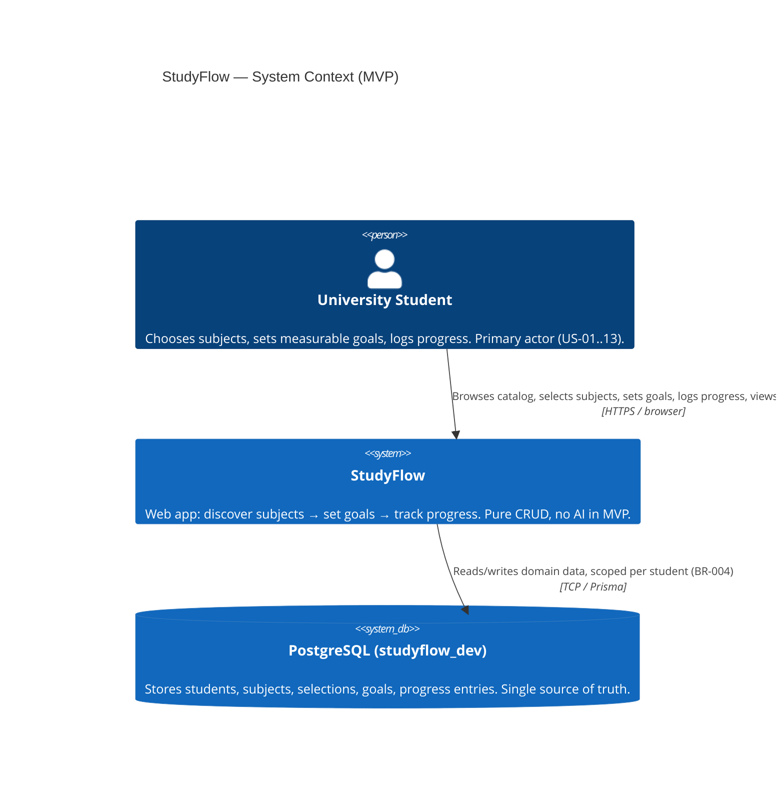
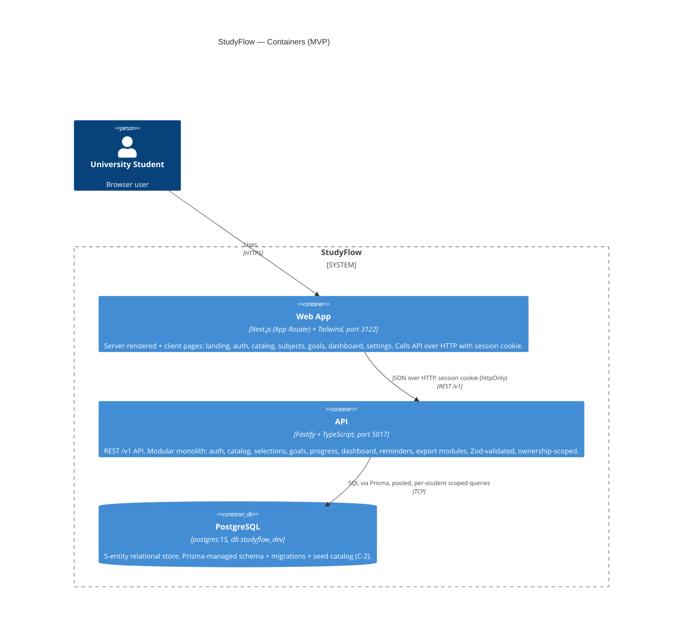
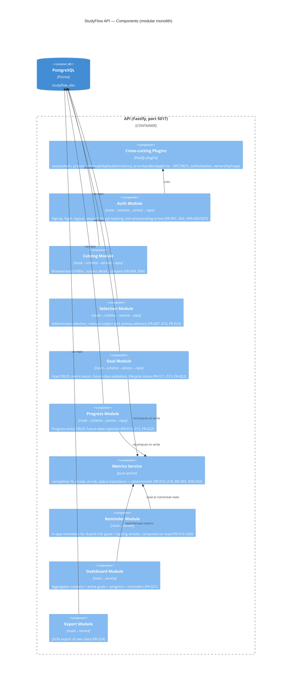
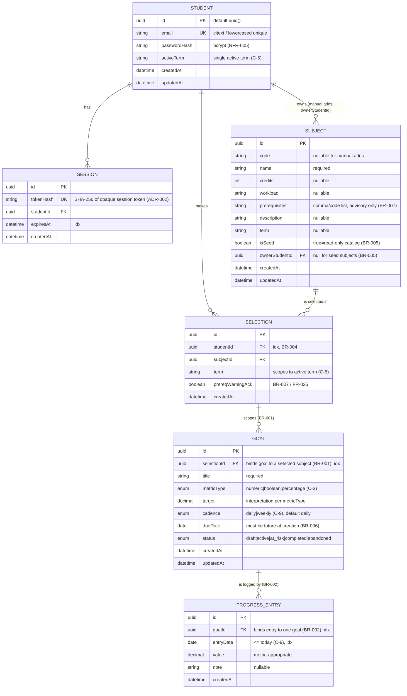
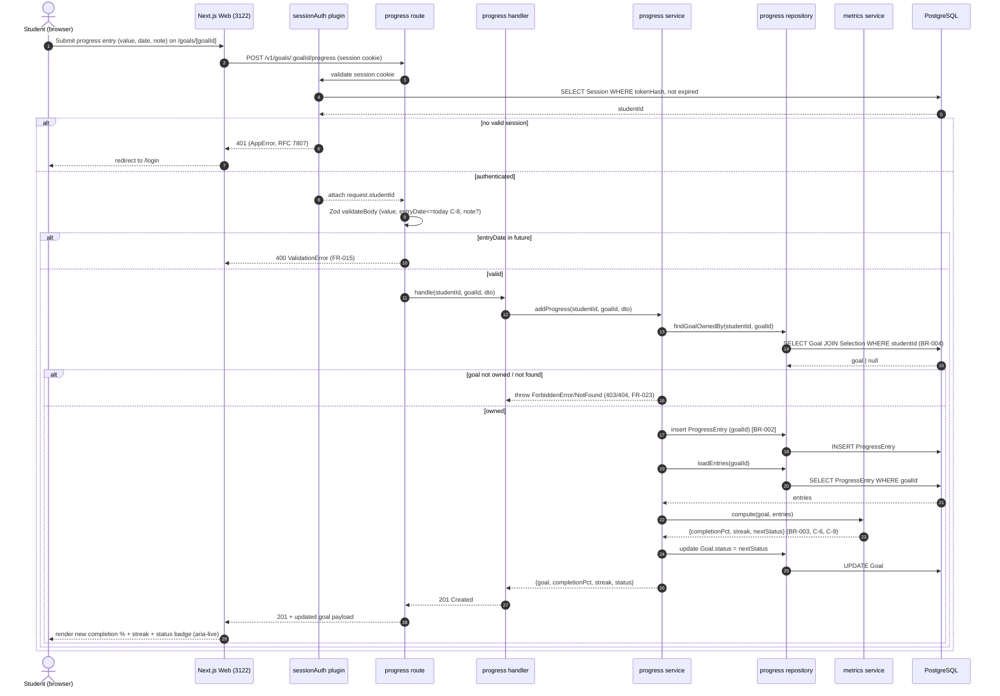

# StudyFlow — System Architecture

**Product:** StudyFlow
**Author:** Architect (ConnectSW)
**Date:** 2026-06-17
**Task:** ARCH-01
**Status:** Complete — Architecture checkpoint (CEO approval before TASKS-01)
**Sources:** `.claude/addendum.md`, `docs/PRD.md`, `docs/specs/spec.md`, `docs/business-analysis.md`, `.claude/COMPONENT-REGISTRY.md`
**Spec governance:** All decisions here trace to FR-001…025 / NFR-001…010 / US-01…13 / C-1…C-11 and the locked clarifications.

> **Diagram-first (Constitution Art. IX):** this document contains 5 Mermaid diagrams of distinct
> types — C4 Context, C4 Container, C4 Component, ER (implementation), and a request-lifecycle
> Sequence diagram.

---

## 0. Constraints honoured (do not re-litigate)

| Constraint | Value | Source |
|------------|-------|--------|
| Platform | Web only (Next.js + Tailwind) | addendum |
| AI | **None in MVP** — pure CRUD | addendum, spec §5 |
| Backend | Fastify + Prisma + PostgreSQL | addendum |
| Language | TypeScript strict + Zod runtime validation | Constitution Art. IV |
| Auth | Email/password + **session** auth, bcrypt/argon2 hashing | C-1, NFR-005 |
| Ports | web **3122**, api **5017** | **ARCH-01 task (authoritative)** |
| Database | local Postgres `studyflow_dev` | addendum |
| Goal metric enum | `numeric` \| `boolean` \| `percentage` | C-3, FR-012 |
| At-risk rule | due ≤ 7 days AND completion < 50% | C-6, FR-018 |
| Reminders | in-app only | C-4, FR-019 |
| Term scope | single active term per student | C-5 |
| Subject removal w/ goals | blocked (delete goals first) | C-7, FR-008 |
| Future progress entries | rejected (date ≤ today) | C-8, FR-015 |
| Streak cadence | per-goal, default daily, weekly option | C-9, FR-017 |
| Export | JSON | C-10, FR-024 |
| Email verification | not required at signup | C-11 |

> **Port note (resolution):** PRD §10/§12 and the BA mention web `3122` / api `5017`. The ARCH-01
> task constraints lock **web 3122 / api 5017**, which match the addendum's intent and are
> treated as authoritative. DevOps must register 3122/5017 in `PORT-REGISTRY.md`; the PRD's
> 3122/5017 references should be corrected to match at the next doc-sync.

---

## 1. Overview

StudyFlow is a **modular monolith**: one Fastify API process and one Next.js web app, backed by a
single PostgreSQL database. There are **no external service dependencies in the MVP** (no AI
provider, no email/SMS provider, no OAuth provider, no SIS/LMS) — every capability is satisfied by
in-process CRUD plus deterministic derived-metric computation (completion %, streaks, at-risk).

The architecture is deliberately small and boring. The value is in the **clean 5-entity domain
model** and the **integrity of derived metrics** (BR-003), not in infrastructure. The data model is
shaped so that Phase-2 AI (recommendations, auto-goal generation) can be added as new read-side
consumers without reshaping the write-side schema (see ADR-005).

### 1.1 Quality attributes driving the design

| Attribute | Requirement | Architectural response |
|-----------|-------------|------------------------|
| Correctness | NFR-002, BR-003 | Derived metrics computed in a single pure **`metrics` service**, TDD against real Postgres. |
| Security | NFR-005/006/007, BR-004 | Session auth, bcrypt hashing, ownership-scoped repositories, Zod validation on every input. |
| Performance | NFR-001 | Indexed list queries, pagination helper, server-rendered catalog/dashboard, p95 < 400ms. |
| Accessibility | NFR-003/004 | Semantic HTML + `@connectsw/ui` accessible primitives, keyboard-first flows, WCAG 2.1 AA. |
| Reliability | NFR-008 | 80%+ coverage, unit + integration (real DB) + Playwright E2E. |
| No-dead-ends | NFR-009 | Every route renders a real page or designed empty/skeleton state. |

---

## 2. C4 Level 1 — System Context



**Boundary:** No external systems in the MVP. The dashed future actors (Phase 2 AI provider, email
provider, OAuth provider, SIS/LMS) are explicitly **out of scope** (spec §5) and are not integrated.

---

## 3. C4 Level 2 — Container Diagram



### 3.1 Container responsibilities

| Container | Tech | Port | Responsibility |
|-----------|------|------|----------------|
| **Web** | Next.js App Router, React, Tailwind | 3122 | All UI; renders real pages/empty states (NFR-009); server components for catalog/dashboard reads (NFR-001); client interactivity for forms; talks only to the API. |
| **API** | Fastify, Prisma, Zod, TS strict | 5017 | All business logic; auth + session; domain CRUD; derived-metric computation; ownership enforcement (BR-004); JSON export. |
| **DB** | PostgreSQL 15 | (internal) | Single relational store; Prisma migrations; seed catalog; `Session` table (or Redis-free DB-backed sessions — see §6). |

### 3.2 Session strategy & infra footprint

The MVP runs **without Redis**. Sessions are stored in a DB-backed `Session` table (see §6 and
ADR-002), keeping the infra footprint to **Postgres only**. `@connectsw/shared/plugins/redis`,
`@connectsw/observability` health/metrics, and the Prisma plugin are reused; Redis is simply not
configured (the plugin degrades gracefully).

---

## 4. C4 Level 3 — API Component Diagram (modular monolith)

The API is layered identically in every module: **route → schema (Zod) → handler → service →
repository → Prisma**. Cross-cutting concerns (auth/session, error handling, ownership scoping,
logging, validation) are Fastify plugins / shared utilities.



### 4.1 Module → FR coverage map

| Module | Endpoints (see API.md) | FRs covered | US |
|--------|------------------------|-------------|----|
| **auth** | `/v1/auth/*` | FR-001, FR-002, FR-003 | US-01 |
| **catalog** | `/v1/subjects`, `/v1/subjects/:id`, `/v1/subjects/compare` | FR-004, FR-005, FR-006 | US-02, US-03 |
| **selection** | `/v1/selections`, `/v1/selections/:id`, `/v1/subjects` (manual add POST) | FR-007, FR-008, FR-009, FR-010, FR-025 | US-04, US-05, US-13 |
| **goal** | `/v1/goals`, `/v1/goals/:id` | FR-011, FR-012, FR-013, FR-022, FR-023 | US-06, US-11 |
| **progress** | `/v1/goals/:id/progress`, `/v1/progress/:id` | FR-014, FR-015, FR-022, FR-023 | US-07, US-11 |
| **metrics** (service) | (consumed by goal/dashboard/reminder) | FR-016, FR-017, FR-018 | US-08 |
| **reminder** | `/v1/reminders` | FR-019, FR-020 | US-09 |
| **dashboard** | `/v1/dashboard` | FR-021 | US-10 |
| **export** | `/v1/export` | FR-024 | US-12 |

**FR coverage check:** FR-001…FR-025 each map to ≥1 module/endpoint. No gaps. (Full
endpoint-level confirmation in §11 and `API.md`.)

### 4.2 Layering contract (binding for Backend Engineer)

```
HTTP request
  │
  ▼
[route]        Fastify route registration; path, method, auth pre-handler, attaches schemas
  │
  ▼
[schema]       Zod request/response schemas (validateBody / validateQuery / validateParams)
  │
  ▼
[handler]      Thin controller: maps validated DTO → service call → HTTP response; never touches Prisma
  │
  ▼
[service]      Business rules (BR-001..007), metric computation, status transitions; throws AppError
  │
  ▼
[repository]   Prisma access ONLY here; every query scoped to studentId (BR-004); no business logic
  │
  ▼
PostgreSQL (Prisma)
```

Rules:
- **Prisma is forbidden outside repositories.** Services depend on repository interfaces.
- **Ownership scoping is enforced in the repository layer** (`where: { studentId }`) AND re-checked
  in services for mutations — cross-student access returns 403/404 (FR-023, BR-004).
- **All thrown errors are `AppError`** (RFC 7807), mapped to HTTP by a single Fastify error handler.
- **The `metrics` service is pure** (input: goal + entries; output: completion %, streak, status) —
  no I/O, fully unit-testable, plus integration-tested against real Postgres (NFR-002).

---

## 5. Data Model — Implementation ER Diagram

Refines the PRD §6 ER to implementation detail: field types, keys, constraints, enums, indexes,
and the BR-001/BR-002 binding. Adds the `Session` table (auth, ADR-002).



### 5.1 Constraints & indexes

| Constraint | Mechanism | Rule |
|------------|-----------|------|
| Unique email | `@unique` on `Student.email` (lowercased) | FR-001 |
| No duplicate selection per term | `@@unique([studentId, subjectId, term])` on `Selection` | FR-007 |
| Goal ⟶ Selection binding | `Goal.selectionId` NOT NULL FK | BR-001, FR-011/013 |
| Progress ⟶ Goal binding | `ProgressEntry.goalId` NOT NULL FK | BR-002 |
| Goal cascade on delete | `onDelete: Cascade` Goal→ProgressEntry | FR-022 (US-11 AC-2) |
| Block selection delete with goals | **application-level** check (not cascade) | C-7, FR-008 |
| Seed read-only | `isSeed=true ⇒ ownerStudentId=null`; service rejects mutation | BR-005, FR-010 |
| Future due date rejected | Zod refine `dueDate > today` | BR-006, FR-013 |
| Future progress rejected | Zod refine `entryDate <= today` | C-8, FR-015 |
| Ownership scope | repo `where studentId` + service re-check | BR-004, FR-003/023 |

**Indexes (NFR-001):** `Selection(studentId, term)`, `Goal(selectionId)`, `ProgressEntry(goalId, entryDate)`,
`Subject(name)`/`Subject(code)` for search, `Session(tokenHash)`, `Session(expiresAt)`.

### 5.2 Derived metrics (computed, not stored)

Completion %, streak, and at-risk are **computed on read** by the `metrics` service from
`ProgressEntry` rows — they are NOT persisted columns (avoids drift; single source of truth). The
**stored** `Goal.status` is updated as a side effect of writes (progress add/edit/delete, goal edit)
so the lifecycle (PRD §7) is queryable and reminders are cheap to evaluate. See ADR-004.

**Completion % (BR-003):**
- `numeric`: `min(100, round( sum(entry.value) / target * 100 ))`
- `percentage`: `min(100, latest(entry.value))` (target implicitly 100)
- `boolean`: `100` if any qualifying entry with `value >= 1`, else `0` (target = 1)

**Streak (C-9):** group entries by cadence period (day/week); streak = count of consecutive
most-recent periods each with ≥1 entry; resets on a missed period.

**At-risk (C-6):** `dueDate within 7 days AND completion% < 50` ⇒ status `at_risk`.
**Completed (BR-003):** `completion% >= 100` ⇒ status `completed`.

---

## 6. Authentication & Authorization

**Decision (C-1, ADR-002): Email/password with server-side, DB-backed opaque sessions.** Not JWT.

| Aspect | Approach |
|--------|----------|
| Registration | `POST /v1/auth/signup` — Zod-validated email + password (min 8 chars, FR-001). Email lowercased + unique. **No email verification** (C-11). bcrypt hash (12 rounds, NFR-005) via `@connectsw/shared/utils/crypto`. |
| Login | `POST /v1/auth/login` — verify bcrypt; on success mint a random opaque token (32 bytes), store **SHA-256(token)** in `Session.tokenHash`, set `expiresAt`. Return token in an **httpOnly, Secure, SameSite=Lax** cookie. |
| Session validation | `sessionAuth` Fastify pre-handler: read cookie, hash, look up non-expired `Session`, attach `studentId` to request. Missing/invalid ⇒ **401** (FR-003, US-01 AC-4). |
| Logout | `POST /v1/auth/logout` — delete the `Session` row, clear cookie. |
| Non-enumeration | Signup-conflict and login-failure return the **same generic message** ("email or password invalid / already in use") — no "email not found" vs "wrong password" (NFR-007, US-01 AC-2/3). |
| Authorization | Every student-data query scoped to `request.studentId` in the repository (BR-004). Mutations on another student's data ⇒ **403/404** (FR-023). |
| CSRF | Session cookie is `SameSite=Lax`; state-changing routes are `POST/PATCH/DELETE` only; optional double-submit CSRF token for defense-in-depth (NFR-006). |

**Why sessions over JWT (summary; full rationale ADR-002):** instant server-side revocation
(logout actually invalidates), no client-side token storage / XSS surface, simpler for a single-API
monolith. The registry's `@connectsw/auth` is JWT+API-key oriented; we **reuse its bcrypt crypto,
`AppError`, and Zod auth-schema patterns** but implement the thin session layer ourselves
(small, well-scoped). API keys are not needed (no programmatic third-party access in MVP).

---

## 7. NFR Strategy (architectural)

### 7.1 Performance (NFR-001)
- **Server-render** catalog (`/catalog`) and dashboard (`/dashboard`) reads in Next.js server
  components → fast LCP (≤ 2.5s).
- **Indexed queries** (§5.1) + **pagination** (`@connectsw/lib/pagination` reuse) on list endpoints
  → API p95 < 400ms at MVP volumes.
- Derived metrics computed in-process over small per-student row sets (term-scoped, C-5) → no N+1:
  dashboard loads goals + entries in batched repository queries.
- Catalog search is a simple `ILIKE`/indexed filter on a small seed set (~20–40 rows + manual adds).

### 7.2 Accessibility (NFR-003/004 — WCAG 2.1 AA)
- Build UI from `@connectsw/ui` accessible primitives (Input has labels/aria, Button focusable).
- Semantic landmarks (`<header><nav><main>`), single `<h1>` per page, skip-to-content link
  (from `@connectsw/ui` DashboardLayout).
- Every interactive flow (signup, select, goal-create, progress-log) **keyboard-operable**;
  visible focus rings; color contrast ≥ 4.5:1 (Tailwind tokens chosen in DESIGN.md).
- Forms expose validation errors via `aria-describedby`; status changes announced via
  `aria-live` regions (reminders, completion updates).
- Verified in the Browser-First + Testing gates (axe/Playwright accessibility checks).

### 7.3 Security & privacy (NFR-005/006/007, BR-004)
- bcrypt password hashing; no plaintext (NFR-005).
- Zod validation on **every** body/query/param; Prisma parameterization prevents SQLi (NFR-006).
- Ownership scoping on all reads/writes (BR-004); non-enumerating auth errors (NFR-007).
- httpOnly/Secure/SameSite session cookie; CSRF posture per §6.
- `@connectsw/shared/utils/logger` redacts PII/secrets; PII (email) never logged in clear.
- RFC 7807 error bodies via `AppError` — no stack traces leaked to clients.

### 7.4 Reliability / quality (NFR-008/009/010)
- TDD: unit (services, metrics) + integration (repositories/routes on **real** Postgres) + E2E
  (Playwright), ≥ 80% coverage (NFR-008, Constitution Art. III).
- No-dead-end routing: every route in the site map (PRD §9) renders content or a designed empty/
  skeleton state; `/settings/profile` ships a disabled-controls skeleton, not a 404 (NFR-009).
- Responsive down to 360px via mobile-first Tailwind (NFR-010).
- `@connectsw/observability` `healthPlugin` (`/health`, `/health/ready` with DB check) + `metricsPlugin`.

---

## 8. Component Reuse Plan (Constitution Art. II)

Checked against `.claude/COMPONENT-REGISTRY.md`. **Reuse > rebuild.**

| Need (FR/NFR) | Registry component | Source | Decision |
|---------------|--------------------|--------|----------|
| Password hashing (NFR-005) | Crypto Utils (`bcrypt`) | `@connectsw/shared/utils/crypto` | **Import** |
| Structured logging + PII redaction (NFR-006) | Logger | `@connectsw/shared/utils/logger` | **Import** |
| Prisma lifecycle + pooling (NFR-001) | Prisma Plugin | `@connectsw/shared/plugins/prisma` | **Import** |
| RFC 7807 errors (NFR-006) | `AppError` / Error Classes | `@connectsw/auth` / `lib/errors.ts` | **Import** |
| Zod auth/pagination/validate helpers | Validation Schemas (generic) | `stablecoin-gateway/utils/validation.ts` | **Adapt** (auth, pagination, validateBody/Query) |
| Pagination on list endpoints (NFR-001) | Pagination Helper | `lib/pagination.ts` | **Import** |
| Health + metrics (NFR-008) | observability plugins | `@connectsw/observability` | **Import** (`healthPlugin`, `metricsPlugin`, `observabilityPlugin`) |
| In-app reminders (FR-019/020) | NotificationService / in-app notifications | `@connectsw/notifications` | **Adapt** — back the reminder feed; *or* compute reminders on read (decision: compute-on-read for MVP simplicity, see ADR-004; notifications pkg is the upgrade path) |
| UI primitives + accessible forms (NFR-003) | Button, Card, Input, Badge, Skeleton, StatCard, DataTable, ErrorBoundary, DashboardLayout, Sidebar | `@connectsw/ui` | **Import** |
| Empty/skeleton states (NFR-009) | Skeleton / SkeletonCard | `@connectsw/ui/components` | **Import** |
| Auth state (frontend) | useAuth / TokenManager / ProtectedRoute | `@connectsw/auth/frontend` | **Adapt** — session-cookie variant (no in-memory JWT needed; cookie is httpOnly) |
| E2E harness (NFR-008) | Playwright Config + Auth Fixture | `stablecoin-gateway/.../playwright.config.ts`, `auth.fixture.ts` | **Adapt** (baseURL 3122, API 5017, session login) |
| CI quality gate (Art. XIII) | GitHub Actions quality-gate workflow | `.github/workflows/test-*.yml` | **Adapt** (paths, db `studyflow_dev`, ports) |
| Docker (deploy) | Multi-stage Dockerfile + docker-compose | `stablecoin-gateway` | **Adapt** (port 5017, Postgres only, no Redis) |

**Not reused / built new (justified):**
- **Session auth layer** — registry auth is JWT+API-key; C-1 mandates sessions (ADR-002). Thin,
  domain-specific; reuses bcrypt + AppError + Zod patterns.
- **`metrics` service** (completion %, streak, at-risk) — domain-specific to StudyFlow (BR-003, C-6, C-9). New.
- **Subject catalog seed** (one faculty, ~20–40 subjects) — product data (C-2). New seed script.
- **Two-class Subject model** (seed read-only vs owned editable, BR-005) — domain-specific. New.

---

## 9. Request Lifecycle — Sequence Diagram

Representative flow (US-07/US-08): **log a progress entry against a goal → recompute completion % →
update status → return updated goal.** Exercises the full layering, ownership scoping (BR-004),
validation (C-8), and metric recomputation (BR-003, FR-016/018).



---

## 10. Frontend Architecture (web, 3122)

- **Next.js App Router.** Server components for read-heavy pages (catalog, dashboard) → NFR-001 LCP.
  Client components for forms and interactive widgets (goal form, progress log, compare picker).
- **Auth:** httpOnly session cookie sent automatically; a `ProtectedRoute`/middleware guard redirects
  unauthenticated users from `/dashboard`, `/subjects`, `/goals/*`, `/settings` to `/login`
  (adapt `@connectsw/auth/frontend`).
- **Routes** map 1:1 to PRD §9 site map; every route renders real content or a designed empty/
  skeleton state (NFR-009). `/settings/profile` is a deferred skeleton with disabled controls.
- **State:** server data fetched per-page; minimal client state (React state/`useReducer` for forms).
  No global store needed for MVP.
- **Styling/UI:** Tailwind + `@connectsw/ui` primitives; tokens defined in `DESIGN.md`
  (UI/UX Designer deliverable). Mobile-first, responsive to 360px (NFR-010).
- **Accessibility:** keyboard-operable flows, focus management on route change, `aria-live` for
  completion/reminder updates (NFR-003/004).

---

## 11. Full FR → Coverage Confirmation

| FR | Covered by (module / endpoint) | Status |
|----|--------------------------------|--------|
| FR-001 | auth · `POST /v1/auth/signup` | ✅ |
| FR-002 | auth · `POST /v1/auth/login` | ✅ |
| FR-003 | sessionAuth plugin · all `/v1` student routes (401 + scope) | ✅ |
| FR-004 | catalog · `GET /v1/subjects`, `GET /v1/subjects/:id` | ✅ |
| FR-005 | catalog · `GET /v1/subjects?q=&credits=&term=` (empty state) | ✅ |
| FR-006 | catalog · `GET /v1/subjects/compare?ids=` (2–4) | ✅ |
| FR-007 | selection · `POST /v1/selections` (dup-guard) | ✅ |
| FR-008 | selection · `DELETE /v1/selections/:id` (block if goals, C-7) | ✅ |
| FR-009 | selection · `POST /v1/subjects` (manual add, auto-select) | ✅ |
| FR-010 | selection/goal · `PATCH/DELETE /v1/subjects/:id` (seed read-only, BR-005) | ✅ |
| FR-011 | goal · `POST /v1/goals` (bound to selection, BR-001) | ✅ |
| FR-012 | goal · metricType enum in goal schema (C-3) | ✅ |
| FR-013 | goal · `POST /v1/goals` (future-due + selected-subject validation) | ✅ |
| FR-014 | progress · `POST /v1/goals/:id/progress` (BR-002) | ✅ |
| FR-015 | progress · entryDate ≤ today refine (C-8) | ✅ |
| FR-016 | metrics svc · completion % (consumed by goal/dashboard) | ✅ |
| FR-017 | metrics svc · streak (cadence C-9) | ✅ |
| FR-018 | metrics svc · at-risk (C-6) + completed (BR-003) | ✅ |
| FR-019 | reminder · `GET /v1/reminders` (due/at-risk/streak, in-app) | ✅ |
| FR-020 | reminder · cleared once qualifying progress logged | ✅ |
| FR-021 | dashboard · `GET /v1/dashboard` (+ empty state) | ✅ |
| FR-022 | goal/progress · `PATCH/DELETE` (recompute + cascade) | ✅ |
| FR-023 | sessionAuth + repo scoping · 403/404 on cross-student | ✅ |
| FR-024 | export · `GET /v1/export` (JSON, C-10) | ✅ |
| FR-025 | selection · prereq advisory + ack on `POST /v1/selections` (BR-007) | ✅ |

**Result: FR-001…FR-025 fully covered. No gaps.**

---

## 12. Conventions established (for Backend / Frontend / DevOps)

| Convention | Rule |
|------------|------|
| **API versioning** | All API routes under `/v1` prefix. Breaking changes → `/v2`. |
| **Layering** | route → schema (Zod) → handler → service → repository → Prisma. Prisma only in repositories. |
| **Error model** | All errors thrown as `AppError` subclasses; single Fastify error handler → RFC 7807 JSON (`type`, `title`, `status`, `detail`, optional `errors` field map). |
| **Validation** | Zod on every body/query/param; reuse `validateBody`/`validateQuery`/`validateParams` helpers. |
| **Auth** | DB-backed opaque session, httpOnly Secure SameSite=Lax cookie; `sessionAuth` pre-handler attaches `request.studentId`. |
| **Ownership** | Every student-data query scoped to `studentId` in the repository; mutations re-checked in service; cross-student ⇒ 403/404. |
| **Naming** | Plugins `[name].ts` in `plugins/`; services `[name].service.ts`; repos `[name].repository.ts`; routes `[name].routes.ts`; Zod `[name].schema.ts`; React hooks `use[Name].ts`; components `[Name].tsx`. |
| **IDs** | DB PKs `uuid` (`@default(uuid())`). |
| **Derived metrics** | Computed on read by pure `metrics` service; `Goal.status` persisted as cached lifecycle state, recomputed on every relevant write. |
| **Pagination** | List endpoints use the shared pagination helper (`page`, `limit` ≤ 100; envelope `{data, pagination}`). |
| **Ports** | web **3122**, api **5017**; DB `studyflow_dev`. Register in `PORT-REGISTRY.md`. |
| **Infra** | Postgres only (no Redis in MVP); observability health/metrics plugins enabled. |
| **Testing** | TDD; unit (services/metrics) + integration (repos/routes on real Postgres) + Playwright E2E; ≥ 80% coverage. |

---

## 13. Deliverable index

| Artifact | Path |
|----------|------|
| This architecture | `products/studyflow/docs/architecture.md` |
| API contract | `products/studyflow/docs/API.md` |
| Implementation plan | `products/studyflow/docs/plan.md` |
| ADR-001 Modular monolith | `products/studyflow/docs/ADRs/ADR-001-modular-monolith.md` |
| ADR-002 Session auth | `products/studyflow/docs/ADRs/ADR-002-session-auth.md` |
| ADR-003 Subject catalog sourcing | `products/studyflow/docs/ADRs/ADR-003-subject-catalog-sourcing.md` |
| ADR-004 Goal/progress model & completion | `products/studyflow/docs/ADRs/ADR-004-goal-progress-completion-model.md` |
| ADR-005 No-AI MVP boundary & Phase-2 seam | `products/studyflow/docs/ADRs/ADR-005-no-ai-boundary-phase2-seam.md` |
| ADR-006 API versioning & validation | `products/studyflow/docs/ADRs/ADR-006-api-versioning-validation.md` |
| Deliverable summary | `products/studyflow/.claude/deliverables/ARCH-01-architect-architecture.md` |
