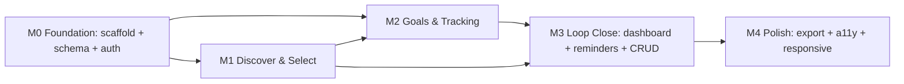

# StudyFlow — Implementation Plan

**Product:** StudyFlow
**Author:** Architect (ConnectSW)
**Date:** 2026-06-17
**Task:** ARCH-01 → feeds TASKS-01 (`/speckit.tasks`)
**Methodology:** spec-kit `/speckit.plan` (traceable to spec.md FR/US)
**Sources:** `architecture.md`, `API.md`, ADRs 001–006, `docs/specs/spec.md`, `docs/PRD.md`

> Greenfield product — no existing code. The Implementation Audit (§5) is therefore **all NEW**,
> except where a `@connectsw/*` package or registry component is **REUSED**.

---

## 1. Constitution Check (gate)

| Article | Check | Status |
|---------|-------|--------|
| I — Spec-first | Plan derives from spec.md (FR-001…025) | ✅ |
| II — Component reuse | Component Reuse Plan completed (§6, architecture §8) | ✅ |
| III — TDD / real deps | Metrics & repos TDD on real Postgres; no mocks (NFR-002) | ✅ planned |
| IV — TS + Zod | TS strict + Zod everywhere (ADR-006) | ✅ |
| V — Default stack | Fastify + Prisma + Postgres + Next.js + Tailwind | ✅ |
| VI — Traceability | Every phase item cites US/FR | ✅ |
| VII — Ports | web 3122 / api 5017 registered | ⏳ DevOps to register |
| VIII — Git safety | No `git add .`; orchestrator stages | ✅ |
| IX — Diagram-first | architecture.md has 5 Mermaid diagrams | ✅ |
| X — Quality gates | Testing/Browser/Security gates per milestone | ✅ planned |
| XI — Anti-rationalization | Modular monolith justified (ADR-001), no over-build | ✅ |
| XII — Context engineering | Deliverables written to files (Direct Delivery) | ✅ |
| XIII — CI | Adapt quality-gate workflow (§ M0) | ⏳ DevOps |
| XIV — Clean & secure | OWASP basics, secure-coding for auth/data | ✅ planned |

**Gate result: PASS** — proceed to phased build.

---

## 2. Build Order (module dependency-ordered)

Rationale: auth + schema gate everything (M0). Goals (M2) require Selections (M1) for BR-001. The
dashboard and reminders (M3) aggregate M1+M2. Export and polish (M4) are last (Could/NFR).

---

## 3. Phases

### M0 — Foundation (gate: Testing Gate PASS)
**Goal:** runnable api+web, schema, migrations, seed, auth.

| Item | Traces to | Reuse | New |
|------|-----------|-------|-----|
| Scaffold `apps/api` (Fastify, TS strict, ESLint) on port **5017** | NFR-008 | saas-kit patterns, Prisma/observability plugins | api skeleton |
| Scaffold `apps/web` (Next.js App Router, Tailwind) on port **3122** | NFR-009/010 | `@connectsw/ui`, saas-kit web patterns | web skeleton |
| Prisma schema: Student, Subject, Selection, Goal, ProgressEntry, Session (+enums, indexes, constraints) | §5 ER, BR-001/002/005/006 | Prisma User pattern (adapt) | schema + migrations |
| Seed catalog script (~20–40 subjects, one faculty) | C-2, FR-004 | — | seed script (NEW) |
| Error handler → RFC 7807; AppError; Zod validate helpers | ADR-006, NFR-006 | AppError, validate helpers | error plugin wiring |
| Session auth (signup/login/logout/me, bcrypt, cookie, sessionAuth pre-handler) | FR-001/002/003, US-01, ADR-002 | bcrypt crypto, logger | session layer (NEW) |
| Health/metrics plugins | NFR-008 | `@connectsw/observability` | wiring |
| CI quality-gate workflow (real Postgres, db `studyflow_dev`) | Art. XIII | GH Actions workflow (adapt) | adapt |
| E2E harness (Playwright config + session auth fixture, baseURL 3122) | NFR-008 | Playwright config + auth fixture (adapt) | adapt |
| DESIGN.md (Tailwind tokens, archetype) | NFR-003 | design-md protocol | NEW (UI/UX) |

### M1 — Discover & Select (gate: Testing Gate PASS)
**Goal:** catalog browse/search/compare, selection, manual add, prereq advisory.

| Item | Traces to | Endpoints |
|------|-----------|-----------|
| Catalog module: browse/search/filter + detail | FR-004, FR-005, US-02 | GET /v1/subjects, /v1/subjects/:id |
| Compare 2–4 subjects | FR-006, US-03 | GET /v1/subjects/compare |
| Selection: add (dup-guard, term-scope) | FR-007, US-04 | POST /v1/selections, GET /v1/selections |
| Selection: remove (block if goals, C-7) | FR-008, US-04/US-11 | DELETE /v1/selections/:id |
| Manual subject add (+auto-select), edit/delete owned, seed read-only | FR-009, FR-010, US-05 | POST/PATCH/DELETE /v1/subjects |
| Prerequisite advisory + ack | FR-025, BR-007, US-13 | (in POST /v1/selections) |
| Web pages: /catalog, /catalog/[id], /catalog/compare, /subjects | US-02/03/04/05 | — |

### M2 — Goals & Tracking (gate: Testing Gate PASS)
**Goal:** goals, progress logging, completion %/streaks/at-risk — TDD on real DB.

| Item | Traces to | Endpoints |
|------|-----------|-----------|
| Goal module: create (BR-001, future-due, metric enum) | FR-011/012/013, US-06 | POST /v1/goals |
| Goal edit/abandon/delete (cascade) | FR-022/023, US-11 | PATCH/POST/DELETE /v1/goals/:id |
| Progress module: log (future-date reject), list | FR-014/015, US-07 | POST/GET /v1/goals/:id/progress |
| Progress edit/delete (recompute) | FR-022, US-07/US-11 | PATCH/DELETE /v1/progress/:id |
| **metrics service** (completion %, streak, at-risk, status) — **TDD-first, real Postgres** | FR-016/017/018, BR-003, C-6/C-9, NFR-002 | (service) |
| Web: /subjects/[selectionId], /goals/[goalId] | US-06/07/08 | — |

### M3 — Loop Close (gate: Testing Gate PASS)
**Goal:** dashboard, in-app reminders, full CRUD surfaced.

| Item | Traces to | Endpoints |
|------|-----------|-----------|
| Dashboard aggregate (+ empty state) | FR-021, US-10 | GET /v1/dashboard |
| Reminders (compute-on-read; due/at-risk/streak; exclude completed/abandoned) | FR-019/020, C-4, US-09 | GET /v1/reminders |
| CRUD surfaced in UI; aria-live updates | FR-022, US-11, NFR-004 | — |
| Web: /dashboard with empty state | US-10, NFR-009 | — |

### M4 — Polish (gate: Pre-deploy Gate)
**Goal:** export, accessibility audit, responsive pass.

| Item | Traces to | Endpoints |
|------|-----------|-----------|
| JSON export (own data) | FR-024, C-10, US-12 | GET /v1/export |
| Accessibility audit (WCAG 2.1 AA, axe + keyboard) | NFR-003/004 | — |
| Responsive pass to 360px | NFR-010 | — |
| /settings, /settings/profile (deferred skeleton, no 404) | NFR-009 | — |
| Coverage ≥ 80% verification | NFR-008 | — |

---

## 4. Test Strategy (per Constitution Art. III / X)

| Layer | What | Where |
|-------|------|-------|
| Unit | `metrics` service (completion %, streak, at-risk, status transitions) — exhaustive edge cases | api/src |
| Integration | repositories + routes against **real Postgres** (no mocks); ownership scoping (BR-004); constraints | api (test DB) |
| E2E | full loop: signup → select → goal → progress → dashboard → reminder; keyboard-only paths | e2e (Playwright) |
| Accessibility | axe checks on every route; focus/landmark assertions | e2e |
| Coverage | ≥ 80% (NFR-008) enforced in CI | CI gate |

Highest-risk-first: the **metrics service is built TDD-first** (RSK-005, NFR-002) before any UI depends on it.

---

## 5. Implementation Audit (greenfield)

| Component | State | Action |
|-----------|-------|--------|
| api scaffold (Fastify) | NEW | Build (saas-kit patterns) |
| web scaffold (Next.js) | NEW | Build (`@connectsw/ui`) |
| Prisma schema (5 entities + Session) | NEW | Build |
| Migrations | NEW | Build |
| Seed catalog | NEW | Build (C-2) |
| Session auth layer | NEW | Build (ADR-002) |
| `auth` module routes | NEW | Build |
| `catalog` module | NEW | Build |
| `selection` module | NEW | Build |
| `goal` module | NEW | Build |
| `progress` module | NEW | Build |
| `metrics` service | NEW | Build (TDD-first) |
| `reminder` module | NEW | Build |
| `dashboard` module | NEW | Build |
| `export` module | NEW | Build |
| Web pages (per site map) | NEW | Build |
| DESIGN.md | NEW | Build (UI/UX) |
| bcrypt crypto | REUSE | Import `@connectsw/shared/utils/crypto` |
| Logger | REUSE | Import `@connectsw/shared/utils/logger` |
| Prisma plugin | REUSE | Import `@connectsw/shared/plugins/prisma` |
| AppError (RFC 7807) | REUSE | Import |
| Zod validate/pagination helpers | REUSE/ADAPT | From stablecoin-gateway utils |
| Observability (health/metrics) | REUSE | Import `@connectsw/observability` |
| UI primitives + layout | REUSE | Import `@connectsw/ui` |
| useAuth/ProtectedRoute (frontend) | ADAPT | Session-cookie variant |
| In-app notifications | ADAPT (optional) | `@connectsw/notifications` — reminders upgrade path |
| Playwright config + auth fixture | ADAPT | ports 3122/5017, session login |
| CI quality-gate workflow | ADAPT | db `studyflow_dev`, paths |
| Dockerfile + compose | ADAPT | port 5017, Postgres only |

---

## 6. Component Reuse Plan (Constitution Art. II)

See `architecture.md §8` for the full table. Summary: reuse `@connectsw/shared` (logger, crypto,
Prisma plugin), `AppError`, `@connectsw/observability`, `@connectsw/ui`, pagination + Zod helpers,
Playwright config/fixture, CI workflow, Docker. Build new: session auth layer, `metrics` service,
two-class subject model, seed catalog. **Justification for each "build new" is in architecture §8.**

---

## 7. Risks carried into build

| Risk | Plan response |
|------|---------------|
| RSK-005 metric bugs | metrics service TDD-first on real Postgres (M2) |
| RSK-002 thin catalog | curate realistic seed + first-class manual add (M0/M1) |
| RSK-001 retention | streaks + reminders shipped in M2/M3; instrument KPIs |
| Port doc mismatch | resolve to 3122/5017; DevOps registers; correct PRD refs at doc-sync |

---

## 8. Handoff to TASKS-01

This plan + `API.md` (26 endpoints) + `architecture.md` module map are the input to
`/speckit.tasks`, which will emit dependency-ordered tasks per module in the M0→M4 order above,
each citing its US/FR. The metrics service and auth layer are the critical-path, build-first items.
