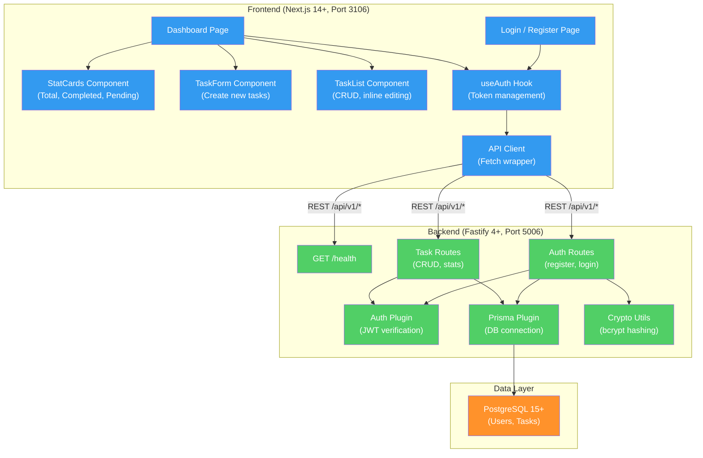

# TaskFlow -- Personal Task Management Application

TaskFlow is a personal task management application that enables users to create, organize, and track their tasks through a clean web interface. It provides secure user authentication, full CRUD operations on tasks, and a dashboard with real-time statistics showing task completion progress.

## Why TaskFlow Exists

Individuals need a simple, secure, and fast way to manage their personal to-do lists without the overhead of enterprise project management tools. Existing solutions are either too complex (Jira, Asana) or lack authentication and data isolation (local-only tools). TaskFlow fills the gap as a lightweight, authenticated task manager with per-user data isolation.

TaskFlow is also a demonstration product for ConnectSW's engineering practices -- showcasing TDD, real database testing, E2E coverage, and the standard Fastify + Next.js + Prisma stack.

## Architecture Overview



## Tech Stack

| Layer | Technology | Version |
|-------|-----------|---------|
| Runtime | Node.js | 20+ |
| Language | TypeScript | 5+ |
| Backend Framework | Fastify | 4.26+ |
| Frontend Framework | Next.js (App Router) | 14+ |
| UI Library | React | 18+ |
| Styling | Tailwind CSS | 3.4+ |
| Database | PostgreSQL | 15+ |
| ORM | Prisma | 5.11+ |
| Password Hashing | bcryptjs | 2.4+ |
| Authentication | JWT (jsonwebtoken) | 9.0+ |
| Validation | Zod | 3.22+ |
| Testing (Integration) | Jest | 29+ |
| Testing (E2E) | Playwright | Latest |

## Port Assignments

| Service | Port |
|---------|------|
| Frontend (Next.js) | 3106 |
| Backend (Fastify API) | 5006 |
| PostgreSQL | 5432 |

## Getting Started

### Prerequisites

- Node.js 20+
- PostgreSQL 15+ (running locally or via Docker)

### Quick Start

```bash
# 1. Navigate to product
cd products/taskflow

# 2. Install dependencies
cd apps/api && npm install && cd ../..
cd apps/web && npm install && cd ../..

# 3. Set up database
cd apps/api
# Create database: createdb taskflow_dev
npx prisma migrate dev
cd ../..

# 4. Start both servers (requires concurrently)
npm run dev
# Or start separately:
# Terminal 1: cd apps/api && npm run dev
# Terminal 2: cd apps/web && npm run dev

# API: http://localhost:5006
# Web: http://localhost:3106
```

## Development Commands

```bash
# Run all tests (backend + E2E)
cd products/taskflow && npm test

# Run backend integration tests only
npm run test:api

# Run E2E tests (requires running frontend + backend)
npm run test:e2e

# Run database migrations
cd apps/api && npx prisma migrate dev

# Open Prisma Studio
cd apps/api && npx prisma studio

# Start both servers concurrently
npm run dev
```

## Project Structure

```
products/taskflow/
├── apps/
│   ├── api/                            # Fastify backend (port 5006)
│   │   ├── prisma/
│   │   │   └── schema.prisma           # User + Task models
│   │   ├── src/
│   │   │   ├── plugins/
│   │   │   │   ├── auth.ts             # JWT authentication plugin
│   │   │   │   ├── crypto.ts           # bcrypt password hashing
│   │   │   │   └── prisma.ts           # Prisma client plugin
│   │   │   ├── routes/
│   │   │   │   ├── auth/index.ts       # Register + Login
│   │   │   │   ├── health/index.ts     # Health check
│   │   │   │   └── tasks/
│   │   │   │       ├── index.ts        # CRUD + Stats
│   │   │   │       └── schemas.ts      # Zod validation
│   │   │   └── server.ts              # Fastify app builder
│   │   ├── tests/
│   │   │   ├── setup.ts               # Test helpers (buildTestApp, resetDB)
│   │   │   └── integration/
│   │   │       ├── auth.test.ts       # 5 auth tests
│   │   │       ├── health.test.ts     # 1 health test
│   │   │       └── tasks.test.ts      # 7 task tests
│   │   └── package.json
│   └── web/                            # Next.js frontend (port 3106)
│       ├── src/
│       │   ├── app/
│       │   │   ├── layout.tsx          # Root layout
│       │   │   ├── page.tsx            # Root redirect
│       │   │   ├── login/page.tsx      # Login/Register
│       │   │   └── dashboard/page.tsx  # Main dashboard
│       │   ├── components/
│       │   │   ├── StatCards.tsx       # Statistics display
│       │   │   ├── TaskForm.tsx        # Task creation form
│       │   │   └── TaskList.tsx        # Task list with inline editing
│       │   ├── hooks/
│       │   │   └── useAuth.ts         # Auth state management
│       │   └── lib/
│       │       └── api.ts             # API client
│       └── package.json
├── e2e/                                # End-to-end tests
│   ├── tests/
│   │   ├── smoke.test.ts             # Smoke + auth + task E2E
│   │   └── dynamic-edge-cases.test.ts # Boundary, state, rapid interaction
│   └── playwright.config.ts
├── docs/
│   ├── PRD.md                         # Product Requirements Document
│   ├── plan.md                        # Implementation Plan
│   ├── tasks.md                       # Task Tracking
│   ├── specs/
│   │   └── mvp.md                     # MVP Specification
│   └── quality-reports/               # Test and quality gate reports
├── package.json                        # Root monorepo config (concurrently)
└── README.md                           # This file
```

## Key Features

| Feature | Status | Description |
|---------|--------|-------------|
| User Registration | Complete | Email + password with Zod validation |
| User Login | Complete | JWT authentication (24-hour expiry) |
| Sign Out | Complete | Client-side token clearing |
| Create Task | Complete | Title (required) + description (optional) |
| List Tasks | Complete | Per-user data isolation, newest first |
| Update Task | Complete | Edit title, toggle completion, inline editing |
| Delete Task | Complete | Two-click confirmation (3-second timeout) |
| Dashboard Stats | Complete | Total, completed, pending counts |
| Health Check | Complete | GET /health for monitoring |

## API Overview

All endpoints prefixed with `/api/v1/`.

| Method | Route | Auth | Description |
|--------|-------|------|-------------|
| GET | `/health` | No | Health check |
| POST | `/api/v1/auth/register` | No | Create account (returns JWT) |
| POST | `/api/v1/auth/login` | No | Authenticate (returns JWT) |
| GET | `/api/v1/tasks` | Yes | List user's tasks |
| POST | `/api/v1/tasks` | Yes | Create task |
| PUT | `/api/v1/tasks/:id` | Yes | Update task |
| DELETE | `/api/v1/tasks/:id` | Yes | Delete task |
| GET | `/api/v1/tasks/stats` | Yes | Task statistics |

## Test Coverage

| Level | Framework | Count | Scope |
|-------|-----------|-------|-------|
| Integration | Jest + real PostgreSQL | 13 | Auth (5), Health (1), Tasks (7) |
| E2E | Playwright (Chromium) | 14 | Smoke (3), Auth (5), CRUD (3), Edge cases (3) |

## Documentation

| Document | Path | Description |
|----------|------|-------------|
| PRD | [docs/PRD.md](docs/PRD.md) | Full product requirements with acceptance criteria |
| MVP Spec | [docs/specs/mvp.md](docs/specs/mvp.md) | MVP specification |
| Plan | [docs/plan.md](docs/plan.md) | Implementation plan |
| Tasks | [docs/tasks.md](docs/tasks.md) | Task tracking |

## License

UNLICENSED -- ConnectSW Internal
