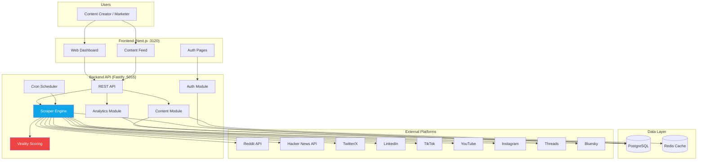
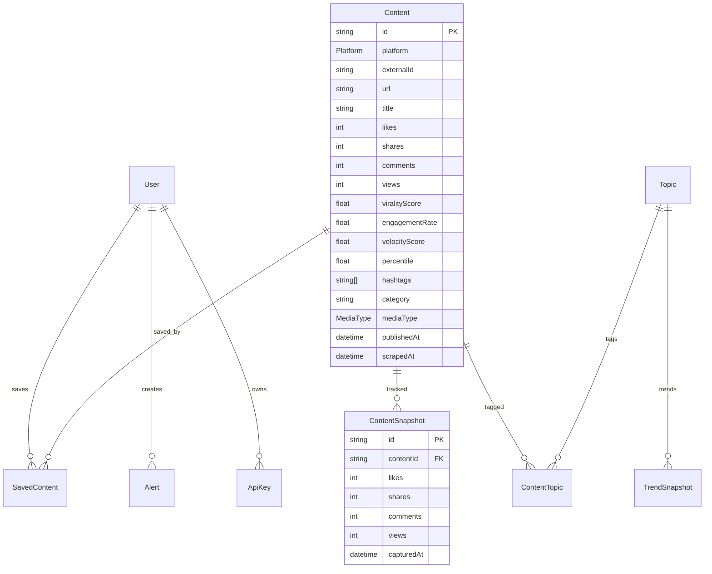
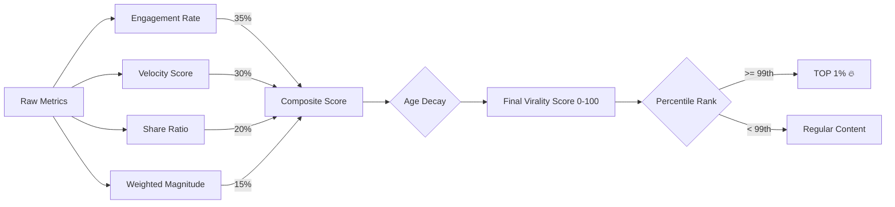
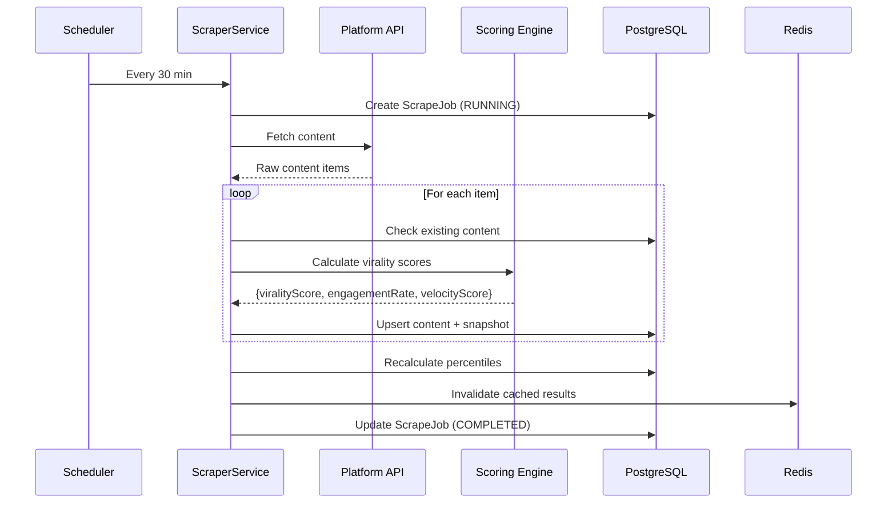

# Viral Content Scraper (VCS)

**Find the top 1% of viral content ideas across social media — before everyone else.**

VCS is a real-time content intelligence platform that scrapes viral content from 9 social media platforms, scores virality using a multi-signal engine, and surfaces only the top 1% to your dashboard. Built for content creators, marketers, and agencies who want data-driven content ideas.

## Why This Exists

99% of content ideas are mediocre. Finding what actually goes viral takes hours of manual scrolling. VCS automates this: scrape, score, surface. Every 30 minutes, fresh data. You only see what matters.

**Use it yourself** to find content ideas, or **sell it as a SaaS** to content creators and marketing teams.

## Architecture



## Data Model



## Virality Scoring Engine

The scoring engine uses 4 signals weighted by platform:



- **Engagement Rate (35%)** — Likes + shares + comments relative to views/followers, normalized against platform-specific benchmarks
- **Velocity Score (30%)** — How fast engagement is growing (measured via time-series snapshots)
- **Share Ratio (20%)** — Shares are the strongest virality signal; higher share-to-engagement ratio = more viral
- **Weighted Magnitude (15%)** — Absolute engagement numbers matter; a post with 100K likes outranks one with 10 likes even at same rate

## Scraping Flow



## Getting Started

### Prerequisites

- Node.js 20+
- PostgreSQL 15+
- Redis (optional, for caching)
- pnpm

### Setup

```bash
# 1. Navigate to product
cd products/viral-content-scraper

# 2. Copy environment config
cp .env.example .env

# 3. Start databases
docker-compose up -d

# 4. Install dependencies
pnpm install

# 5. Generate Prisma client and run migrations
pnpm db:generate
pnpm db:migrate

# 6. Start development servers
pnpm dev
```

- **Frontend**: http://localhost:3120
- **API**: http://localhost:5015
- **Health check**: http://localhost:5015/api/v1/health

### Trigger a Scrape

```bash
# Create an admin user first, then:
curl -X POST http://localhost:5015/api/v1/scraper/run \
  -H "Authorization: Bearer <your-token>" \
  -H "Content-Type: application/json"
```

## API Overview

| Method | Endpoint | Description |
|--------|----------|-------------|
| `GET` | `/api/v1/health` | Liveness check |
| `GET` | `/api/v1/health/ready` | Readiness check (DB connected) |
| `POST` | `/api/v1/auth/signup` | Create account |
| `POST` | `/api/v1/auth/login` | Login |
| `GET` | `/api/v1/auth/me` | Current user |
| `GET` | `/api/v1/content` | List content with filters |
| `GET` | `/api/v1/content/top` | Top 1% viral content |
| `GET` | `/api/v1/content/:id` | Content detail + snapshots |
| `POST` | `/api/v1/content/save` | Save to collection |
| `GET` | `/api/v1/content/saved` | User's saved content |
| `GET` | `/api/v1/analytics/overview` | Dashboard stats |
| `GET` | `/api/v1/analytics/trends` | Trending hashtags + velocity |
| `GET` | `/api/v1/analytics/velocity` | Engagement over time |
| `POST` | `/api/v1/scraper/run` | Trigger scrape (admin) |
| `GET` | `/api/v1/scraper/jobs` | Scrape job history |

### Content Filters

```
GET /api/v1/content?platform=REDDIT&timeRange=24h&minScore=50&category=tech&sortBy=viralityScore&order=desc&search=AI&page=1&limit=20
```

## Tech Stack

| Layer | Technology |
|-------|-----------|
| Frontend | Next.js 14, React 18, Tailwind CSS |
| Backend | Fastify, TypeScript |
| Database | PostgreSQL 15 + Prisma ORM |
| Cache | Redis |
| Scheduling | node-cron |
| Scraping | Native fetch + Cheerio |
| Auth | JWT (@fastify/jwt) |

## Supported Platforms

| Platform | Status | Method |
|----------|--------|--------|
| Reddit | Active | Public JSON API |
| Hacker News | Active | Firebase API |
| Twitter/X | Planned | API v2 (requires key) |
| LinkedIn | Planned | Public scraping |
| TikTok | Planned | Unofficial API |
| YouTube | Planned | Data API v3 |
| Instagram | Planned | Graph API |
| Threads | Planned | API |
| Bluesky | Planned | AT Protocol |

## Ports

| Service | Port |
|---------|------|
| Web (Next.js) | 3120 |
| API (Fastify) | 5015 |
