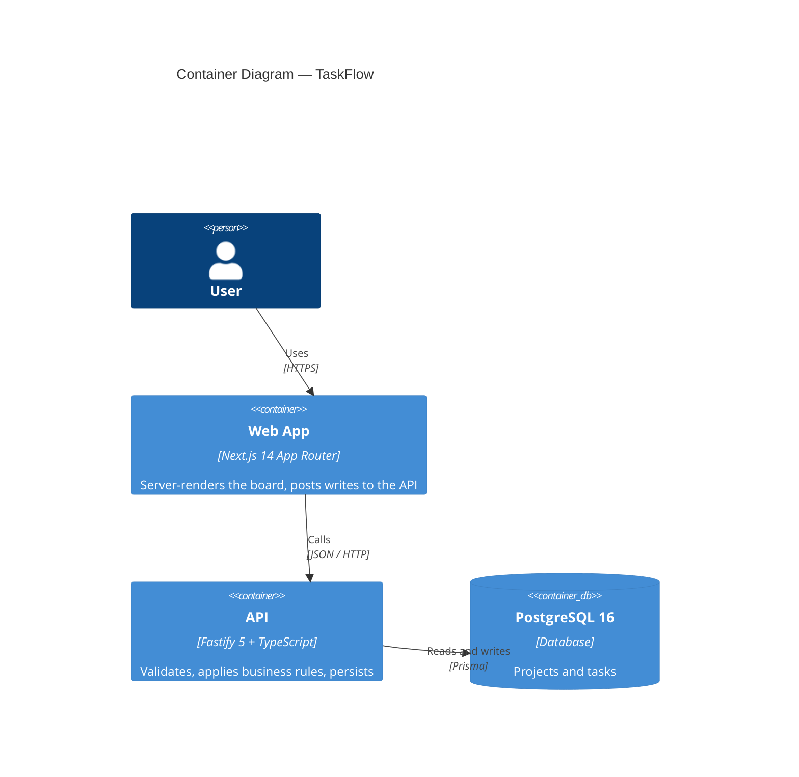
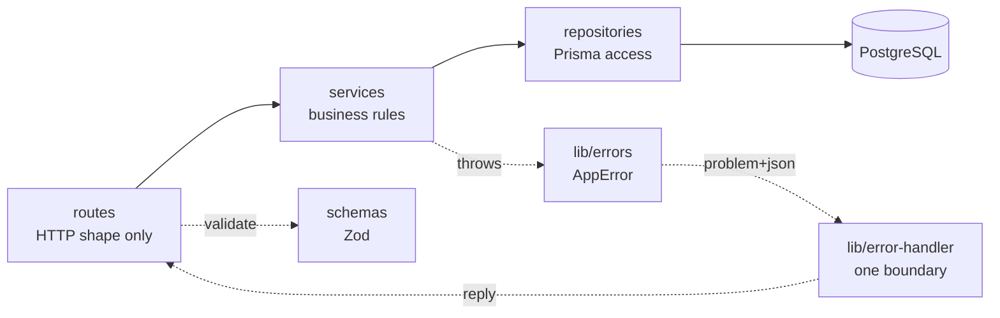
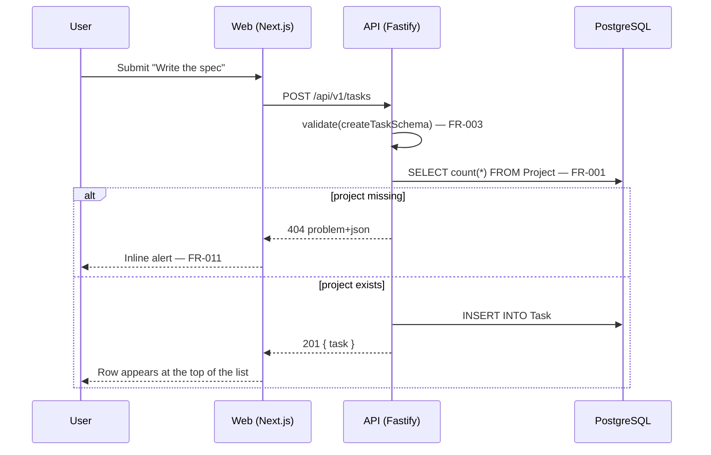

# Implementation Plan: Task Lifecycle

**Product**: taskflow
**Spec**: [specs/001-task-crud/spec.md](specs/001-task-crud/spec.md)
**Author**: Architect agent
**Status**: Implemented

## Constitution Check

| Article | Requirement | How this plan complies |
|---------|-------------|------------------------|
| I | Spec first | Plan derives from `specs/001-task-crud/spec.md`; no requirement is invented here |
| II | Reuse before build | `AppError`, the Prisma plugin and the validation helper come from `.claude/COMPONENT-REGISTRY.md` |
| III | TDD, real dependencies | Integration tests run against real PostgreSQL; no database mocks |
| IV | TypeScript strict | `strict` + `noUncheckedIndexedAccess`; Zod validates every boundary |
| V | Default stack | Fastify 5 + Prisma 6 + PostgreSQL 16 + Next.js 14 + Tailwind |
| VI | Traceability | Every route, service rule and test names its `US`/`FR`/`AC` id |
| VII | Port registry | Web 3100, API 5000 — registered in `.claude/PORT-REGISTRY.md` |
| IX | Diagram-first | Container and sequence diagrams below |
| X | Quality gates | Browser, Testing and Security gates run before the feature is called done |

## Container Diagram (C4 Level 2)

## Layering

Every failure leaves through one boundary, registered before the routes — a
Fastify error handler added after a plugin has booted does not apply inside that
plugin's context, which is how Prisma errors quietly become 500s.

Routes never touch Prisma; services never touch Fastify. That boundary is what
makes the service rules (FR-005 in particular) testable without HTTP, and it is
recorded in [ADR-001](ADRs/ADR-001-layered-api.md).

## Create-a-task Sequence

## Data Model

`Project 1 ── * Task`, cascade delete on the foreign key (FR-008), indexes on
`(projectId, status)` for the filtered list (FR-006) and on `dueDate` for future
sorting. Full definition in `apps/api/prisma/schema.prisma`.

## Risks

| Risk | Likelihood | Mitigation |
|------|-----------|------------|
| Reviewers run the demo without Docker | High | `pnpm setup` starts PostgreSQL; the web app shows a readable message when the API is down |
| Port clash with a local PostgreSQL | Medium | Container publishes 5433, not 5432 |
| Demo drifts from the framework it demonstrates | Medium | CI runs the demo's own tests on every push |
