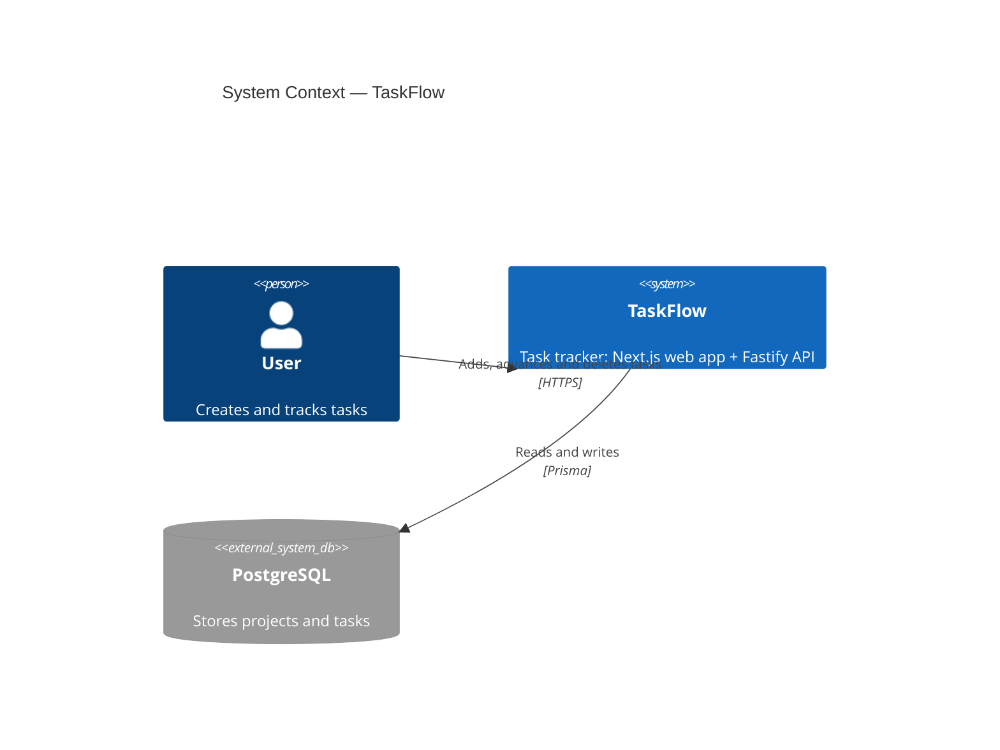

# Feature Specification: Task Lifecycle

**Product**: taskflow
**Feature Branch**: `feature/taskflow/001-task-crud`
**Created**: 2026-01-15
**Status**: Implemented
**Input**: CEO brief — "a small task tracker we can use to demonstrate the whole pipeline end to end"

## Business Context

### Problem Statement

Anyone evaluating this repository has to take the pipeline on trust: the agents,
the constitution and the gates are all described, but nothing shows them
producing running software. TaskFlow exists to close that gap — it is the
smallest product that still exercises every stage of the workflow.

### Target Users

| Persona | Role | Pain Point | Expected Outcome |
|---------|------|-----------|-----------------|
| Evaluator | Engineer assessing the framework | Cannot tell whether the process yields real code | Clones the repo, runs one command, sees a working app whose every line traces to this spec |
| Adopter | Team lead adopting the framework | No reference for what "done" looks like | Has a worked example of spec → plan → tasks → tests → code → gates |

### Business Value

- **Adoption**: a runnable example removes the largest objection to forking.
- **Onboarding**: new agents read this spec as the canonical shape of a feature.
- **Regression safety**: the demo doubles as an integration test of the toolchain.

## System Context (C4 Level 1)

## User Scenarios & Testing

### User Story 1 — Capture a task (Priority: P1)

**As a** user, **I want to** add a task to a project, **so that** it is not lost.

**Independent Test**: POST a task to the API and read it back.

**Acceptance Criteria**:

1. **Given** an existing project, **When** a task is created with a title, **Then** it is persisted with status `TODO` and returned with `201`. *(AC-1)*
2. **Given** a blank title, **When** the task is created, **Then** the API answers `422` and nothing is written. *(AC-2)*
3. **Given** a project id that does not exist, **When** the task is created, **Then** the API answers `404`. *(AC-3)*

### User Story 2 — Work a task through its lifecycle (Priority: P1)

**As a** user, **I want to** move a task between states and remove it, **so that** the list reflects reality.

**Acceptance Criteria**:

4. **Given** a due date in the past, **When** the task is created, **Then** the API answers `400`. *(AC-4)*
5. **Given** several tasks, **When** the list is filtered by status with a limit, **Then** only matching tasks are returned and `total` counts all matches. *(AC-5)*
6. **Given** an id that does not exist, **When** the task is fetched, **Then** the API answers `404`. *(AC-6)*
7. **Given** a malformed id, **When** the task is fetched, **Then** the API answers `422`. *(AC-7)*
8. **Given** an open task, **When** its status is patched, **Then** the new status is returned. *(AC-8)*
9. **Given** a `DONE` task, **When** a field other than status is patched, **Then** the API answers `400` and nothing changes. *(AC-9)*
10. **Given** a `DONE` task, **When** its status is patched to `TODO`, **Then** the task reopens. *(AC-10)*
11. **Given** an empty patch body, **When** the request is sent, **Then** the API answers `422`. *(AC-11)*
12. **Given** an existing task, **When** it is deleted twice, **Then** the first call answers `204` and the second `404`. *(AC-12)*
24. **Given** tasks in several states, **When** the list is requested with no filter, **Then** every task is returned. *(AC-24)*
25. **Given** tasks in two projects, **When** the list is filtered by `projectId`, **Then** only that project's tasks are returned. *(AC-25)*

### User Story 3 — Group tasks under projects (Priority: P2)

**As a** user, **I want** tasks to belong to a project, **so that** unrelated work stays separate.

**Acceptance Criteria**:

13. **Given** a project with tasks, **When** the project is deleted, **Then** its tasks are deleted with it. *(AC-13)*
20. **Given** a valid name, **When** a project is created, **Then** it is persisted and returned with `201`. *(AC-20)*
21. **Given** a name already in use, **When** a project is created, **Then** the API answers `409`. *(AC-21)*
22. **Given** a blank name, **When** a project is created, **Then** the API answers `422`. *(AC-22)*
23. **Given** several projects, **When** they are listed, **Then** they come back in alphabetical order. *(AC-23)*

### User Story 4 — See the board (Priority: P1)

**As a** user, **I want** a page listing my tasks, **so that** I can work without the API.

**Acceptance Criteria**:

14. **Given** no tasks, **When** the page loads, **Then** an empty state is shown. *(AC-14)*
15. **Given** tasks exist, **When** the page loads, **Then** each task is listed with its status. *(AC-15)*

### User Story 5 — Act from the board (Priority: P1)

**As a** user, **I want** to advance and delete tasks from the page, **so that** I never touch curl.

**Acceptance Criteria**:

16. **Given** a task row, **When** the status button is pressed, **Then** the task advances to the next status. *(AC-16)*
17. **Given** a task row, **When** delete is pressed, **Then** the task disappears from the list. *(AC-17)*
18. **Given** the running app, **When** a task is added, advanced and deleted in a browser, **Then** each step is visible. *(AC-18)*
19. **Given** the API rejects a write, **When** the user submits, **Then** the error is shown in an alert rather than swallowed. *(AC-19)*
26. **Given** a request to a route that does not exist, **When** it is sent, **Then** the answer is problem+json with code `NOT_FOUND`. *(AC-26)*

## Functional Requirements

| ID | Requirement | Covered by |
|----|-------------|-----------|
| FR-001 | A task belongs to exactly one existing project | AC-1, AC-3 |
| FR-002 | Task status is one of `TODO`, `IN_PROGRESS`, `DONE` | AC-8 |
| FR-003 | Titles are 1–200 characters after trimming | AC-2 |
| FR-004 | Due dates, when present, are in the future | AC-4 |
| FR-005 | A completed task must be reopened before it can be edited | AC-9, AC-10 |
| FR-006 | Listing supports status filter, project filter, limit and offset | AC-5, AC-24, AC-25 |
| FR-007 | Deleting a task is not idempotent — the second call is a 404 | AC-12 |
| FR-008 | Projects can be created and listed; deleting one cascades to its tasks | AC-13, AC-20..AC-23 |
| FR-009 | The web app lists tasks server-side on first paint | AC-14, AC-15 |
| FR-010 | The web app can advance a task's status | AC-16, AC-18 |
| FR-011 | The web app surfaces API errors to the user | AC-19 |

## Non-Functional Requirements

| ID | Requirement | Verified by |
|----|-------------|-------------|
| NFR-001 | Every error response is RFC 7807 problem+json, including unknown routes | AC-26; unit tests for the error hierarchy |
| NFR-002 | `/api/v1/health` reports database reachability | Integration test, Production Gate |
| NFR-003 | Test coverage ≥ 80% on the API (Article III) | `pnpm --filter @taskflow/api test:coverage` |
| NFR-004 | No secrets in source; database URL comes from the environment | Security Gate, gitleaks |

## Out of Scope

- Authentication and multi-tenancy — the demo runs locally and single-user.
- Real-time updates, attachments, comments, recurring tasks.
